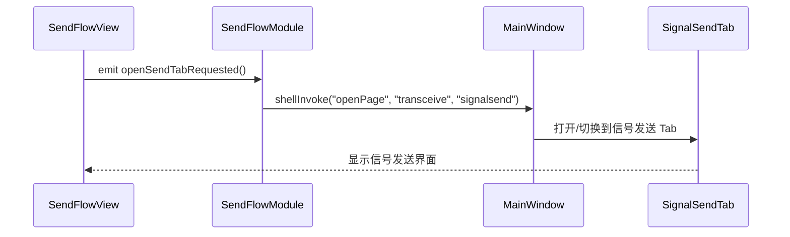
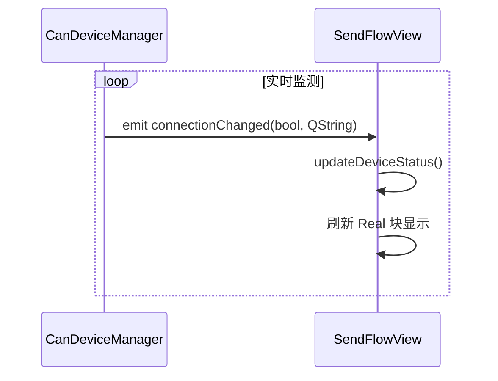

# CAN Data Send Flow - ShellContext 集成指南

## 📋 概述

`SendFlowModule` 是一个新增的业务模块，用于可视化展示 CAN 数据发送流程，与现有的收发模块（SignalSendTab）深度集成。

## 🏗️ 架构分层

```
┌─────────────────────────────────────────┐
│        Layer 1: SignalGenerator         │
│           (信号发生器)                  │
└──────────────┬──────────────────────────┘
               │ sendFrame
         ┌─────▼───────────────────────────┐
         ▼    Layer 2: 数据分发层          │
┌──────────────────┐  ┌──────────────────┐ │
│     Trace        │  │    Graphic       │ │
└──────────────────┘  └──────────────────┘ │
┌──────────────────┐                       │
│     Record       │◄─────── (并行接收)    │
└──────────────────┘                       │
               │                           │
         ┌─────▼───────────────────────────┐
         ▼    Layer 3: 实时设备显示        │
┌──────────────────────────────────────────┤
│      Real Device Block                   │
└──────────────────────────────────────────┘
```

## 🔧 ShellContext 集成点

ShellContext 为 SendFlowModule 提供了以下关键服务：

### 1. 数据层服务

```cpp
struct ShellContext {
    // ... other fields
    
    CanDeviceManager *deviceManager = nullptr;  ///< 设备管理
    DbcManager *dbcManager = nullptr;           ///< DBC 管理
    
    // 回调函数
    std::function<void(const QString &action, const QVariant &arg)> shellInvoke;
};
```

### 2. ShellInvoke 动作约定

SendFlowModule 可通过 `shellInvoke` 执行以下动作：

#### 打开收发模块的信号发送 Tab

```cpp
// 在 SendFlowModule::createSetupPage 中
QObject::connect(view, &SendFlowView::openSendTabRequested, [this]() {
    if (m_ctx.shellInvoke) {
        m_ctx.shellInvoke(QStringLiteral("openPage"), QVariantList()
            << QStringLiteral("transceive") 
            << QStringLiteral("signalsend"));
    }
});
```

#### 可能的扩展动作（未来可添加）

```cpp
// 设置设备连接状态
"deviceConnected" (bool connected, QString deviceName)

// 刷新画布
"refreshSendFlow" ()

// 同步发送配置
"syncSendConfig" (QVariantList config)
```

## 📦 DLL 构建配置

CMakeLists.txt 需要添加：

```cmake
# 创建 SendFlow DLL
add_library(openbus_sendflow SHARED
    ui/sendflowmodule.h
    ui/sendflowmodule.cpp
    ui/sendflowview.h
    ui/sendflowview.cpp
)

target_link_libraries(openbus_sendflow PUBLIC
    openbus_data
    Qt6::Widgets
    Qt6::Svg
)
```

### 主可执行文件链接

```cmake
target_link_libraries(openbus PRIVATE
    # ... existing modules ...
    openbus_sendflow  # 新增
)
```

## 🎨 UI 组件特性

### SendFlowView

**核心功能**:
- 三层级拓扑图绘制
- 点击 SignalGenerator 时跳转至收发模块
- 实时更新设备连接状态显示
- 响应设备管理器状态变化

**关键方法**:
```cpp
void buildTopology();             // 重建拓扑图
void updateDeviceStatus();        // 更新设备状态
void refreshView();               // 刷新整个视图
```

**信号**:
```cpp
void openSendTabRequested();                          // 请求打开发送 Tab
void deviceStatusChanged(bool connected, QString);    // 设备状态变化
```

## 🔌 与其他模块的交互

### 与收发模块 (TransceiveModule)



### 与设备管理器 (CanDeviceManager)



## 🚀 使用场景

1. **可视化监控发送流程**
   - 用户可以在 Flow 页面直观看到信号发送的完整路径
   - Real 块实时显示当前连接的设备状态

2. **快速跳转到发送配置**
   - 点击 SignalGenerator 块即可进入收发模块的详细配置界面

3. **设备状态可视化**
   - Real 块会根据实际设备连接状态更新显示
   - 提供设备未连接的视觉提示

## 🛠️ 待完善功能

- [ ] 支持多个 SignalGenerator（多路发送）
- [ ] 添加 Tx 回环帧统计到各模块块
- [ ] 实现流指示器系统（绿色闪烁表示数据流活跃）
- [ ] 支持配置 SignalGenerator 的参数
- [ ] 添加右键菜单进行高级配置

## 📝 编译后注意事项

1. **确保 signal.svg 图标已添加到 resources.qrc**
2. **DLL 部署**：sendflow.dll 需自动部署到 bin 目录
3. **模块注册**：需在 main.cpp 或 ModuleRegistry 中注册该模块
4. **ActivityBar 集成**：可选添加快捷入口

## 🔍 调试建议

### 检查模块是否注册成功

```bash
# 查看控制台输出
[INFO] Registering module: sendflow
[INFO] Module id='sendflow' title='CAN 数据发送' loaded
```

### 验证 SignalConnect 工作正常

```cpp
// 在 SendFlowView 构造函数中添加断点
SendFlowView::SendFlowView(QWidget *parent)
{
    setupUi();
    
    // 测试用：确认连接建立
    connect(this, &SendFlowView::openSendTabRequested, [](){
        qDebug() << "[DEBUG] openSendTabRequested emitted!";
    });
}
```
