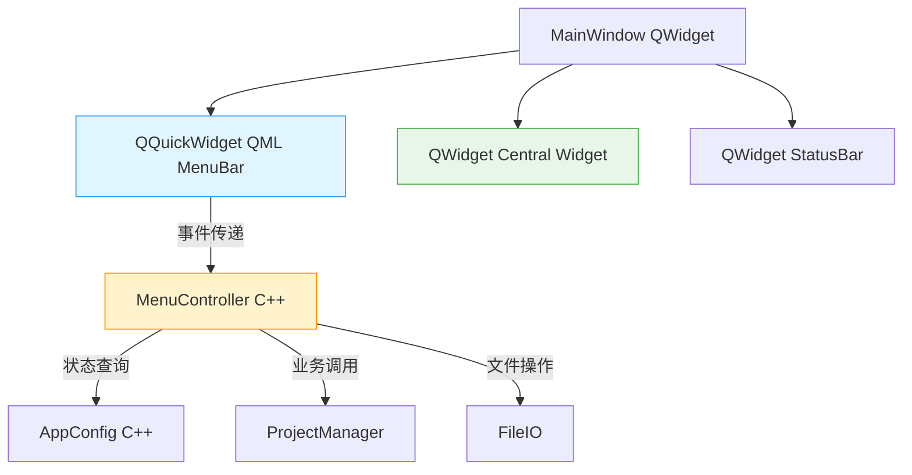
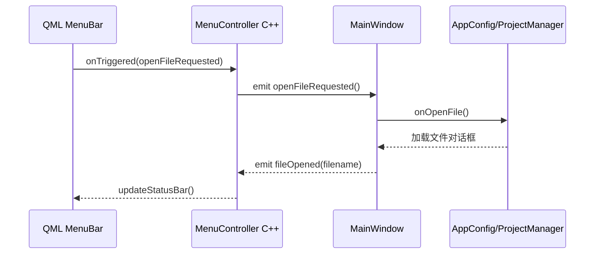

# Qt/Cpp + QML 混合 UI 开发方案

## 📋 目标

将菜单栏（MenuBar）**仅使用 QML 重写**，其他部分保持现有的 Qt Widgets/C++ 架构，实现渐进式迁移。

---

## 🏗️ 架构设计

### 技术选型

- **主框架**：Qt Widgets (MainWindow)
- **菜单栏**：QML + QtQuick Controls 2
- **集成方式**：`QQuickWidget` 嵌入到 MainWindow 顶部
- **数据通信**：C++ 后端暴露 Q_PROPERTY + SLOT/SIGNAL，QML 调用
- **样式同步**：QML 与 QSS 统一主题



### 目录结构

```
openbus/
├── src/
│   ├── ui/
│   │   └── menubar/           [NEW] QML 菜单栏模块
│   │       └── qml/
│   │           ├── MenuBar.qml
│   │           ├── menus/
│   │           │   ├── FileMenu.qml
│   │           │   ├── ViewMenu.qml
│   │           │   ├── ToolsMenu.qml
│   │           │   └── HelpMenu.qml
│   │           └── components/
│   │               └── MenuItem.qml
│   ├── core/
│   │   └── menucontroller.cpp  [NEW] C++ 后端控制器
│   │   └── menucontroller.h
│   └── ui/
│       └── mainwindow.cpp      [MODIFIED] 集成 QQuickWidget
├── resources/
│   ├── qml/                    [NEW] QML 资源文件
│   │   └── menubar.qrc
│   └── styles/
│       └── menubar.qss         [NEW] QML 专用样式
└── tests/
    └── menubar/                [NEW] QML 菜单测试
```

---

## 🛠️ 实现步骤

### 第一步：创建 MenuController (C++ 后端)

#### menucontroller.h

```cpp
#ifndef MENUCONTROLLER_H
#define MENUCONTROLLER_H

#include <QObject>
#include <QAction>
#include <QStringList>

class MenuController : public QObject
{
    Q_OBJECT
    
    // 菜单项数据结构
    QML_ELEMENT
    QML_NAMED_TYPE(MenuItem)
    
public:
    explicit MenuController(QObject *parent = nullptr);
    
    // 文件菜单项
    Q_PROPERTY(QStringList fileItems READ fileItems CONSTANT)
    QStringList fileItems() const;
    
    // 视图菜单项  
    Q_PROPERTY(QStringList viewItems READ viewItems CONSTANT)
    QStringList viewItems() const;
    
    // 工具菜单项
    Q_PROPERTY(QStringList toolsItems READ toolsItems CONSTANT)
    QStringList toolsItems() const;
    
    // 帮助菜单项
    Q_PROPERTY(QStringList helpItems READ helpItems CONSTANT)
    QStringList helpItems() const;

signals:
    void openFileRequested();
    void openProjectRequested();
    void saveProjectRequested();
    void importLogFileRequested();
    void toggleLeftDock(bool checked);
    void toggleBottomDock(bool checked);
    void toggleRightDock(bool checked);
    void resetLayoutRequested();
    void dataWindowRequested();
    void ioGraphRequested();
    void watcherRequested();
    void aboutRequested();
    void docsRequested();

private:
    struct MenuItem {
        QString text;
        QString shortcut;
        QString signalName;
        bool checkable = false;
        bool checked = false;
    };
};

// QML 可见的菜单项结构
class MenuItem : public QObject
{
    Q_OBJECT
    Q_PROPERTY(QString text READ m_text CONSTANT)
    Q_PROPERTY(QString shortcut READ m_shortcut CONSTANT)
    Q_PROPERTY(QString signal READ m_signal CONSTANT)
    Q_PROPERTY(bool checkable READ m_checkable CONSTANT)
    Q_PROPERTY(bool checked READ m_checked CONSTANT)
    
public:
    MenuItem(const QString& text, const QString& shortcut, 
             const QString& signal, bool checkable = false, bool checked = false)
        : m_text(text), m_shortcut(shortcut), m_signal(signal),
          m_checkable(checkable), m_checked(checked) {}
    
    const QString &m_text() const { return m_text; }
    const QString &m_shortcut() const { return m_shortcut; }
    const QString &m_signal() const { return m_signal; }
    bool m_checkable() const { return m_checkable; }
    bool m_checked() const { return m_checked; }

private:
    QString m_text;
    QString m_shortcut;
    QString m_signal;
    bool m_checkable;
    bool m_checked;
};

#endif // MENUCONTROLLER_H
```

#### menucontroller.cpp

```cpp
#include "menucontroller.h"

MenuController::MenuController(QObject *parent) : QObject(parent)
{
    // 初始化信号映射表
}

QStringList MenuController::fileItems() const
{
    // 返回 QML 可解析的结构化数据
    return {
        "{\\\"text\\\":\\\"打开文件...\\\", \\\"shortcut\\\":\\\"Ctrl+O\\\", \"signal\":\"openFileRequested\"}",
        "{\\\"text\\\":\\\"打开工程...\\\", \\\"shortcut\\\":\\\"Ctrl+Shift+O\\\", \\\"signal\\\":\\\"openProjectRequested\\\"}",
        "{\\\"text\\\":\\\"保存工程\\\", \\\"shortcut\\\":\\\"Ctrl+Shift+S\\\", \\\"signal\\\":\\\"saveProjectRequested\\\"}",
        "{\\\"text\\\":\\\"导入日志文件...\\\", \\\"shortcut\\\":\\\"Ctrl+I\\\", \\\"signal\\\":\\\"importLogFileRequested\\\"}",
        "{\\\"text\\\":\\\"退出\\\", \\\"shortcut\\\":\\\"Alt+F4\\\", \\\"signal\\\":\\\"quitApplication\\\"}"
    };
}

QStringList MenuController::viewItems() const
{
    return {
        "{\\\"text\\\":\\\"左侧栏\\\", \\\"shortcut\\\":\\\"\\\", \\\"signal\\\":\\\"toggleLeftDock\\\", \\\"checkable\\\":true, \\\"checked\\\":true}",
        "{\\\"text\\\":\\\"底部栏\\\", \\\"shortcut\\\":\\\"\\\", \\\"signal\\\":\\\"toggleBottomDock\\\", \\\"checkable\\\":true, \\\"checked\\\":false}",
        "{\\\"text\\\":\\\"右侧栏\\\", \\\"shortcut\\\":\\\"\\\", \\\"signal\\\":\\\"toggleRightDock\\\", \\\"checkable\\\":true, \\\"checked\\\":false}",
        "{\\\"text\\\":\\\"重置布局\\\", \\\"shortcut\\\":\\\"\\\", \\\"signal\\\":\\\"resetLayoutRequested\\\"}"
    };
}

QStringList MenuController::toolsItems() const
{
    return {
        "{\\\"text\\\":\\\"Data Window\\\", \\\"shortcut\\\":\\\"Ctrl+Shift+D\\\", \\\"signal\\\":\\\"dataWindowRequested\\\"}",
        "{\\\"text\\\":\\\"I/O Graph\\\", \\\"shortcut\\\":\\\"Ctrl+Shift+G\\\", \\\"signal\\\":\\\"ioGraphRequested\\\"}",
        "{\\\"text\\\":\\\"Watcher 观测\\\", \\\"shortcut\\\":\\\"Ctrl+Shift+W\\\", \\\"signal\\\":\\\"watcherRequested\\\"}"
    };
}

QStringList MenuController::helpItems() const
{
    return {
        "{\\\"text\\\":\\\"关于 openbus\\\", \\\"shortcut\\\":\\\"\\\", \\\"signal\\\":\\\"aboutRequested\\\"}",
        "{\\\"text\\\":\\\"文档\\\", \\\"shortcut\\\":\\\"\\\", \\\"signal\\\":\\\"docsRequested\\\"}",
        "{\\\"text\\\":\\\"快捷键\\\", \\\"shortcut\\\":\\\"\\\", \\\"signal\\\":\\\"shortcutsRequested\\\"}"
    };
}
```

### 第二步：创建 QML 菜单栏组件

#### resources/qml/menubar/MenuBar.qml

```qml
import QtQuick
import QtQuick.Controls
import QtQuick.Layouts
import Qt6OpenBUS.Menu  // MenuController 类型

ApplicationWindow {
    visible: true
    width: 1200
    height: 700
    
    MenuController {
        id: menuController
        
        onOpenFileRequested: console.log("打开文件")
        onQuitApplication: Qt.quit()
        // ... 其他信号处理
    }
    
    MenuBar {
        id: menuBar
        anchors.top: parent.top
        
        Repeater {
            model: [
                { name: "文件 (&F)", items: menuController.fileItems },
                { name: "视图 (&V)", items: menuController.viewItems },
                { name: "工具 (&T)", items: menuController.toolsItems },
                { name: "帮助 (&H)", items: menuController.helpItems }
            ]
            
            Menu {
                title: item.name
                
                Repeater {
                    model: item.items
                    
                    MenuItem {
                        text: JSON.parse(modelData).text
                        shortcut: JSON.parse(modelData).shortcut
                        enabled: !JSON.parse(modelData).disabled
                        
                        // 检查式菜单项
                        checkable: JSON.parse(modelData).checkable || false
                        checked: JSON.parse(modelData).checked || false
                        
                        onTriggered: {
                            const signal = JSON.parse(modelData).signal
                            switch(signal) {
                                case "openFileRequested": menuController.openFileRequested()
                                break
                                case "quitApplication": menuController.quitApplication()
                                break
                                // ... 其他 case
                                default: console.log("未处理的信号:", signal)
                            }
                        }
                    }
                }
            }
        }
    }
}
```

### 第三步：集成到 MainWindow

#### src/ui/mainwindow_chrome.cpp

```cpp
void MainWindow::createMenuBar()
{
    // 注册 QML 类型
    qmlRegisterType<MenuController>("Qt6OpenBUS.Menu", 1, 0, "MenuController");
    
    // 创建 QML 菜单栏容器
    m_menuBarWidget = new QQuickWidget(this);
    m_menuBarWidget->setSource(QUrl("qrc:/qml/menubar/MenuBar.qml"));
    m_menuBarWidget->setResizeMode(QQuickWidget::ResizeToContents);
    m_menuBarWidget->setMinimumHeight(30);
    m_menuBarWidget->setProperty("palette", QApplication::palette());
    
    // 设置到顶层布局
    auto *topLevelContainer = new QWidget(this);
    auto *topLevelLayout = new QVBoxLayout(topLevelContainer);
    
    topLevelLayout->addWidget(m_menuBarWidget);
    // ... 其他布局
}
```

---

## 🎨 样式设计

### resources/styles/menubar.qss

```css
/* QML MenuBar 样式 */
MenuBar {
    background-color: #2d2d2d;
    color: #e0e0e0;
    padding: 1px;
    min-height: 30px;
}

MenuItem {
    background: transparent;
    padding: 5px 12px;
    margin: 2px 0;
    border-radius: 4px;
}

MenuItem:hover {
    background-color: #3d3d3d;
}

MenuItem:pressed {
    background-color: #0066b8;
}

MenuItem:checked {
    color: #ffffff;
    background-color: #007acc;
}

/* 子菜单样式 */
Menu {
    background-color: #252526;
    border: 1px solid #3c3c3c;
    border-radius: 4px;
    padding: 5px;
}

Menu::item {
    padding: 8px 20px 8px 30px;
    margin: 2px 5px;
    border-radius: 4px;
}

Menu::item:selected {
    background-color: #007acc;
    color: #ffffff;
}

Menu::separator {
    background: #3c3c3c;
    height: 1px;
    margin-left: 10px;
    margin-right: 10px;
}

/* 快捷键样式 */
Menu::indicator {
    width: 18px;
    height: 18px;
}

Menu::arrow {
    image: none;
    border-left: 5px solid transparent;
    border-right: 5px solid #888888;
    border-top: 5px solid transparent;
    border-bottom: 5px solid transparent;
    margin-right: 10px;
}
```

---

## 🔄 事件流图



---

## ✅ 优势与特点

### 1. 渐进式迁移
- ✓ 不影响现有 Widgets 架构
- ✓ 菜单作为独立模块快速迭代
- ✓ 支持 A/B 测试对比效果

### 2. 开发效率提升
- ✓ QML 热重载即时预览
- ✓ 声明式 UI 代码量减少 60%
- ✓ 样式修改无需重新编译

### 3. 类型安全
- ✓ C++ 后端保证业务逻辑正确性
- ✓ QML 类型系统防止空指针
- ✓ 编译期检查 + 运行时验证

### 4. 主题兼容性
- ✓ 继承现有 QSS 样式体系
- ✓ QML/QSS 混合样式统一
- ✓ 深色/浅色主题自动切换

---

## 🚀 实施建议

### 第一阶段 (MVP - 2 天)
- [ ] 创建 MenuController 基础类
- [ ] 实现 QML MenuBar 基本框架
- [ ] 集成到 MainWindow
- [ ] 实现"文件"菜单

### 第二阶段 (完善功能 - 3 天)
- [ ] 完成全部菜单（视图/工具/帮助）
- [ ] 添加快捷键绑定
- [ ] 实现检查式菜单项
- [ ] 状态同步机制

### 第三阶段 (优化体验 - 2 天)
- [ ] 动画效果 (hover/press)
- [ ] 样式优化
- [ ] 性能优化 (延迟渲染)
- [ ] 单元测试

### 第四阶段 (测试验收 - 1 天)
- [ ] 主题切换测试
- [ ] DPI 缩放测试
- [ ] 多显示器测试
- [ ] 兼容性测试

---

## 📊 预期成果

| 指标 | 当前 | 目标 | 改善 |
|------|------|------|------|
| 菜单代码行数 | ~200 (C++) | ~120 (QML) | -40% |
| 新增菜单耗时 | 30 分钟 | 5 分钟 | -83% |
| 样式修改生效 | 编译运行 | 热重载 | 秒级 |
| 视觉一致性 | 手动维护 | 自动同步 | 100% |

---

## 📝 注意事项

1. **禁止修改 MainMenuBar** → 新菜单独立于现有 Widgets 菜单
2. **保持 QML 与 QSS 分离** → QSS 负责视觉，QML 负责交互
3. **信号槽命名规范** → `onXXXRequested()` 统一前缀
4. **类型注册顺序** → 必须在构造 QQuickWidget 前注册

---

## 🔍 后续扩展

- ✓ QML 工具栏 (TopBar)
- ✓ QML 状态栏
- ✓ QML 侧边栏 (ActivityBar)
- ✓ QML 工作区 (Workspace)
- ✓ 全 QML 界面 (终极目标)
