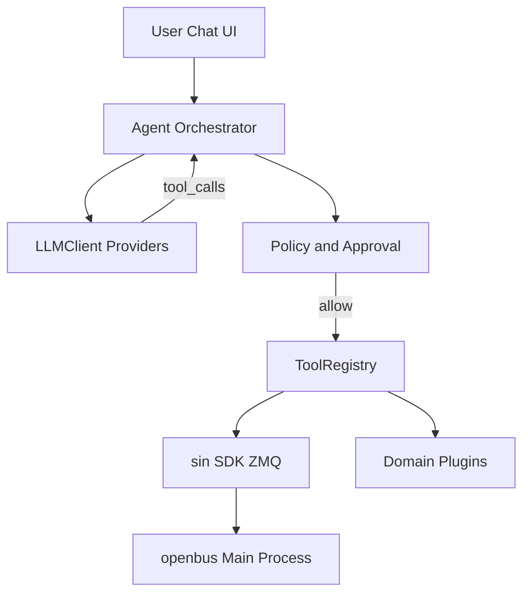

# openbus AI Agent 插件 — 设计思路、功能特性与实现路径

> 文档状态：Phase 1 MVP 已落地（2026-09-18），见 `plugins/ai-agent/`  
> 目标产物：重磅级 Python 插件 `plugins/ai-agent/`（id：`ai-agent`）  
> 对标定位：一流 AI Agent 的「工具编排 + 人机审批」能力 × 汽车总线诊断场景  
> 闭环目标：**自然语言需求 → 调用主进程 / 插件能力 → 观测总线 → 验证 → 报告**

---

## 1. 调研结论（前沿资料摘要）

### 1.1 通用 Agent 栈（2025–2026）

| 趋势 | 要点 | 对 openbus 的启示 |
|------|------|-------------------|
| **Tool / Function Calling** | 模型在推理中反复选工具、读结果、再决策；Responses API / Chat Completions 均已成熟 | Agent 内核必须是「ReAct / tool-loop」，而不是单次问答 |
| **MCP（Model Context Protocol）** | 工具发现与调用的开放标准；OpenAI Agents SDK、Claude Agent SDK 均原生支持 stdio / Streamable HTTP / Hosted MCP | 把 openbus 能力封装成 **MCP Tool Server**，同时兼容「插件内本地 tool registry」 |
| **Agents SDK** | OpenAI Agents Python/JS：多 Agent、handoff、会话状态、审批钩子 | 编排层可借鉴，但总线安全策略必须自研 |
| **Computer Use** | GUI 操控兜底，慢且脆 | **不作为主路径**；优先 API / SDK / MCP |
| **推理模型 + 工具** | o3 / Claude 等可在 CoT 中调工具，降低「先想完再调」的断链 | Provider 层需支持流式与多轮 tool_calls |

权威参考（实现时再精读）：

- OpenAI：[MCP and Connectors](https://developers.openai.com/api/docs/guides/tools-connectors-mcp)、[Agents SDK + MCP](https://openai.github.io/openai-agents-python/mcp/)
- Anthropic：Claude Agent SDK + MCP `allowedTools` / 权限门控
- 协议：MCP 规范（tools/list、tools/call、资源与提示可选）

### 1.2 汽车 / 总线向 Agent（最合适的对标）

| 项目 | 形态 | 亮点 | 差距 / 可借鉴 |
|------|------|------|----------------|
| **Majster-AI / Car_Diagnostic_AI** | LangGraph + 多 MCP（UDS / RAG 手册 / Web） | **默认只读**；写操作强制 HITL | 最接近「诊断闭环」产品形态 — **首选对标** |
| **mcp-can** | MCP Server + 虚拟 CAN + DBC/OBD/UDS/J1939 | 工具类型化、仿真友好 | 偏「协议 MCP」，缺与 IDE 级分析软件深度集成 |
| **obd-mcp-server** | 只读 OBD MCP | 明确拒绝清码/刷写/裸请求 | 安全策略模板优秀 |
| **pyudskit** | UDS + LLM 编解码助手 | 自然语言 ↔ UDS 字节 | 适合作为「解释层」工具，不足以做全站编排 |

**对标选择（结论）**  
以 **Majster-AI 类「诊断编排 Agent」** 为产品对标（HITL、只读默认、工具化诊断），以 **Cursor / Claude Code 类「工具循环 Agent」** 为交互与工程对标（会话、计划、可审计工具轨迹），以 **mcp-can** 为工具暴露形态参考。  

openbus 的差异化：**不是再造一个独立诊断聊天机器人，而是把已有主进程 Trace/DBC/设备 + 33 个领域插件，变成 Agent 可调用的工具宇宙**，形成「分析软件内的总线 AI 同事」。

### 1.3 openbus 现有可被 Agent 调用的能力（资产盘点）

```
主进程 (C++/Qt)                     插件宿主 (Python/PyQt6)
├─ Trace / Graphic / Capture        ├─ sin.frames  send / getRecent / getSelected
├─ Device connect / bitrate         ├─ sin.dbc / sin.signals
├─ DBCManager                       ├─ sin.workspace / files.convert*
├─ PluginManager activate/…         ├─ sin.ui 窗口
└─ ZMQ ROUTER+PUB                   └─ 领域插件: UDS / OBD2 / J1939 / Dashboard /
                                       FrameGen / Simulator / Trigger / Lint …
```

传输契约见 [插件方案.md](插件方案.md)（JSON-RPC 控制面 + 二进制帧数据面）。  
P0 插件升级见 [Plugin_P0_Competitive_Upgrade.md](Plugin_P0_Competitive_Upgrade.md)。

---

## 2. 设计思路

### 2.1 一句话定位

**openbus AI Agent = 嵌入式总线领域的「有权限边界的工具型 Agent」**：用户用自然语言描述问题或需求，Agent 通过标准 tool-loop 调用主进程与插件能力，在可审计、可审批的前提下完成观测—假设—验证—交付闭环。

### 2.2 设计原则

1. **工具优先，不臆造总线事实** — 一切结论尽量绑定 Trace 帧、DBC 解码、UDS/OBD 响应或日志附件。  
2. **默认只读，写操作显式批准** — `frames.send`、UDS 写/清码/刷写、仿真压测等进入审批队列。  
3. **双入口工具面** — 对内：`ToolRegistry`（直连 `sin.*` + 插件 Facade）；对外：可选 **MCP Server**，便于 Claude Desktop / Cursor / 其他 Agent 复用同一能力。  
4. **多 Provider，统一 OpenAI-compatible 抽象** — OpenAI、Azure OpenAI、Anthropic（via adapter）、DeepSeek、通义、Moonshot、本地 Ollama/vLLM 等。  
5. **会话可复现** — 每次 tool call 落盘（参数、结果摘要、耗时、审批结果），支持导出「诊断报告」。  
6. **不替代专业插件 UI** — Agent 编排；复杂交互仍可 `activate` / `raise` 既有插件窗口。  
7. **英文代码 / 配置键**；用户可见文案可中英（文档 Markdown 可用中文）。

### 2.3 目标闭环（用户故事）

| 故事 | Agent 行为链（示例） |
|------|----------------------|
| 「总线负载高，查谁在刷屏」 | `frames.get_recent` → 统计 ID → 可选 `dbc.decode` → 报告 Top talkers + 建议滤波 |
| 「读一下发动机水温 DID」 | 确认设备已开 → 调 UDS facade `read_did(F190/…)` → 解码 → 展示 |
| 「按这份需求做个周期发 0x123」 | 生成 FrameGen 配置 JSON → **审批** → 写入/启动发送 → `get_recent` 验证 |
| 「对比两个 DBC 并指出风险」 | 调 `dbc-lint` / `dbc-diff` facade → HTML/CSV 路径回传 |
| 「J1939 上 DM1 亮了」 | 激活 j1939-analyzer 逻辑或读其导出 → 解释 SPN/FMI → 建议下一步 |

### 2.4 非目标（明确不做）

- 不在 V1 做完全自主无人值守刷写 / SecurityAccess 爆破。  
- 不做「替用户在屏幕上点鼠标」的 Computer Use 主路径。  
- 不把模型权重内嵌进安装包（仅 API / 本地推理端点配置）。  
- 不替代 CANoe CAPL/ODX 全套产线生态；聚焦 **分析师与售后/台架** 效率。

---

## 3. 功能特性（产品规格草案）

### 3.1 交互与会话

| 特性 | 说明 |
|------|------|
| Chat 工作台 | 独立 `sin.ui` 窗口：消息流、工具轨迹折叠、一键复制报告 |
| 系统提示可切换 | 角色：`Analyst` / `Diagnostics` / `TestEngineer` / `SafetyOfficer` |
| 计划模式 | 先输出 Plan（只读），用户点「执行」再进入 tool-loop |
| 多轮记忆 | 会话内摘要 + 关键上下文（当前 DBC、通道、最近告警） |
| 斜杠命令 | `/read-only` `/allow-tx` `/use uds` `/report` `/mcp-status` |

### 3.2 Provider 接入

| Provider 族 | 接入方式 |
|-------------|----------|
| OpenAI / Azure OpenAI | 官方 API + Responses 或 Chat Completions + tools |
| Anthropic Claude | Messages API + tools（或 OpenAI-compatible 网关） |
| DeepSeek / Qwen / Moonshot / ZhiPu 等 | OpenAI-compatible base_url |
| 本地 Ollama / vLLM / LM Studio | OpenAI-compatible `http://127.0.0.1:…/v1` |
| 配置项 | `api_key`（系统钥匙串或本地加密文件）、`base_url`、`model`、`temperature`、`max_tokens`、代理 |

实现建议：内部统一 **`LLMClient` 协议**（`chat(messages, tools) -> assistant|tool_calls`），用轻量适配层或 `litellm`（需评估 MSYS2 打包体积）。

### 3.3 工具目录（V1 建议）

#### A. 主进程 / SDK 原语（始终可用）

| Tool | 能力 | 默认权限 |
|------|------|----------|
| `bus.get_status` | 工程目录、已载 DBC、设备是否连接（扩展 RPC 若缺则占位） | 读 |
| `frames.get_recent` | 最近 N 帧 | 读 |
| `frames.get_selected` | Trace 选中 | 读 |
| `frames.stats` | ID 频次 / 负载粗估（插件侧计算） | 读 |
| `frames.send` | 发一帧 | **写 · 需审批** |
| `dbc.list_messages` / `dbc.decode_frame` | 打开 DBC、解码 | 读 |
| `signals.encode` | 信号编码为 payload | 读（未上总线） |
| `workspace.get_paths` | 工程与 DBC 路径 | 读 |
| `files.convert_*` | 日志格式转换作业 | 读/写文件 |
| `output.log` | 写主程序输出面板 | 读 |

#### B. 领域插件 Facade（按需 activate）

| Tool 前缀 | 映射插件 | 示例 |
|-----------|----------|------|
| `uds.*` | uds-diagnostic | `read_did` `read_dtc` `run_sequence`（写类审批） |
| `obd.*` | obd2-scanner | `discover_pids` `read_pid` `read_dtcs` |
| `j1939.*` | j1939-analyzer | `decode_pgn` `send_rqst` |
| `tx.*` | can-frame-generator | `load_entries` `start_cyclic` |
| `sim.*` | can-simulator | `load_config` `start` |
| `dash.*` | can-dashboard | `load_layout` |
| `capture.*` | trigger-logger | `arm` `export_asc` |
| `dbc_quality.*` | dbc-lint / dbc-diff | `lint` `diff_html` |

Facade 原则：**优先调插件内 Python API / 共享模块，而不是 OCR 其 UI**；必要时 `plugin.raise` 给用户看窗口。

#### C. 元工具

| Tool | 说明 |
|------|------|
| `plugins.list` / `plugins.activate` | 列举与激活（需宿主/主进程扩展命令时落到 RPC） |
| `agent.set_policy` | 切换只读/允许 TX（仍受全局策略约束） |
| `agent.export_report` | Markdown/HTML 诊断报告 |
| `rag.search_docs`（V2） | 索引 `doc/` + 用户手册 PDF |

### 3.4 安全与治理

| 机制 | 行为 |
|------|------|
| Policy 级别 | `readonly` / `tx_allowed` / `diag_write` / `flash`（逐级升高） |
| 审批 UI | 工具卡展示 diff：将发的 CAN ID、UDS PDU、目标 ECU；允许/拒绝/修改后发 |
| 速率限制 | TX 工具默认上限（如 100 frame/s），防误操作打爆总线 |
| 密钥隔离 | API Key 不进 git；不进 tool 日志明文 |
| 审计 | `~/.openbus/ai-agent/sessions/<id>.jsonl` |

对标 Majster-AI：**写路径必须 HITL**；对标 obd-mcp-server：**危险能力默认不出现在 tool schema**（按策略动态裁剪 `tools` 列表）。

### 3.5 体验亮点（「重磅」观感）

1. **一键「分析当前 Trace」** — 自动取选中/最近帧 + DBC 上下文生成结构化报告。  
2. **需求 → 可执行工件** — 生成 FrameGen JSON、UDS sequence CSV、Trigger 条件，用户确认后落地。  
3. **工具轨迹时间线** — 类似 Cursor 的 tool steps，可回放。  
4. **双模：插件内 Agent / MCP 外挂** — 同一 ToolRegistry，两种消费方式。  
5. **与 P0 插件同源 `_shared`** — 不重复造 DBC/ISO-TP 轮子。

---

## 4. 架构设计

### 4.1 逻辑架构



### 4.2 进程与部署

| 组件 | 位置 | 说明 |
|------|------|------|
| `plugins/ai-agent/` | 标准 `.opk` 插件 | UI + Orchestrator + Registry |
| `plugins/ai-agent/mcp_server.py` | 可选子进程 | 对外 MCP（stdio 或 localhost HTTP） |
| `sdk/sin/*` | 已有 | 控制面 / 帧总线 |
| 主进程扩展（可选 V1.1） | `PluginManager` 新 RPC | 如 `device.getStatus`、`plugins.activateFromHost` |

### 4.3 核心模块划分（建议目录）

```
plugins/ai-agent/
  plugin.json
  main.py                 # activate / ChatWindow
  agent/
    orchestrator.py       # tool-loop
    llm_client.py         # multi-provider
    prompts.py            # system / role prompts
    session_store.py      # jsonl audit
  tools/
    registry.py
    bus_tools.py          # frames/dbc/workspace
    plugin_facades.py     # uds/obd/j1939/…
    policy.py
  mcp/
    server.py             # optional MCP export
  resources/
    system_prompt.md
    tool_catalog.yaml
  tests/
    test_orchestrator_mock.py
    test_policy.py
```

### 4.4 Tool-loop 伪代码

```text
messages = [system, user]
tools = registry.schema(policy)
loop:
  resp = llm.chat(messages, tools)
  if resp.content: show(resp.content)
  if not resp.tool_calls: break
  for call in resp.tool_calls:
    if policy.requires_approval(call):
      if not ui.approve(call): result = Denied; continue
    result = registry.invoke(call)
    audit.log(call, result)
    messages.append(tool_result)
emit final report
```

### 4.5 与 MCP 的关系

- **对内**：不必强制依赖 MCP；本地 function calling 延迟更低。  
- **对外**：同一 Registry 适配为 MCP `tools/list` + `tools/call`，使 Claude / Cursor / 其他编排器可把 openbus 当「汽车工具服务器」。  
- **不要**把 Hosted Remote MCP（公网）作为默认：总线与密钥应留在本机。

---

## 5. 实现路径（分阶段）

### Phase 0 — 调研落地准备（0.5–1 周）

- [x] 冻结 V1 只读 tool 清单：`frames_*` / `dbc_decode_frame` / `workspace_get_paths` / `bus_get_status`；写工具 `frames_send` 注册但不进入 schema。  
- [ ] 盘点主进程 RPC 缺口（设备状态、激活插件等），列最小补齐项。`bus_get_status` 的设备字段暂为占位。  
- [x] 选定 LLM 抽象：自研薄 `LLMClient`（urllib，OpenAI-compatible，含 Ollama `/v1`），不引入 litellm。  
- [x] 安全评审（MVP）：默认 readonly；审计 `~/.openbus/ai-agent/sessions/<id>.jsonl`；Key 在本地 `settings.json`，不进 git、不进 tool 日志。

### Phase 1 — MVP 闭环（2–3 周）**【已落地 2026-09-18】**

**目标**：自然语言 → 只读工具 → 有依据的分析报告。

1. [x] 插件骨架：`plugin.json`、Chat UI、`LLMClient`（OpenAI-compatible + Ollama 预设）。  
2. [x] ToolRegistry：`frames_get_recent` / `frames_get_selected` / `frames_stats` / `dbc_decode_frame` / `workspace_get_paths`。  
3. [x] Orchestrator + session jsonl。  
4. [x] 一键「Analyze recent Trace」。  
5. [x] 单元测试：mock LLM 固定 tool_calls 路径（`plugins/ai-agent/tests/`）。

**验收**：`summarize_frames` 在假 Trace 上把 `0x123` 排第一并带上 DBC 名 `EngineData`；scripted tool-loop 走 `frames_stats` 后给出同一结论。真机提问仍需配置 Provider。

### Phase 2 — 写路径 + 领域 Facade（2–3 周）**【已落地 2026-09-20】**

1. [x] Policy 级别（`readonly` / `tx_allowed` / `diag_write` / `flash`）+ TX 速率限制；写工具 HITL 审批卡片。  
2. [x] `frames_send` / `uds_read_did` / `obd_read_pid` facade（ISO-TP SF 发出；响应从 Trace 回读）。  
3. [x] 工件生成：`tx_build_cyclic` JSON、`uds_build_sequence` CSV（不自动上总线）。  
4. [x] `/report` Markdown 导出（沿用 Phase 1）；斜杠 `/allow-tx` `/diag-write` `/read-only`。

**验收**：单元测试覆盖「readonly 隐藏写工具 → /allow-tx + 审批后 frames_send 真正调用 host.send_frame」；工件生成不发帧。真机周期发送自证仍建议配合 TX Lab 加载 artifact。

### Phase 3 — MCP 外向与多 Agent（2 周）

1. 本地 MCP Server 暴露只读工具子集。  
2. 可选：Analyst / Diagnostics 双 Agent handoff。  
3. Provider 面板：多模型切换、用量统计。  
4. 与市场 `.opk` 打包、签名策略对齐。

### Phase 4 — 增强（持续）

- RAG：索引 `doc/` 与用户手册。  
- Graphic/Trace 深度 RPC（书签、过滤器写入）。  
- 团队策略：企业 Key、审计上报。  
- 评测集：固定总线场景 + 期望工具序列（类似 agent eval）。

---

## 6. 风险与缓解

| 风险 | 缓解 |
|------|------|
| 模型幻觉导致误发帧 | 默认只读；写操作审批；schema 级禁止 flash |
| 工具过多上下文爆掉 | 按角色动态裁剪 tools；tool search（大目录时） |
| 宿主单进程卡顿 | 长任务进 QThread；帧统计采样 |
| Provider API 差异 | 统一 LLMClient；CI 用 mock |
| 合规 / 钥匙泄露 | 本地加密；日志脱敏；文档明确责任边界 |
| 与既有插件状态冲突 | Facade 约定「短事务」；冲突时提示用户关闭手动操作 |

---

## 7. 成功标准（产品）

1. **闭环**：至少 3 个标准场景（Trace 分析、UDS 读 DID、周期发送）无需手写代码即可完成。  
2. **可审计**：任意结论可追溯到 tool 结果片段。  
3. **可对标**：在「只读诊断 + HITL 写入」体验上达到 Majster-AI 类产品水位；在「与分析软件深度集成」上超过独立 MCP 玩具项目。  
4. **可扩展**：新增领域插件时，按约定注册 3–10 个 tool 即可被 Agent 发现。

---

## 8. 建议的立即下一步

1. 评审本文权限矩阵与 V1 tool 列表（产品 + 安全）。  
2. 开分支实现 Phase 1 MVP 骨架（`plugins/ai-agent/`）。  
3. 若缺 RPC：先在插件侧用现有 `sin.frames` / `sin.dbc` 闭环，主进程补齐延后。  
4. 准备 2–3 个 demo 脚本（vcan / 模拟器）用于评审演示。

---

## 9. 参考链接（调研）

- OpenAI MCP & Connectors：https://developers.openai.com/api/docs/guides/tools-connectors-mcp  
- OpenAI Agents SDK（MCP）：https://openai.github.io/openai-agents-python/mcp/  
- Claude Agent SDK + MCP：https://code.claude.com/docs/en/agent-sdk/mcp  
- mcp-can：https://pypi.org/project/mcp-can/  
- Majster-AI / Car_Diagnostic_AI（Glama）：https://glama.ai/mcp/servers/Mati83mon/Car_Diagnostic_Ai  
- obd-mcp-server：https://github.com/ayhammouda/obd-mcp-server  
- 本仓库：[插件方案.md](插件方案.md)、[Plugin_P0_Competitive_Upgrade.md](Plugin_P0_Competitive_Upgrade.md)

---

*Phase 2 代码在 `plugins/ai-agent/`（v0.2.0）。Phase 3 起再做 MCP 外向与多 Agent。*
