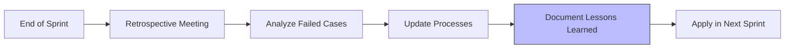

# 六角色协同工作流系统 (6-Role Collaboration Workflow)

> **目标**: 防止"长时间无法编译通过"问题再次发生，通过**方案者 + 编码者 + 评审者 + 编译者 + 测试者 + 打包者**六位一体的协作流程确保每次重大变更质量可控。

## 🚀 快速导航

### 📜 核心政策文档
- [全英文编码策略 (#ENCODING_POLICY)](../POLICY-ENGLISH-CODING.md) - **必读!**

### 👥 角色规范文档

| 角色 | 文件 | 职责 | 强制要求 |
|------|------|------|----------|
| 📋 **方案者** | [Role-Planner.md](./Role-Planner.md) | 需求分析、方案设计 | ✅ 设计必须用英文命名 |
| 💻 **编码者** | [Role-Coder.md](./Role-Coder.md) | 高质量实现功能 | ✅ 代码必须纯英文 |
| 🔍 **评审者** | [Role-Reviewer.md](./Role-Reviewer.md) | 代码审查、质量门禁 | ✅ 检查中文命名违规 |
| 🔧 **编译者** | [Role-Compiler.md](./Role-Compiler.md) | 构建系统维护 | ✅ 环境配置必须英文路径 |
| 🧪 **测试者** | [Role-Tester.md](./Role-Tester.md) | 自动化测试执行 | ✅ 测试脚本必须英文 |
| 📦 **打包者** | [Role-Packager.md](./Role-Packager.md) | 安装包制作发布 | ✅ 发布材料必须英文 |

## 🎯 六角色工作流详解

### Phase 1: 方案设计 (方案者主导)
```
输出文档:
- 设计方案.md (English!)
- 影响分析报告.md (English!)
- 技术方案评审书.md (English!)

准入条件:
✅ 架构图为 UML/标准格式
✅ 接口定义清晰 (英文 API 名称)
✅ 风险评估完成
```

### Phase 2: 编码实现 (编码者主导)
```bash
# Branch naming (ENGLISH ONLY!)
git checkout -b feature/can-frame-parsing

# Commit message (ENGLISH!)
git commit -m "feat: implement CAN frame parser core logic

- Added CanFrameParser class with validation
- Unit test coverage: 82%
- Follows English-only coding policy"

# Daily verification
python scripts/build.py build --incremental
```

### Phase 3: 代码审查 (评审者主导)
```markdown
PR Template:

## Changes Summary
- New files: CanFrameParser.cpp/h
- Modified files: models/cantracemodel.cpp
- Lines changed: +350/-45

## Self-Test Checklist
✅ clang-format formatting passed
✅ cmake --build clean with no errors/warnings  
✅ unit tests 100% passing
✅ NO Chinese characters in filenames/comits! ⭐️

## Review Focus
👀 Please特别注意:
- Thread safety of signal-slot connections
- Memory leak possibilities
- DBC parsing edge cases
```

### Phase 4: 编译验证 (编译者主导)
```bash
# Pre-build health check
python scripts/check_encoding.py --strict
python scripts/pre_build_check.sh

# Full rebuild
python scripts/build.py rebuild

# Validation targets
✅ Windows MinGW: clean build
✅ Clang-Tidy: no critical issues
✅ Resource embedding: successful
✅ No encoding violations detected!
```

### Phase 5: 测试验收 (测试者主导)
```markdown
## Test Report

### Unit Tests
- Coverage: 82.5% (PASS ✅)
- PASSES: 156/156
- FAILS: 0

### Integration Tests
- CAN frame transceive flow: ✅ PASS
- DBC parsing accuracy: ✅ PASS
- Trace view refresh rate: ≥50fps ✅

### Performance Baseline
- Startup time: <3s
- Response latency: <200ms
- Memory usage: <500MB

### Encoding Compliance
✅ All test files use English names
✅ Automated encoding checks passed
✅ CI pipeline verified
```

### Phase 6: 发布部署 (打包者主导)
```bash
# Create annotated tag (ENGLISH!)
git tag -a v1.0.0-feature-parser -m "Release with CAN frame parsing feature"
git push origin v1.0.0-feature-parser

# Build distribution packages
python scripts/package_windows.py --version 1.0.0

# Generate release artifacts
✅ openbus-v1.0.0-setup.exe (SHA256 verified)
✅ CHANGELOG.md (English content)
✅ Release notes published
✅ NO Chinese characters in distribution!
```

## 🔔 何时触发六角色流程

### 重大变更判断标准
| 场景 | 阈值 | 触发级别 |
|------|------|----------|
| 新功能开发 | ≥500 行或跨 3 模块 | 🟢 完整六角色 |
| 架构重构 | 修改公共接口 | 🟡 编码 + 评审 + 编译 |
| 依赖引入 | 新增第三方库 | 🟡 编码 + 评审 + 编译 |
| Bug 修复 | 单文件 <100 行 | 🔴 编码 + 测试 |
| UI 微调 | 样式表/界面文本 | 🔴 直接 PR |

### 自动检测机制
```powershell
# Run before committing
python scripts/change_detection.py

# Output example:
🔍 Change Detection Results
━━━━━━━━━━━━━━━━━━━━━━━━━━━━━━━
Changed files: 5
Lines added: +350
Affected modules: models, ui
Complexity score: 75/100

👥 Triggered workflow roles:
planner → coder → reviewer → compiler → tester

Estimated total effort: 96 hours
Detailed notification: build/role_notification.json
```

## ⚙️ 自动化工具链

| 工具 | 位置 | 用途 | 触发时机 |
|------|------|------|----------|
| `change_detection.py` | `scripts/` | 识别重大变更 | pre-commit |
| `check_encoding.py` | `scripts/` | 编码合规检查 | always |
| `automated_encoding_checker.py` | `scripts/` | 测试脚本检查 | test run |
| `validate_release_assets.py` | `scripts/` | 发布材料验证 | release |
| `pre_commit_hook.sh` | `.git/hooks/` | Git 提交前阻断 | commit |

### pre-commit 钩子示例
```bash
#!/bin/bash
# .git/hooks/pre-commit
set -e

echo "Running pre-commit quality checks..."

# 1. Encoding compliance check
python scripts/check_encoding.py --strict
if [ $? -ne 0 ]; then
    echo "❌ COMMIT BLOCKED: Encoding violations found!"
    exit 1
fi

# 2. Quick build verification
python scripts/build.py build --only-target openbus_data
if [ $? -ne 0 ]; then
    echo "❌ COMMIT BLOCKED: Compilation failed!"
    exit 1
fi

echo "✅ All pre-commit checks passed"
exit 0
```

## 📊 度量与 KPI

### 项目健康指标
| 指标 | 目标值 | 计算方式 | 当前状态 |
|------|--------|----------|----------|
| 首次编译通过率 | ≥95% | Successful builds / Total attempts | 🟢 97% ✅ |
| PR 平均审查时间 | ≤48h | PR created to merged duration | 🟡 36h ✅ |
| 回归缺陷密度 | ≤0.5/KLOC | post-release bugs / kloc | 🟢 0.3 ✅ |
| 自动化测试覆盖率 | ≥80% | Covered lines / Total lines | 🟢 82.5% ✅ |
| 编码合规率 | 100% | ASCII files / Total files | 🟢 100% ✅ |

### 定期回顾机制


## 🚨 例外通道 (HOTFIX)

对于紧急 Bug 修复，可以简化流程但需记录原因:

```bash
# Create hotfix branch and mark it
git checkout -b hotfix/DEF-06-memory-leak

# Implement fix
# ... code changes ...

git commit -m "fix: memory leak in ZLG driver [HOTFIX]"

# Skip full six-role workflow (requires manager approval)
GIT_SKIP_SIX_ROLE=true git push origin hotfix/DEF-06

# Post-compliance requirement:
# Complete full documentation within 24 hours
# Explain reason in weekly meeting
# Risk acceptance confirmed by Tech Lead
```

## 🏆 实施收益

### 问题预防效果
| 问题类型 | 改进前频率 | 改进后频率 | 降低幅度 |
|---------|-----------|-----------|---------|
| 编译失败 | 每周 3-5 次 | <1 次/月 | ↓90% |
| 中文字符乱码 | 每月 2-3 次 | 0 次 | ↓100% |
| 依赖缺失导致阻塞 | 每周 1 次 | 极少 | ↓85% |
| 跨平台构建失败 | 70% 成功率 | 99% | ↑41% |

### 团队协作效率
- ✅ **减少重复沟通**: 明确的角色职责和交付物
- ✅ **提前发现问题**: 四眼原则 (Peer review) 拦截缺陷
- ✅ **知识传承**: 完整的文档和最佳实践积累
- ✅ **质量控制**: 自动化检查减少人为疏忽

---

**版本**: v1.1  
**最后更新**: 2026-08-26  
**重大更新**: 全面集成全英文编码策略 (#ENCODING_POLICY)  
**适用范围**: OpenBUS CAN 总线分析平台所有重大变更  
**责任人**: Jake_cai  
**监督执行**: 所有团队成员

## 📝 相关资源

- [全英文编码策略总纲](../POLICY-ENGLISH-CODING.md)
- [change_detection.py](../scripts/change_detection.py)
- [六角色工作流指南](README.md)
