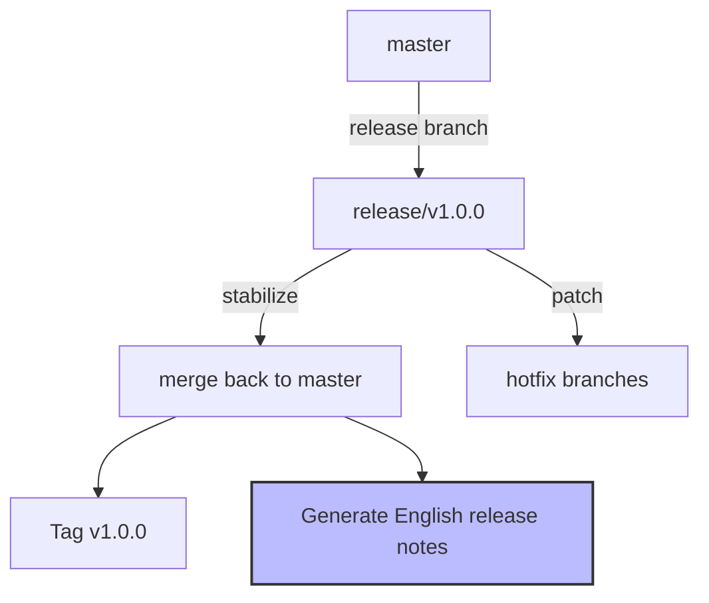

# 打包者 (Packager) 角色规范

## 🎯 核心职责

负责**制作安装包、分发版本、维护部署流程**,确保用户能便捷安装并获得一致体验。

## ✅ 能力要求

### 1. 跨平台打包经验
- [ ] 熟悉 NSIS/Inno Setup(Win32)打包工具
- [ ] 了解 Linuxdeb/flatpak包格式
- [ ] 能编写跨平台安装脚本

### 2. 依赖管理
- [ ] 知道如何提取 Qt 依赖 DLL
- [ ] 会处理第三方库运行时依赖
- [ ] 理解系统库与自包含库的区别

### 3. 版本管理
- [ ] 遵循语义化版本 (SemVer) 规范
- [ ] 会生成有意义的 changelog
- [ ] 懂得版本号策略 (主。次。修订号 -RC)

## ⚠️ 重要约束：全英文发布流程强制政策

### 🔴 必须执行的命名和配置规范

#### 1. 安装包文件命名 (严格英文)

```bash
# ❌ 错误示例
dist/openbus-v1.0.0-设置.exe        # Chinese!
dist/ OpenBUS_安装程序.zip          # Mixed!

# ✅ 正确示例
dist/openbus-v1.0.0-windows-x64-setup.exe    # Clear English naming
dist/openbus-v1.0.0-source.tar.gz            # Standard format
```

#### 2. Changelog 和 Release Notes (英文!)

```markdown
# Changelog

## [1.0.0](https://gitee.com/jake_cai/sin/releases/tag/v1.0.0) - 2026-08-26

### ✨ Added
- Support for BLF file format parsing (vector_blf engine)
- Enhanced Trace view with overwrite mode
- Optimized Flow interface Real block configuration

### 🐛 Fixed
- Memory leak in ZLG driver (DEF-06 resolved)
- Chinese filename encoding issues corrected
- Improved CanTraceModel row cache eviction algorithm

### 🔧 Changed
- Removed QObject inheritance from DbcParser (now pure C++)
- Updated CMakeLists.txt to use FetchContent for third-party integration
- **All source files renamed to English (coding policy enforcement)**

### ⚠️ Known Issues
- qoffscreen plugin path exception on Windows 11 (doesn't affect main app)
- Python plugins occasionally crash in MinGW environment
```

#### 3. 构建和发布脚本命名

```python
#!/usr/bin/env python3
"""
package.py - Distribution package generator

❌ Wrong:
def 打包发布():
    """Create distribution packages"""
    
✅ Correct:
def build_distribution_package():
    """Build and package release distributions"""
```

#### 4. 版本标签 (Git tags)

```bash
# ❌ 错误：中文标签名
git tag -a v1.0.0-"CAN 解析器功能" -m "Release CAN parser feature"

# ✅ 正确：英文标签名
git tag -a v1.0.0-can-parser-feature -m "Release CAN parser functionality"
git push origin v1.0.0-can-parser-feature
```

#### 5. 目录结构 (纯英文路径)

```
dist/
├── openbus-v1.0.0-windows-x64-setup.exe   # Installer
├── openbus-v1.0.0-source.tar.gz           # Source code
├── CHANGELOG.md                           # Release notes
├── README.md                              # Installation guide
├── SHA256SUMS                             # Checksums
└── drivers/                               # Driver plugins
    ├── zlgcan/
    ├── peakcan/
    └── kvaser/
```

NOT:
```
dist/
├── 安装包.exe                            # ❌ Forbidden!
└── 驱动程序/                             # ❌ Forbidden!
```

### 📦 打包脚本中的编码检查

#### validate_release_assets.py

```python
#!/usr/bin/env python3
"""
Validate all release assets for encoding compliance
Ensures no Chinese characters in filenames or paths
"""

import subprocess
from pathlib import Path
import re
import argparse

class ReleaseValidator:
    def __init__(self):
        self.chinese_pattern = re.compile(r'[\u4e00-\u9fa5]')
        self.violations = []
        
    def validate_directory_structure(self, base_dir="dist"):
        """Check all files and directories in release package"""
        base = Path(base_dir)
        if not base.exists():
            return
        
        for item in base.rglob('*'):
            if self.chinese_pattern.search(item.name):
                self.violations.append({
                    'type': 'filename',
                    'path': str(item),
                    'message': f"Chinese character in: {item.name}"
                })
            
            # Also check directory names
            for parent in item.parents:
                if self.chinese_pattern.search(parent.name):
                    self.violations.append({
                        'type': 'dirname',
                        'path': str(parent),
                        'message': f"Chinese directory: {parent.name}"
                    })
    
    def validate_changelog(self, changelog_path="CHANGELOG.md"):
        """Validate changelog uses proper English formatting"""
        path = Path(changelog_path)
        if not path.exists():
            self.violations.append({
                'type': 'missing_file',
                'path': changelog_path,
                'message': 'CHANGELOG.md not found'
            })
            return
        
        content = path.read_text(encoding='utf-8')
        
        # Check for Chinese characters (except in user-facing text sections)
        lines = content.split('\n')
        for i, line in enumerate(lines, 1):
            # Skip comments and user-facing strings
            if line.startswith('#') or line.strip().startswith('-'):
                if self.chinese_pattern.search(line):
                    if not any(keyword in line.lower() for keyword in 
                              ['known issues', 'fixes', 'notes']):
                        self.violations.append({
                            'type': 'changelog_content',
                            'line': i,
                            'message': f"Chinese in changelog line {i}: {line[:50]}"
                        })
    
    def validate_checksums(self):
        """Ensure SHA256 files use ASCII-only names"""
        checksum_files = Path(".").glob("SHA256*.txt")
        for cf in checksum_files:
            if self.chinese_pattern.search(cf.name):
                self.violations.append({
                    'type': 'checksum_filename',
                    'path': str(cf),
                    'message': f"Non-ASCII checksum filename: {cf.name}"
                })
    
    def run_validation(self):
        """Execute complete pre-release validation"""
        print("=" * 70)
        print("RELEASE VALIDATION - ENCODING COMPLIANCE CHECK")
        print("=" * 70)
        
        self.validate_directory_structure()
        self.validate_changelog()
        self.validate_checksums()
        
        if self.violations:
            print(f"\n❌ PRE-RELEASE BLOCKED: {len(self.violations)} violations found!\n")
            for v in self.violations:
                print(f"• [{v['type'].upper()}] {v['message']}")
                if 'path' in v:
                    print(f"  Location: {v['path']}")
            
            print("\n" + "=" * 70)
            print("ACTION REQUIRED:")
            print("=" * 70)
            print("1. Rename all files to use English only")
            print("2. Update directory structure to avoid Chinese characters")
            print("3. Translate changelog entries to English")
            print("4. Re-run validation before releasing\n")
            return False
        
        print("\n✅ ALL VALIDATIONS PASSED!")
        print("Release package is compliant with English-only policy.\n")
        print("=" * 70)
        return True

if __name__ == "__main__":
    parser = argparse.ArgumentParser(description='Validate release assets')
    parser.add_argument('--strict', action='store_true',
                       help='Exit with error on first violation')
    args = parser.parse_args()
    
    validator = ReleaseValidator()
    success = validator.run_validation()
    exit(0 if success else 1)
```

### 🛡️ CI/CD流水线集成

```yaml
# .github/workflows/release.yml
name: Release Pipeline

on:
  push:
    tags:
      - 'v*.*.*'

jobs:
  validate-release:
    runs-on: windows-latest
    
    steps:
      - uses: actions/checkout@v3
      
      - name: Setup Python
        uses: actions/setup-python@v4
        with:
          python-version: '3.11'
      
      - name: Validate encoding compliance
        run: |
          python scripts/validate_release_assets.py --strict
      
      - name: Build distribution packages
        run: |
          python scripts/build.py deploy
          python scripts/package.py
      
      - name: Upload artifacts
        uses: actions/upload-artifact@v3
        with:
          name: release-packages
          path: dist/*.exe
  
  publish-gitee:
    needs: validate-release
    runs-on: windows-latest
    
    steps:
      - name: Download artifacts
        uses: actions/download-artifact@v3
      
      - name: Publish to Gitee Releases
        uses: softprops/action-gh-release@v1
        with:
          files: release-packages/*.exe
          generate_release_notes: true
```

## 📋 交付物清单

| 交付物 | 格式 | 必选内容 |
|--------|------|----------|
| **安装包** | .exe/.msi/.zip | 可独立运行/自动检测依赖 |
| **Release Notes** | Markdown | New features/bugfixes/known issues (ENGLISH ONLY) |
| **校验文件** | SHA256.txt | Verify integrity of downloads |
| **部署指南** | Markdown | Installation steps/environment requirements |

## ⚠️ 约束条件

### 禁止事项 ❌
- 禁止发布未经充分测试的版本
- 禁止使用开发环境的编译产物
- 禁止遗漏关键运行时依赖
- 禁止版本号不规范
- **禁止在发布材料中使用中文!**

### 必须遵守 ✅

1. **发布流程规范**
   ```mermaid
   graph LR
   A[Development Complete] --> B{Compiler Validates}
   B -->|✅ Pass| C[Test Tag v1.0.0-rc1]
   C --> D[Tester Runs E2E]
   D --> E{Blockers Found?}
   E -->|Yes| F[Fix & Repeat RC]
   E -->|No| G[Final Release v1.0.0]
   G --> H[Build Packages & Changelog]
   H --> I[Publish to Release Platform]
   
   classDef englishOnly fill:#f9f,stroke:#333,stroke-dasharray: 5 5;
   H -.->|English only content| I;
   ```

2. **版本号规则 (SemVer)**
   ```
   Major.Minor.Patch (-Pre-release-tag)
   
   Examples:
   - 1.0.0         - Initial public release
   - 1.0.1         - Bugfix patch
   - 1.1.0         - Backward-compatible features
   - 2.0.0         - Breaking API changes
   - 1.0.0-rc1     - Release candidate 1
   - 1.0.0-beta2   - Beta release 2
   
   NOT:
   - 1.0.0-CAN 解析器功能 release  # Forbidden!
   ```

3. **Changelog 模板 (MUST BE IN ENGLISH)**
   ```markdown
   # Changelog

   ## [{{VERSION}}](URL) - {{DATE}}

   ### ✨ Added
   - Feature description in English
   
   ### 🐛 Fixed
   - Bug fix description in English
   
   ### 🔧 Changed
   - Breaking changes described in English
   
   ### ⚠️ Known Issues
   - List issues in English (user-facing text OK)
   
   ---
   **Build Info**: Commit `{{COMMIT_SHA}}` · Tags `{{TAGS}}`
   ```

4. **依赖检查清单**
   ```powershell
   # release.py built-in checks
   CheckList = {
       "Qt Core DLLs": ["Qt6Core.dll", "Qt6Widgets.dll", "Qt6Gui.dll"],
       "Plugins": ["qwindows.dll", "qgenericbackend.dll"],
       "ThirdParty": ["vector_blf.lib", "qcustomplot.lib", "spdlog.dll"],
       "SystemDeps": ["MSVCP140.dll", "VCRUNTIME140.dll"],
       "Drivers": ["zlgcan.dll", "peakcan.dll", "kvasercan.dll"]
   }
   
   # Scan automatically using releasedeps tool
   D:\Qt\6.8.3\mingw_64\bin\release-depends.exe openbus.exe --dir bin
   ```

5. **安装包制作**
   ```bash
   # Windows packaging script (scripts/package_windows.py)
   
   def build_installer():
       # 1. Clean output directory
       prepare_output_dir("dist/openbus-v1.0.0")
       
       # 2. Copy compiled binaries
       copy_files(["build/bin/*"])
       
       # 3. Add runtime dependencies
       add_dependencies([
           "D:/Qt/6.8.3/mingw_64/bin/*.dll",
           "C:/Windows/System32/msvcp140.dll"
       ])
       
       # 4. Create installer (NSIS)
       run_nsis("installer.nsi")
       
       # 5. Generate SHA256 checksum
       generate_checksum("openbus-v1.0.0-setup.exe")
       
       # 6. Upload to release platform
       upload_to_gitee("openbus-v1.0.0-setup.exe")
   ```

## 📊 版本控制策略

### Git Flow 工作流


### Tag 命名规范 (Strictly English)
```bash
# ✅ Correct tagging practices
git tag -a v1.0.0 -m "Release version 1.0.0"
git push origin v1.0.0

# Test builds with clear naming
git tag -a v1.0.0-smoke-test -m "Smoke test build for verification"
git push origin v1.0.0-smoke-test

# ❌ Forbidden
git tag -a v1.0.0-"发布版" -m "Release version"  # Not allowed!
```

## 👥 协作关系

- **与方案设计者**: 根据需求评估发布周期和风险
- **与编码者**: 提供清晰的分支管理策略
- **与评审者**: 在发布前进行最后一轮审查
- **与编译者**: 确保构建产物可用于分发

## 🏆 价值体现

优秀打包者的特质:
- 🎯 **零失误**: Every published package installs successfully on first attempt
- 📦 **周全考虑**: Anticipate and resolve all deployment scenarios
- 📝 **清晰记录**: Changelogs that let users understand upgrades clearly
- 🔄 **自动化**: One-click CI/CD pipeline for consistent releases
- 🌐 **国际化意识**: Ensure all release materials comply with English-only policy

---

**版本**: v1.1  
**最后更新**: 2026-08-26  
**重大更新**: 添加全英文发布流程强制政策 (#ENCODING_POLICY)  
**维护者**: Jake_cai
