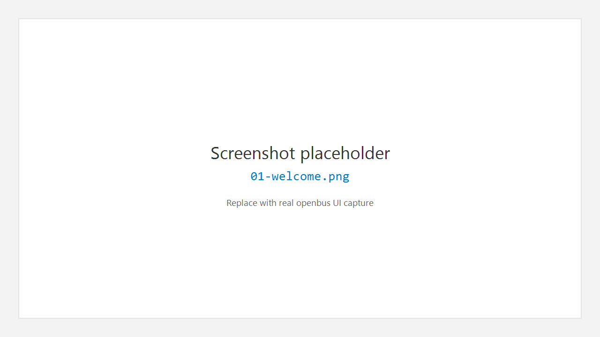

# 1. 产品介绍与安装

## 1.1 产品是什么

**OpenBus** 是面向汽车电子与工控现场的 **CAN / CAN FD 总线分析桌面软件**。它把工程管理、设备连接、测量配置（Flow）、实时报文列表（Trace）、信号波形（Graphic）、DBC 解码、报文收发与录制回放，以及可扩展的驱动 / 插件市场，组织在一个类似 VS Code 的工作台里。

典型用途包括：

- 实车 / 台架上实时抓取与过滤 CAN 报文
- 用 DBC 解码信号并在 Graphic 中观察波形
- 周期性 / 列表发送测试帧
- 录制 BLF / ASC / CSV，或回放已有日志做离线分析
- 通过扩展市场安装硬件驱动与领域套件（如诊断相关插件）

## 1.2 环境要求

| 项目 | 建议配置 |
|------|----------|
| 操作系统 | Windows 10 / 11，64 位 |
| 内存 | ≥ 8 GB（高负载 Trace + Graphic 建议 16 GB） |
| 显示 | 1920×1080 或更高 |
| 硬件 | 已支持的 CAN 适配器（如 ZLG、PEAK、Kvaser、Candle、SLCAN、BUSMUST 等，以市场驱动为准） |
| 可选 | 厂商官方驱动 / DLL（部分硬件需先安装厂商运行库） |

## 1.3 安装与启动

1. 获取发行包（**安装程序** `openbus-*-windows-x64-setup.exe` 或绿色压缩包）。
2. **安装程序**：启动后先选择安装向导语言（English / 简体中文 / Deutsch 等）。该选择会写入界面语言，首次打开软件即为对应语言（之后仍可在 **设置 → 常规 → Language** 中更改）。
3. 完成安装，或将绿色包解压到无特殊权限问题的路径。
4. 启动 **OpenBus**。首次通常进入 **Welcome** 页。

> **截图说明**：请截取最大化后的主窗口，包含顶部菜单、活动栏、Welcome 内容区与底部 Panel。

## 1.4 卸载

- **安装版**：使用系统「应用和功能」卸载。
- **绿色版**：退出程序后删除解压目录；用户配置一般位于本机用户目录下的应用数据文件夹（若发布说明中有路径，以说明为准）。

## 1.5 获取帮助

软件内：

- **Help > Welcome** — 欢迎页与入门提示
- **Help > Keyboard Shortcuts** — 快捷键
- **Help > Documentation** / **Website** / **Report Issue** — 文档与反馈入口

---

← [手册首页](README.md) · 下一章：[快速上手](02-getting-started.md) →
