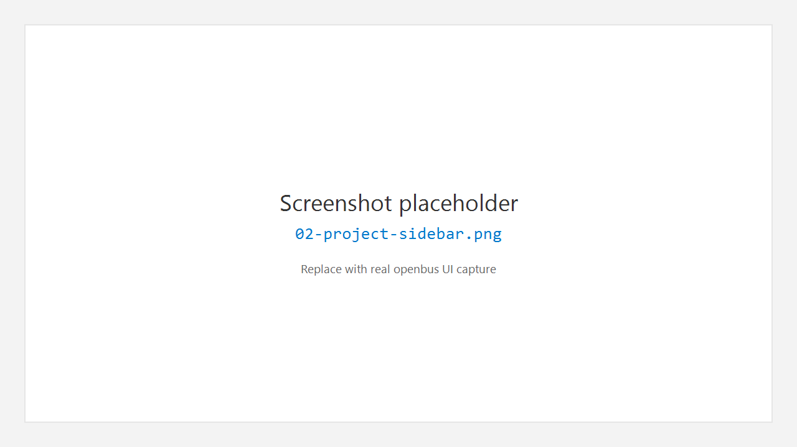
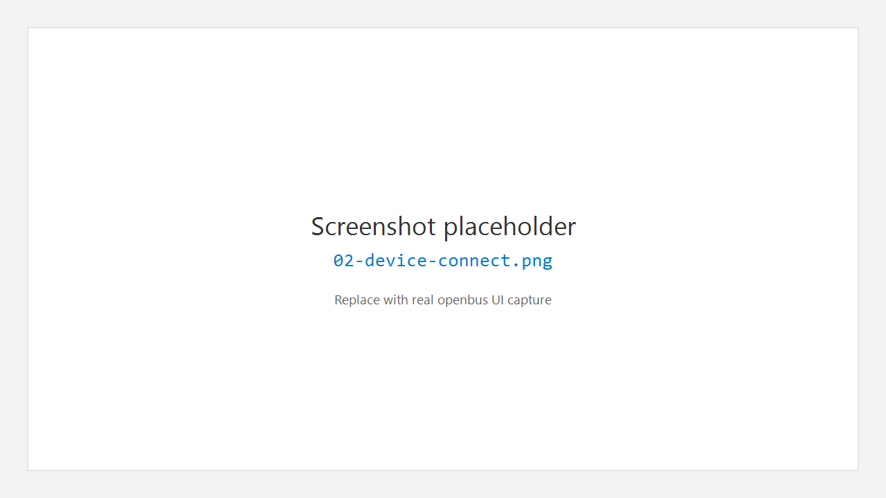
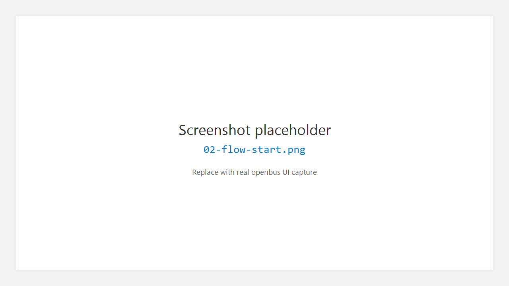
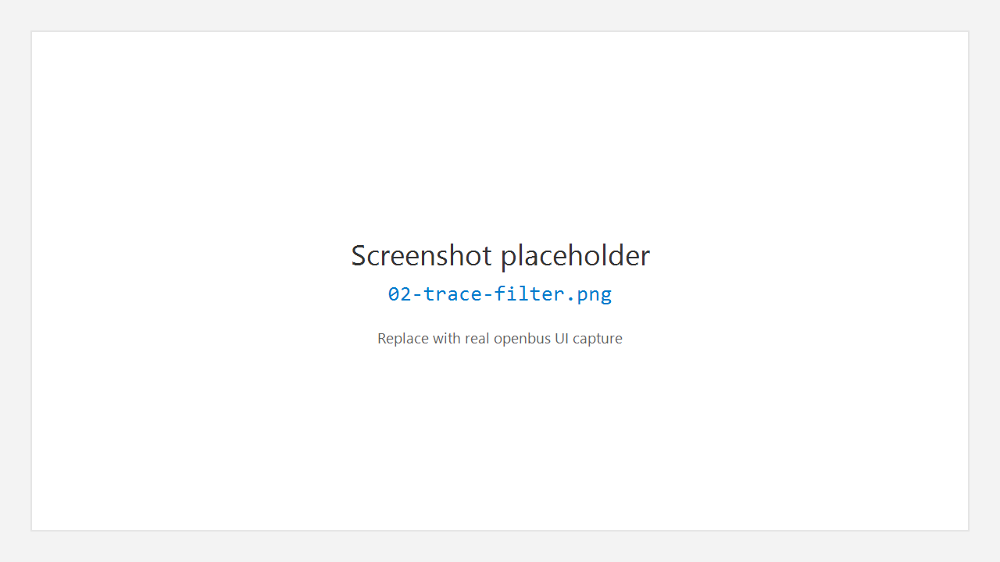
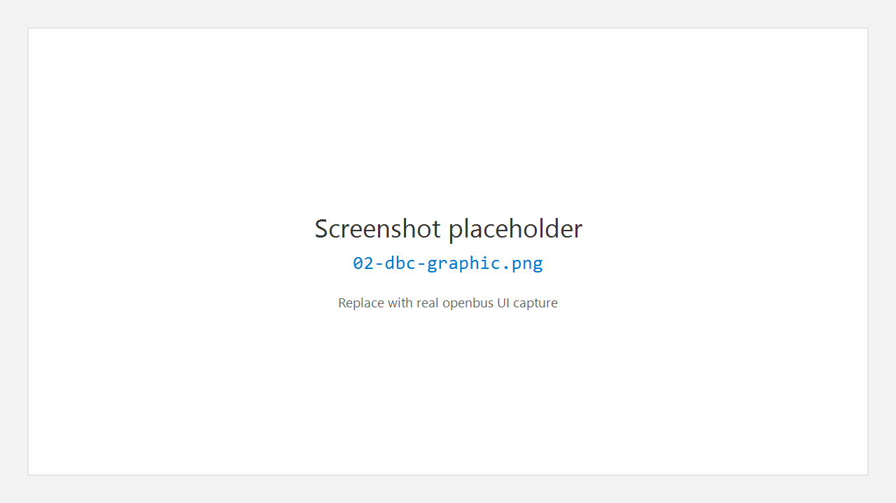

# 2. 快速上手

本章用一条「最小闭环」帮助你在约 10 分钟内看到实时报文。

## 2.1 推荐流程总览


## 2.2 步骤一：打开或新建工程

1. 点击左侧活动栏 **Project**。
2. 在侧栏选择 **New Project** 或 **Open Project**；也可使用菜单 **File > Open Project…**（`Ctrl+Shift+O`）。
3. 需要时用 **File > Save Project**（`Ctrl+Shift+S`）保存。



## 2.3 步骤二：连接设备

1. 点击活动栏 **Device**。
2. 在侧栏设备列表中选择适配器（或内置模拟器，若可用）。
3. 在编辑器中的设备页配置：
   - **CAN mode**：Classic 或 CAN FD
   - **Channels**：通道勾选
   - **Baud rate** / **Timing preset**
4. 点击 **Connect**。状态应变为 Connected；状态栏也会显示连接信息。



> 若按钮显示 **Connect (not implemented)**，表示当前类型驱动尚未接入，请换已支持的设备或先到 **Extensions** 安装对应驱动。

## 2.4 步骤三：启动 Flow 测量

1. 点击活动栏 **Flow**，打开测量配置视图。
2. 确认拓扑中包含 Trace / Graphic 等分析节点（按工程模板或自行添加）。
3. 点击界面上的 **Start**（或等价启动控件）开始全局测量。



## 2.5 步骤四：在 Trace 中查看报文

1. 点击活动栏 **Trace**，打开或新建 Trace 标签页。
2. 测量运行后，列表应滚动显示报文。
3. 可在过滤栏输入显示过滤表达式，例如：

```text
id == 0x123
```

按 Enter 或点击应用图标生效。



## 2.6 步骤五（可选）：加载 DBC 并看波形

1. 活动栏 **Database** → 在侧栏添加 / 打开 `.dbc` 文件。
2. 活动栏 **Graphic** → 添加要观察的信号。
3. 在 Trace 与 Graphic 之间可做选中 / 联动（以当前版本菜单与右键项为准）。



## 2.7 结束测量

- 在 Flow 中 **Stop** 停止测量。
- 设备页点击 **Disconnect** 断开硬件。

## 2.8 下一步

- 深入界面：[工作台总览](03-workbench.md)
- 发送 / 录制：[收发 Transceive](10-transceive.md)
- 装驱动与插件：[扩展与市场](11-extensions.md)

---

← [产品介绍](01-introduction.md) · [手册首页](README.md) · 下一章：[工作台总览](03-workbench.md) →
