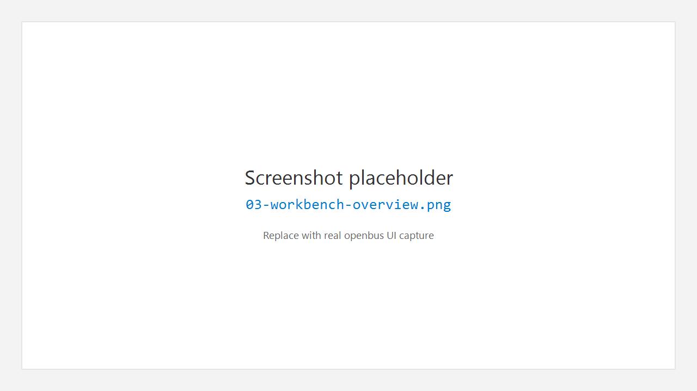
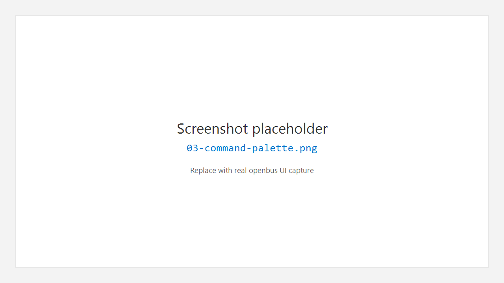

# 3. 工作台总览

openbus 的界面布局刻意对齐 **VS Code** 式工作台：左侧活动栏切换「工作区」，中间是编辑器标签，底部是共享 Panel，顶部是菜单与命令中心。

## 3.1 界面分区

```text
┌─ MenuBar / Command Center / 布局开关 / 窗口按钮 ─────────────┐
├─ ActivityBar ┬─ Side Bar ─┬─ Editor Tabs (Trace / Flow / …) ─┤
│  图标条      │  资源树     │                                 │
│              │            ├─────────────────────────────────┤
│              │            │ Bottom Panel (Terminal/Output/…) │
└──────────────┴────────────┴─────────────────────────────────┘
└─ Status Bar ────────────────────────────────────────────────┘
```



| 区域 | 作用 |
|------|------|
| **Activity Bar** | 在 Project / Flow / Device / Trace / Graphic / Database / Transceive / Extensions 之间切换 |
| **Side Bar** | 当前工作区的资源树、列表、快捷操作 |
| **Editor** | 主工作区；可用标签页、拆分、浮动窗口 |
| **Bottom Panel** | Terminal / Output / Problems / Extensions 输出，默认可见 |
| **Right Panel** | Inspector / Bookmarks / Watch 等辅助信息，默认隐藏 |
| **Status Bar** | Ready、连接状态、帧计数、选中行、时间等 |

## 3.2 布局开关

标题栏右侧提供三个布局切换按钮（与 VS Code 类似）：

| 操作 | 快捷键 | 说明 |
|------|--------|------|
| 切换左侧栏 | `Ctrl+B` | Primary Side Bar |
| 切换底部面板 | `Ctrl+J` | Panel |
| 切换右侧栏 | （按钮） | Secondary Side Bar |

菜单：**View > Primary Side Bar / Panel / Secondary Side Bar**，以及 **View > Reset Layout**。

## 3.3 菜单栏概要

| 菜单 | 常用项 |
|------|--------|
| **File** | Open File…、Open / Save Project、Import Log File…、Exit |
| **View** | 侧栏 / 面板、Welcome、Reset Layout、Command Center |
| **Tools** | Data Window、I/O Graph、Watcher、Color Rules… |
| **Help** | Welcome、About、文档、快捷键、许可证等 |

## 3.4 命令中心与命令面板

- 标题栏中部的搜索框：**Command Center**（`Ctrl+P`）
- 命令模式：`Ctrl+Shift+P`，可输入 `>` 前缀执行命令、打开视图



## 3.5 底部 Panel

默认打开，标签包括：

- **Terminal** — 内置终端工作区
- **Output** — 程序与插件通用输出
- **Problems** — 问题列表
- **Extensions** — 扩展相关输出

右上角提供清空、更多、关闭面板等操作（与 VS Code Panel 类似）。

## 3.6 状态栏阅读建议

- 左侧：主状态（如 Ready）与连接摘要
- 右侧：当前标签、帧数、选中信息、时间

状态栏是「安静提示」，详细日志请看底部 **Output**。

---

← [快速上手](02-getting-started.md) · [手册首页](README.md) · 下一章：[工程](04-project.md) →
