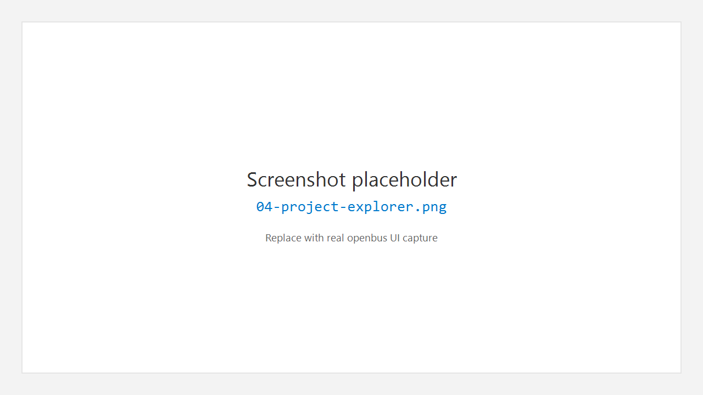

# 4. 工程 Project

## 4.1 作用

**Project** 工作区管理 OpenBus 工程：打开的工程树、最近项目，以及与会话相关的入口。工程用于记住测量布局、设备与分析窗口等配置（具体持久化字段以当前版本为准）。

## 4.2 打开工程工作区

1. 点击活动栏 **Project**。
2. 侧栏标题一般为 **EXPLORER**，下含分区，例如：
   - **Open Project**
   - **Recent**

## 4.3 新建 / 打开 / 保存

| 操作 | 入口 |
|------|------|
| 新建 | 侧栏 **New Project** 按钮，或工程相关菜单项 |
| 打开 | **File > Open Project…**（`Ctrl+Shift+O`）或侧栏 **Open Project** |
| 保存 | **File > Save Project**（`Ctrl+Shift+S`） |

## 4.4 最近项目

- Welcome 页与 Project 侧栏的 **Recent** 均可打开最近路径。
- Welcome 提供 **Clear Recent** 清空列表。

## 4.5 打开数据文件（非工程）

**File > Open File…**（`Ctrl+O`）可打开报文日志或 DBC 等文件，格式支持因构建而异，常见包括：

- 日志：`.blf`、`.asc`、`.csv`、`.pcap`、`.trc`
- 数据库：`.dbc`

**File > Import Log File…**（`Ctrl+I`）用于把日志导入 Trace。

---

← [工作台](03-workbench.md) · [手册首页](README.md) · 下一章：[设备](05-device.md) →
