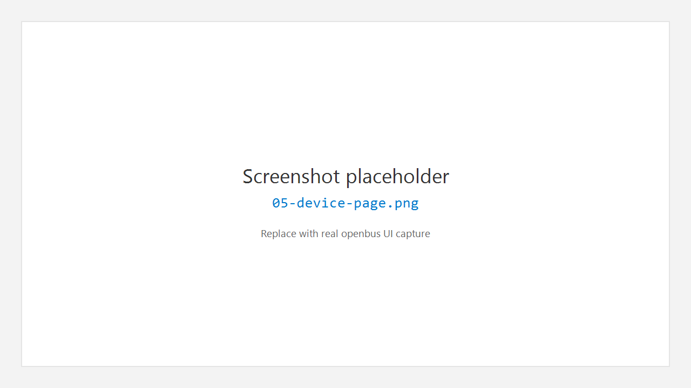

# 5. 设备 Device

## 5.1 作用

**Device** 用于选择 CAN 适配器、配置波特率 / 时序、连接与断开。连接成功后，收发与测量才有真实总线数据（或模拟器数据）。

## 5.2 选择设备

1. 活动栏点击 **Device**。
2. 侧栏 **Devices** 分区列出已发现设备 / 已配置项。
3. 点击某一设备，编辑器打开设备配置页。

## 5.3 基本配置

| 字段 | 说明 |
|------|------|
| **CAN mode** | `CAN 2.0A (Classic)` 或 `CAN FD (ISO 11898-1)` |
| **Channels** | Channel 1 / Channel 2 等通道使能 |
| **Baud rate** | 仲裁段波特率，可手输 |
| **Timing preset** | 时序预设（如 CiA recommended） |
| **Data baud rate** | 仅 CAN FD：数据段波特率 |
| **Data phase timing** | 仅 CAN FD：数据段时序预设 |

部分驱动（如 SLCAN / 部分 USB 方案）由驱动自动管理时序，预设下拉可能禁用，并显示 Driver auto timing 提示。

## 5.4 连接与断开

1. 确认至少勾选一个通道。
2. 点击 **Connect**。
3. 成功后状态为 **Connected: …**，**Disconnect** 可用。
4. 点击 **Disconnect** 断开。

### 常见提示

| 现象 | 处理 |
|------|------|
| Select at least one channel | 勾选通道 |
| Invalid arbitration / data-phase baud rate | 检查波特率数字 |
| Connect (not implemented) | 该 DeviceKind 未实现，换设备或装驱动 |
| Connect failed (see output / log) | 打开底部 **Output**，检查驱动、权限、占用 |

## 5.5 与 Flow / Trace 的关系

- **Connect** 只建立设备会话。
- 要让 Trace / Graphic **持续收数**，通常还需在 **Flow** 中 **Start** 测量（见 [Flow](06-flow.md)）。

---

← [工程](04-project.md) · [手册首页](README.md) · 下一章：[Flow](06-flow.md) →
