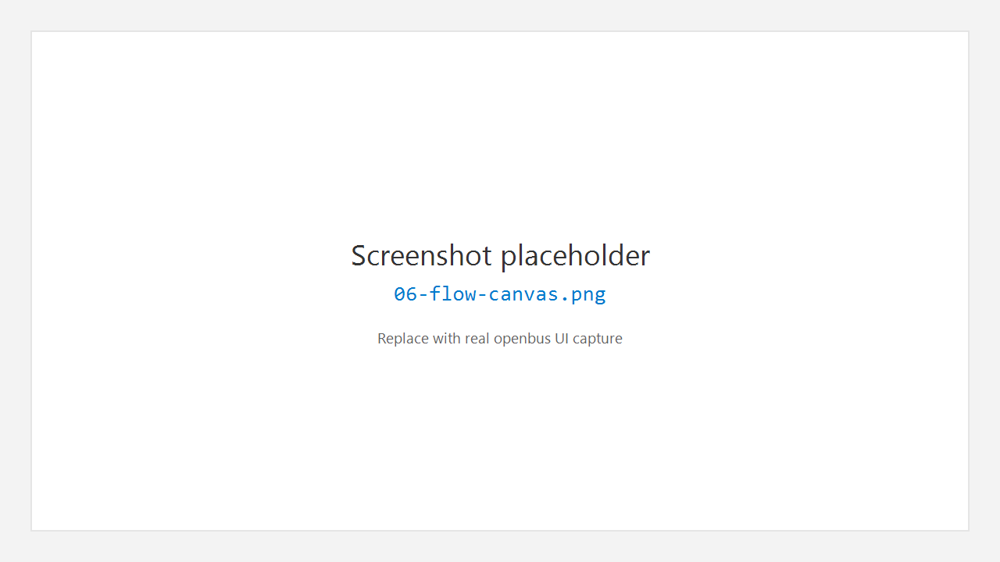

# 6. Flow 测量配置

## 6.1 作用

**Flow**（活动栏图标，分析 / Measurement Setup）用于配置「测量拓扑」：哪些分析窗口参与本次测量、如何启动与停止全局测量。它对应业界常见的 Measurement Setup 思路。

## 6.2 打开 Flow

1. 点击活动栏 **Flow**。
2. 侧栏可管理已打开的 Flow 编辑器、新建 Protocol Flow 等。
3. 中央画布显示节点与连线（具体节点类型随版本扩展）。

## 6.3 启动与停止测量

1. 确保设备已 **Connect**（若使用真实总线）。
2. 在 Flow 工具区点击 **Start**（或等价控件）开始测量。
3. Trace / Graphic 等已挂到测量中的视图开始更新。
4. 点击 **Stop** 结束测量。

> 状态栏会反映测量相关帧计数；详细日志见 **Output**。

## 6.4 与 Trace / Graphic 实例

- 可从 Flow 或 Trace / Graphic 侧栏 **New Trace** / **New Graphic** 创建多个实例。
- 工程保存时可记住布局与实例关系（以当前工程格式为准）。

## 6.5 使用建议

- 先连设备，再 Start，避免空跑。
- 高负载场景下先只开必要 Trace 窗口，确认稳定后再加 Graphic。
- 修改波特率后：Stop → Disconnect → 改配置 → Connect → Start。

---

← [设备](05-device.md) · [手册首页](README.md) · 下一章：[Trace](07-trace.md) →
