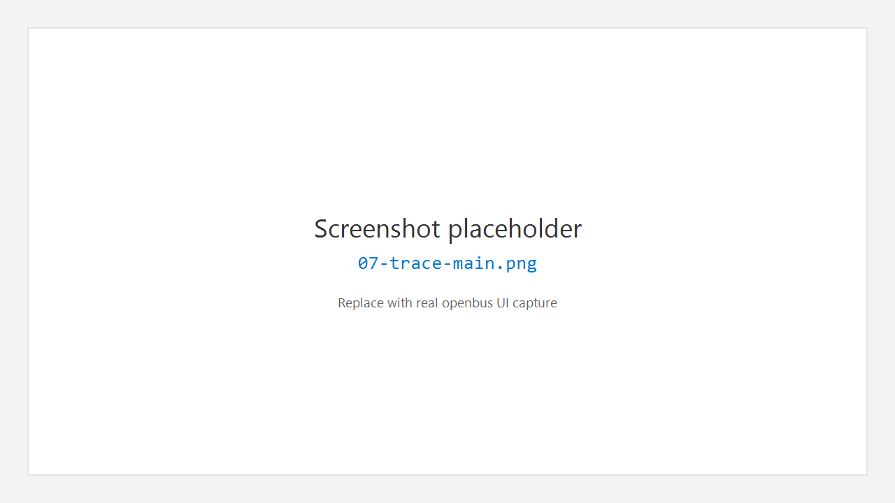
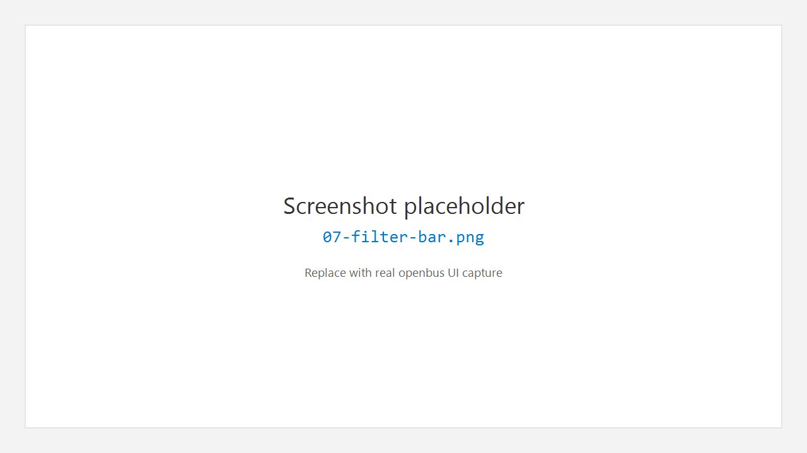

# 7. Trace 报文列表

## 7.1 作用

**Trace** 以表格形式显示总线帧（时间、通道、ID、方向、DLC、数据等），支持显示过滤、着色、导出，并与 Graphic 等工具联动。

## 7.2 打开 Trace

1. 活动栏 **Trace**。
2. 侧栏 **Open Editors** / **New Trace** 管理实例。
3. 编辑器中出现 Trace 标签页。



## 7.3 过滤栏（Display Filter）

顶部过滤栏支持表达式过滤（语法帮助见过滤栏 **?** 图标）。

示例：

```text
id == 0x123
id == 0x123 and fd
```

| 操作 | 说明 |
|------|------|
| Enter / Apply | 应用过滤 |
| Clear | 清除表达式 |
| Presets | 过滤预设 |
| Clear list | 清空列表中的帧（`Ctrl+L` 清空 Trace 相关操作以快捷键页为准） |

语法正确时输入框背景偏绿，错误时偏红。



## 7.4 列表操作（常见）

- **滚动 / 自动滚动**：跟随最新帧（可用自动滚动开关）。
- **选中行**：状态栏显示选中信息；右侧 Inspector 可显示详情（若打开右栏）。
- **右键菜单**：复制、应用为过滤、标记着色、导航等（以实际菜单为准）。
- **导出**：将当前可见或选中帧导出为支持的日志格式。

## 7.5 导入日志

- **File > Import Log File…**（`Ctrl+I`）
- 或 **File > Open File…** 打开日志后进入分析流程

离线批量文件也可使用 Transceive 中的 **Offline Analysis**（见 [收发](10-transceive.md)）。

## 7.6 性能提示

- Trace 为高频路径：过滤尽量精确，避免无过滤下无限累积过大会话时仍开大量着色规则。
- 与 Graphic 同时高负载时，优先保证测量 Stop / Start 节奏清晰。

---

← [Flow](06-flow.md) · [手册首页](README.md) · 下一章：[Graphic](08-graphic.md) →
