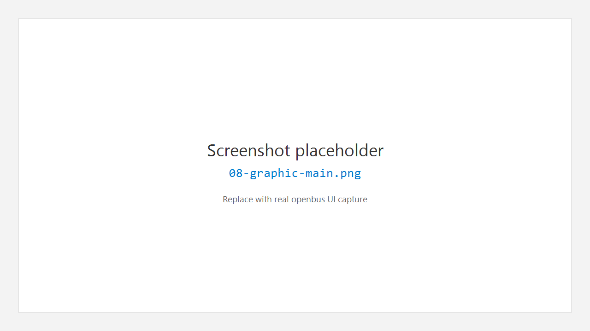

# 8. Graphic 波形

## 8.1 作用

**Graphic** 将 DBC 信号（或选定变量）以时间为横轴绘制波形，用于观察数值变化、对比多信号、光标测量。

## 8.2 打开 Graphic

1. 活动栏 **Graphic**。
2. 侧栏 **New Graphic** 或打开已有编辑器。
3. 从 Database / Trace / 信号选择器添加信号到视图。

## 8.3 基本操作（概念）

| 操作 | 说明 |
|------|------|
| 添加信号 | 从 DBC 树或选择对话框勾选信号 |
| 显示 / 隐藏 | 信号列表中切换可见性 |
| 缩放 / 平移 | 鼠标滚轮、拖拽或工具栏（以界面为准） |
| 光标 | 放置测量光标，查看时刻与差值 |
| 暂停 | 暂停视图刷新（数据路径仍可能在后台累计） |

## 8.4 与 Trace / DBC 的关系

- 无 DBC 时，通常只能看原始帧级信息；**解码物理量波形需要先加载 DBC**。
- Trace 中选中帧 / 信号可「发送到 Graphic」（若右键菜单提供该动作）。

## 8.5 使用建议

- 同时观察的信号数量宜适量；过多曲线会影响可读性与性能。
- Overlay（叠加）与分轨显示模式以工具栏选项为准；默认偏向清晰对比。

---

← [Trace](07-trace.md) · [手册首页](README.md) · 下一章：[Database](09-database.md) →
