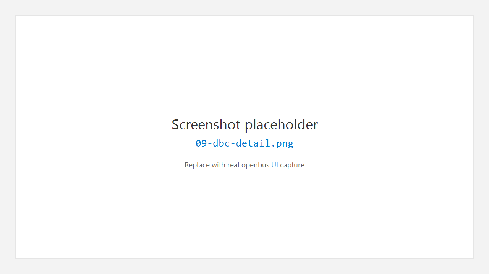

# 9. Database 数据库（DBC）

## 9.1 作用

**Database** 管理工作中的解码数据库（当前以 **DBC** 为主）：加载文件、浏览节点 / 报文 / 信号、查看属性与 Value Table。Trace 解码与 Graphic 信号均依赖此处加载的定义。

## 9.2 打开数据库工作区

1. 活动栏 **Database**。
2. 侧栏 **Databases** 列出已加载文件。
3. 双击或打开后，编辑器显示 DBC 详情（左树右表）。

## 9.3 加载 DBC

常见入口：

- 侧栏添加 / 打开 `.dbc`
- **File > Open File…** 选择 `.dbc`
- 工程内已保存的数据库引用（打开工程后自动恢复）

## 9.4 浏览结构

左侧树通常包含：

- 报文（Message）与 CAN ID
- 信号（Signal）
- 网络节点（Node）
- Value Table 等

右侧根据选中项显示：

- 报文信号表（起始位、长度、字节序、因子、偏移、单位等）
- 信号属性
- 节点 TX / RX 列表

顶部搜索框可快速过滤树节点。

## 9.5 与发送 / 观测的关系

- **Send（Transceive）** 可从 DBC 导入报文到发送列表。
- **Watcher** 可从已加载 DBC 多选信号加入观测。
- **Graphic** 按信号定义取物理值曲线。

## 9.6 注意

- DBC 编码、扩展帧、多文件合并策略以当前解析器为准。
- 修改外部 DBC 文件后，需在软件内重新加载才能生效。

---

← [Graphic](08-graphic.md) · [手册首页](README.md) · 下一章：[收发](10-transceive.md) →
