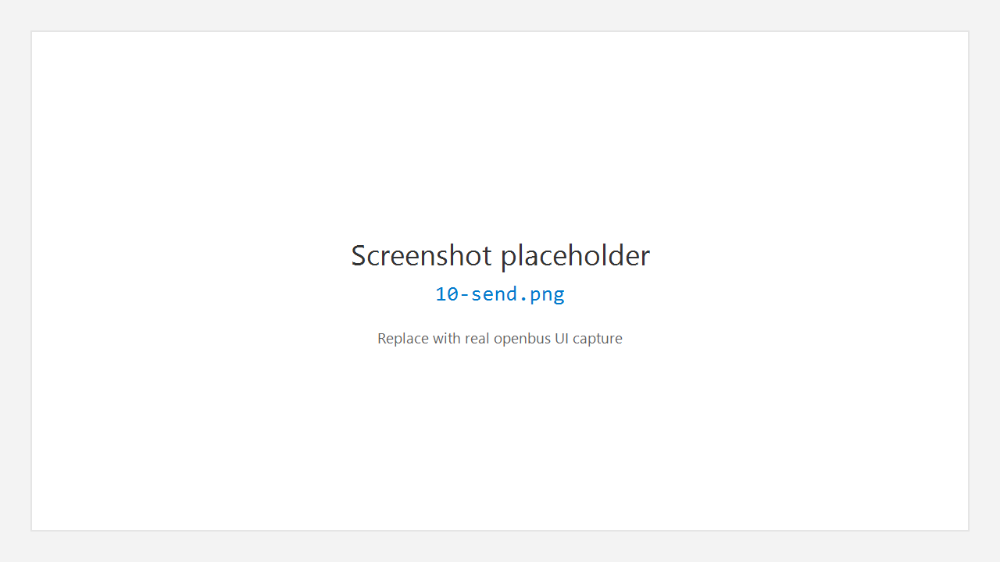
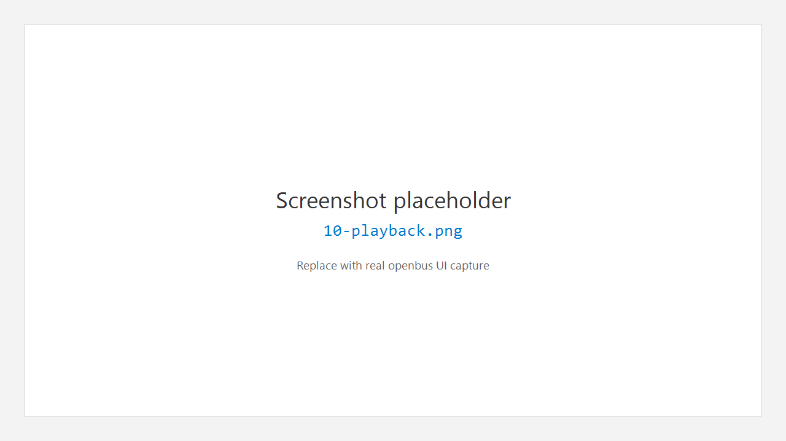
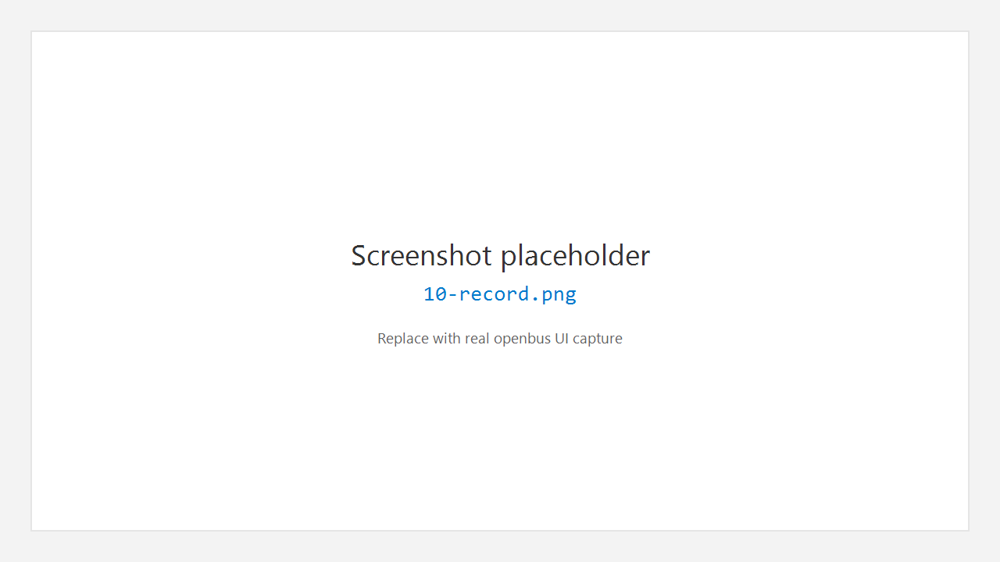
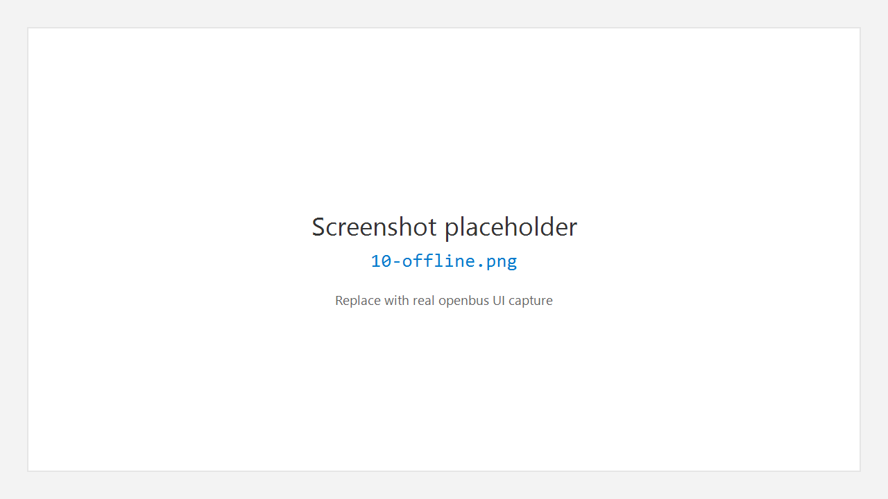

# 10. 收发 Transceive

活动栏 **Transceive** 聚合与「发送 / 回放 / 录制 / 离线」相关的页面，通常通过侧栏或标签切换。

## 10.1 发送 Send

用于编辑发送列表、周期发送与单帧发送。

### 界面结构

- 工具栏：**Send All** / **Stop All** / **Clear List**
- 上表：发送列表（On、ID、Name、DLC、Data、Period、Count、Status、Actions）
- 下区：**Edit frame** — ID / DLC / Data、Period、Count，以及 **Import from DBC**、**Add to List**、**Send Once**

### 推荐步骤

1. 设备已 Connect，Flow 已 Start（若需要回显进 Trace）。
2. 手填 ID / Data，或 **Import from DBC**。
3. **Add to List**，勾选 **On**。
4. 行内 Send，或顶部 **Send All**。
5. **Stop All** 或行内 Stop 结束周期发送。

| 状态文案 | 含义 |
|----------|------|
| Ready | 就绪 |
| Sending | 发送中 |
| Stopped | 已停止 |

## 10.2 回放 Playback

将日志按时间轴回放到总线或分析链路。

1. **Add files** 或拖入 `.blf` / `.asc` / `.csv` 等。
2. 选择文件行，使用 **Play** / **Pause** / **Stop**。
3. 调节 **Speed**、**Loop**、**Auto-scroll during playback**。
4. **Playback settings** 中可限制 Channel / Direction / Protocol / Filter。

## 10.3 录制 Record

将总线数据写入文件。

1. 设置 **文件目录**、**前缀**、**格式**（BLF / ASC / CSV）。
2. 可选：按大小 / 时间分割、环形覆盖、缓冲区大小。
3. **录制过滤**：全部 / 仅 Rx / 仅 Tx / 仅 CAN FD，以及 ID 列表。
4. 可选启用 **Trigger Recording**（表达式触发、前后缓冲）。
5. **开始录制** / **暂停** / **停止**。

## 10.4 离线分析 Offline Analysis

批量添加分析文件，解析帧数、时长、大小，再送入后续分析。

1. **Add files** 或拖放。
2. 列表显示解析进度与摘要。
3. 按界面提供的方式打开 Trace / 继续分析（以当前按钮为准）。

---

← [Database](09-database.md) · [手册首页](README.md) · 下一章：[扩展](11-extensions.md) →
