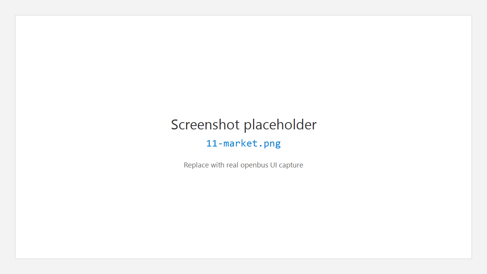

# 11. 扩展与市场 Extensions

## 11.1 作用

**Extensions** 提供驱动与插件的发现、安装、启用与运行入口，侧栏迷你列表与完整 **Marketplace** 页配合使用。

## 11.2 打开市场

1. 活动栏 **Extensions**。
2. 侧栏查看 **Installed** / **Running** 等分区。
3. 打开完整市场页：浏览卡片、搜索、进入详情。

## 11.3 搜索与安装

1. 在市场搜索框输入型号 / 厂商 / 关键词，点 **Search** 或 Enter。
2. 在卡片上点 **Install**，或进入详情再安装。
3. 安装完成后，在侧栏 **Installed** 中可见；驱动类扩展需按说明重启或重新扫描设备。

## 11.4 运行插件

- 已安装插件：侧栏双击或详情中 **启动** / **停止运行**。
- 齿轮菜单提供更多操作（启用 / 禁用 / 卸载等）。

## 11.5 领域套件（简介）

市场中可能提供独立领域窗口（例如诊断、DBC Studio、协议相关套件）。它们通常有自己的左侧导航与 OUTPUT，用法以套件内帮助或发布说明为准。安装后从市场或侧栏启动。

## 11.6 注意

- 安装来源应可信；校验哈希失败时勿强行安装。
- 硬件驱动常依赖厂商运行库，请先按驱动文档安装系统组件。

---

← [收发](10-transceive.md) · [手册首页](README.md) · 下一章：[其他工具](12-tools.md) →
