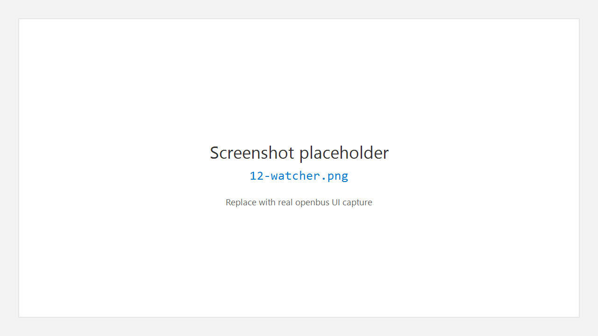

# 12. 其他工具

## 12.1 Watcher 观测

**Tools > Watcher**（`Ctrl+Shift+W`）

对标调试器 Watch（Ozone / IAR / Keil）风格：

- **Watch**：从已加载 DBC 添加信号；列含当前值、VAL_ 符号名、原始值、Age、Min/Max；值变化短暂高亮。
- **更新频率**：工具栏可选 50–2000 ms（默认 200 ms）。
- **Freeze**：冻结表格显示；后台仍收帧。
- **录制**：勾选 **Rec** 或工具栏 Record，按「每次更新 / 仅变化」写入环形缓冲（每信号最多约 2000 点）；下方历史表查看；**Export CSV** 导出。
- **总线统计**：ID 频率、周期、抖动与错误计数摘要。

## 12.2 Data Window

**Tools > Data Window**（`Ctrl+Shift+D`）

用于以数据窗口方式查看选中信号 / 变量的数值呈现（适合仪表式观察）。具体列与刷新行为以当前版本界面为准。

## 12.3 I/O Graph

**Tools > I/O Graph**（`Ctrl+Shift+G`）

用于总线负载或收发速率类趋势图（若已启用）。可与测量同时打开，避免与 Graphic 信号波形混淆。

## 12.4 着色规则

**Tools > Color Rules…**

为 Trace 配置按条件着色的规则列表（自上而下匹配）。用于突出错误帧、特定 ID 或方向。

## 12.5 右侧辅助栏

打开 Secondary Side Bar 后：

- **Inspector** — 当前选中帧详情；可加入 Watch
- **Bookmarks** — 书签
- **Watch** — 快速监视列表

## 12.6 Settings

活动栏底部 **Settings**（齿轮）打开设置页，可调整通用选项；具体项以界面为准。

---

← [扩展](11-extensions.md) · [手册首页](README.md) · 下一章：[快捷键](13-shortcuts.md) →
