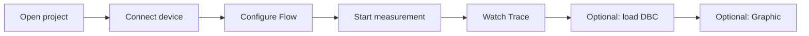

# 2. Getting started

This chapter walks a minimal closed loop so you can see live frames in about 10 minutes.

## 2.1 Recommended flow



## 2.2 Step 1: Open or create a project

1. Click **Project** in the activity bar.
2. In the side bar choose **New Project** or **Open Project**; or use **File > Open Project…** (`Ctrl+Shift+O`).
3. Save with **File > Save Project** (`Ctrl+Shift+S`) when needed.


## 2.3 Step 2: Connect a device

1. Click **Device** in the activity bar.
2. Select an adapter in the side-bar list (or the built-in simulator if available).
3. On the device page in the editor, configure:
   - **CAN mode**: Classic or CAN FD
   - **Channels**: enable channels
   - **Baud rate** / **Timing preset**
4. Click **Connect**. The status should become Connected; the status bar shows connection info as well.


> If the button shows **Connect (not implemented)**, that device kind is not wired yet — pick a supported device or install the matching driver under **Extensions**.

## 2.4 Step 3: Start Flow measurement

1. Click **Flow** to open the measurement setup view.
2. Confirm the topology includes Trace / Graphic (or other analysis nodes) from the template or your own edits.
3. Click **Start** (or the equivalent control) to begin global measurement.


## 2.5 Step 4: Watch frames in Trace

1. Click **Trace** to open or create a Trace tab.
2. With measurement running, the list should scroll with new frames.
3. Optionally enter a display filter, for example:

```text
id == 0x123
```

Press Enter or click Apply.


## 2.6 Step 5 (optional): Load DBC and plot signals

1. **Database** → add / open a `.dbc` in the side bar.
2. **Graphic** → add the signals you want to watch.
3. Trace and Graphic can link selection (see menus and context actions for the current build).


## 2.7 Stop measurement

- **Stop** in Flow to end measurement.
- **Disconnect** on the Device page to release hardware.

## 2.8 Next steps

- Layout deep dive: [Workbench overview](03-workbench.md)
- Send / record: [Transceive](10-transceive.md)
- Drivers and plugins: [Extensions](11-extensions.md)

---

← [Introduction](01-introduction.md) · [Manual home](README.md) · Next: [Workbench](03-workbench.md) →
