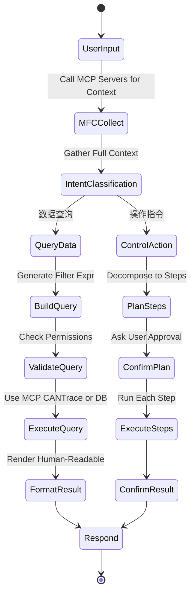
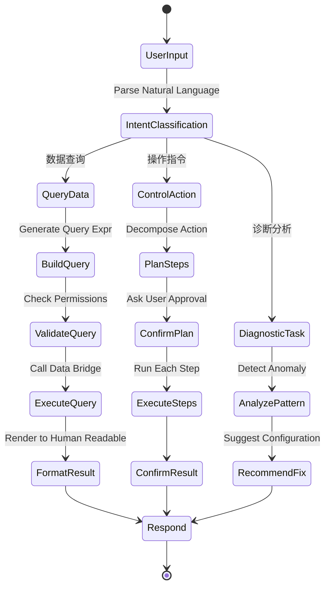

# openbus 插件系统方案

> 本文档由 README.md 分离整理而成，汇总插件系统全部设计内容
>（对标 VS Code Extension 模型：Python 独立进程 + JSON-RPC/二进制双通道 + 订阅制推送 + 声明式贡献点）。
>
> | 章节 | 内容 | 性质 |
> |------|------|------|
> | 一、插件系统架构设计（v2 重构方案） | 设计目标、进程模型、双通道通信、二进制数据协议、订阅制数据推送、Python SDK、plugin.json 与声明式贡献点、C++ 侧架构与集成点、v1→v2 对比迁移、目录结构、实施计划 | 设计方案 |
> | 二、插件扩展机制（实施版） | 落地总体架构、目录结构、清单文件 plugin.json、SDK API、通信协议、里程碑与现有组件集成方式 | ✅ 已实现 |
> | 三、插件 UI 能力（方案 A — PyQt6 独立窗口） | 五方案选型对比、实现原理、sin_host.py 事件循环、SDK ui 模块与示例 | ✅ 已实现 |
> | 六、插件市场与驱动市场前后端联调（对标 VS Code Marketplace） | 市场服务端（openbus_appstore）资产管线、market.json 索引 API、桌面端市场源配置、下载→校验→安装链、开发联调流程 | ✅ 已实现 |
> | 七、主程序↔插件链路审计与修复（2026-08-23） | 数据链路/控制链路逐方法比对审计、9 处缺口修复、E2E 验证工具与证据 | ✅ 已实施验证 |
> | 八、固化接口契约与舰队推广验证（2026-08-23） | 以 UDS 诊断客户端为参考实现的全链路契约（全方法清单 + SDK 速查）、新插件标准链路准入清单、5 插件舰队验证结果 | ✅ 已固化验证 |

---

## 一、插件系统架构设计（v2 重构方案）

> 参考 VS Code Extension API 设计思想，主进程（Qt C++）与插件进程（Python + PyQt6）完全隔离，双通道通信实现高效 raw data 交互，订阅制按需推送。

### 1. 设计目标

| 目标 | 说明 |
|------|------|
| **进程隔离** | 每个插件运行在独立 Python 进程中，插件崩溃不影响主程序和其他插件 |
| **高效数据传输** | 二进制协议替代 JSON，CAN 帧批量传输，吞吐量 ≥ 100k frames/s |
| **订阅制推送** | 插件按需订阅（CAN ID / 通道 / 信号），主程序仅推送匹配数据，无订阅 = 零开销 |
| **完整 SDK** | Python SDK 封装全部通信细节，插件开发者只需关注业务逻辑 |
| **VS Code 风格** | 激活事件、贡献点、命令注册、独立 UI 窗口，与 VS Code 扩展模型对齐 |
| **声明式贡献点** | 插件通过 `plugin.json` 声明式描述能力（命令/视图/设置/数据输入输出/协议解码器），主程序解析后即注册 UI 和数据路由，无需激活插件进程即可发现其全部能力 |
| **零侵入主程序** | 插件系统作为纯消费者连接到现有信号与单例，不修改任何现有源文件；集成点仅为一行 `PluginManager::instance()->initialize()` |
| **协议契约稳定** | 协议版本化（major.minor），仅增量演进——可新增消息类型/方法/字段，禁止修改已定义语义或二进制编码，禁止删除已发布接口；前后向兼容，旧插件与新主程序互操作 |

### 2. 进程模型

```
┌──────────────────────────────────────────────────────────────┐
│ 主进程 openbus.exe (Qt C++)                                    │
│                                                              │
│  ┌─────────────┐  ┌─────────────┐  ┌─────────────┐          │
│  │ TraceView   │  │ GraphicView │  │ MainWindow  │          │
│  └──────┬──────┘  └──────┬──────┘  └──────┬──────┘          │
│         │                │                │                  │
│  ┌──────┴─────────────────┴────────────────┴──────┐          │
│  │          PluginManager (C++ 单例)                │          │
│  │  · 发现插件 · 激活/停用 · 订阅路由 · 崩溃重启      │          │
│  └──┬───────────┬───────────┬───────────┬─────────┘          │
│     │           │           │           │                    │
│  ┌──┴──┐    ┌──┴──┐    ┌──┴──┐    ┌──┴──┐                 │
│  │Host1│    │Host2│    │Host3│    │HostN│  PluginHost(C++)  │
│  └──┬──┘    └──┬──┘    └──┬──┘    └──┬──┘  每插件一个进程    │
│     │           │           │           │                    │
└─────┼───────────┼───────────┼───────────┼────────────────────┘
      │ Named Pipe │           │           │
      │ + Binary   │           │           │
      ▼           ▼           ▼           ▼
┌───────────┐ ┌───────────┐ ┌───────────┐ ┌───────────┐
│ Plugin A  │ │ Plugin B  │ │ Plugin C  │ │ Plugin N  │
│ Python    │ │ Python    │ │ Python    │ │ Python    │
│ PyQt6     │ │ PyQt6     │ │ 无UI      │ │ PyQt6     │
│ openbus   │ │ openbus   │ │ openbus   │ │ openbus   │
│ SDK       │ │ SDK       │ │ SDK       │ │ SDK       │
└───────────┘ └───────────┘ └───────────┘ └───────────┘
```

**关键设计决策**：

- **每插件一进程**：`PluginHost` (C++) 通过 `QProcess` 为每个已激活插件启动独立 Python 进程，彻底隔离插件间影响
- **主从隔离**：主进程 C++ Qt6，插件进程 Python + PyQt6，通过 Named Pipe 通信，无共享内存竞争
- **崩溃自愈**：`PluginHost` 监控子进程状态，崩溃后指数退避重启（最多 3 次），超过则标记为「错误」状态
- **资源回收**：插件进程退出时，主程序自动清理该插件的所有订阅、命令注册、UI 窗口

### 3. 双通道通信架构

```
┌──────────────────────┐          ┌──────────────────────┐
│   主进程 (C++ Qt)     │          │  插件进程 (Python)    │
│                      │          │                      │
│  ┌────────────────┐  │          │  ┌────────────────┐  │
│  │ Control Channel│◄─┼──────────┼─►│ Control Channel│  │
│  │ JSON-RPC 2.0   │  │  Named   │  │ JSON-RPC 2.0   │  │
│  │ 命令/查询/配置   │  │  Pipe    │  │ 命令/查询/配置   │  │
│  └────────────────┘  │ (Text)   │  └────────────────┘  │
│                      │          │                      │
│  ┌────────────────┐  │          │  ┌────────────────┐  │
│  │  Data Channel   │◄─┼──────────┼─►│  Data Channel   │  │
│  │ Binary Protocol │  │  Named   │  │ Binary Protocol │  │
│  │ 帧批量/信号更新   │  │  Pipe    │  │ 帧批量/信号更新   │  │
│  └────────────────┘  │ (Binary) │  └────────────────┘  │
└──────────────────────┘          └──────────────────────┘
```

**为什么双通道？**

| 通道 | 协议 | 用途 | 吞吐量 |
|------|------|------|--------|
| Control | JSON-RPC 2.0 (UTF-8 text) | 激活/停用、命令注册、查询选中帧、DBC 解码请求、配置读写 | 低频，延迟敏感 |
| Data | Binary (自定义二进制协议) | CAN 帧批量推送、信号值更新、统计推送 | 高频，吞吐敏感 |

Named Pipe 在 Windows 上支持全双工、二进制模式，单管道吞吐量 > 200 MB/s，满足 CAN FD 最高速率需求。

### 4. 二进制数据协议

#### 4.1 消息包格式

所有 Data Channel 消息使用统一的二进制包格式：

```
┌──────────┬──────────┬──────────┬──────────────────────┐
│ Magic    │ MsgType  │ Payload  │ Payload Data         │
│ 4 bytes  │ 2 bytes  │ Length   │ N bytes              │
│ 0x4F425553│ uint16   │ 4 bytes  │                      │
│ "OBUS"   │          │ uint32   │                      │
└──────────┴──────────┴──────────┴──────────────────────┘
  固定头 10 bytes              变长 payload
```

#### 4.2 消息类型

| MsgType | 名称 | 方向 | Payload |
|---------|------|------|---------|
| 0x0000 | _保留（协议保留值，不使用）_ | — | — |
| 0x0001 | `FRAME_BATCH` | 主→插件 | N 个 CAN 帧的二进制打包 |
| 0x0002 | `SIGNAL_UPDATE` | 主→插件 | 信号名+值+时间戳的批量打包 |
| 0x0003 | `STATISTICS` | 主→插件 | 总线统计快照 |
| 0x0010 | `SUBSCRIBE` | 插件→主 | JSON 订阅请求 |
| 0x0011 | `UNSUBSCRIBE` | 插件→主 | JSON 取消订阅 |
| 0x0020 | `RPC_REQUEST` | 双向 | JSON-RPC 2.0 请求 |
| 0x0021 | `RPC_RESPONSE` | 双向 | JSON-RPC 2.0 响应 |
| 0x0022 | `RPC_NOTIFICATION` | 双向 | JSON-RPC 2.0 通知 |

#### 4.3 CAN 帧二进制编码

单帧编码（16 + N 字节，N = 实际数据长度 0-64）：

```
Offset  Size  Field         说明
0       4     can_id        CAN ID (bit31=扩展帧, bit30=FD, bit29=BRS, bit28=ESI)
4       1     flags         bit7=extended, bit6=fd, bit5=brs, bit4=esi, bit3=direction(0=Rx,1=Tx)
5       1     dlc           数据长度码 0-15
6       1     channel       通道号 (1-based)
7       1     data_length   实际数据字节数 (0-64)
8       8     timestamp_ns  纳秒时间戳 (相对起点)
16      N     data          原始数据 (N = data_length)
```

**批量帧编码**：`[uint16 frame_count][frame_1][frame_2]...[frame_N]`

**效率对比**（100 帧 Classic CAN，每帧 8 字节数据）：

| 编码方式 | 单帧大小 | 100 帧总大小 | 倍率 |
|---------|---------|------------|------|
| JSON-RPC (hex) | ~220 bytes | ~22,000 bytes | 1× (基准) |
| 二进制协议 | 24 bytes | 2,402 bytes | **9.2× 压缩** |

#### 4.4 Control Channel — JSON-RPC 2.0 方法清单

**主程序 → 插件**：

| Method | 说明 |
|--------|------|
| `activate` | 激活插件，传入 context 参数 |
| `deactivate` | 停用插件 |
| `executeCommand` | 执行插件注册的命令 |
| `fileOpened` | 通知文件打开事件 |
| `shutdown` | 优雅关闭 |

**插件 → 主程序**：

| Method | 说明 |
|--------|------|
| `output.append` | 追加文本到输出面板 |
| `output.clear` | 清空输出面板 |
| `sendFrame` | 请求发送 CAN 帧 |
| `registerCommand` | 注册命令到主程序菜单 |
| `frames.getSelected` | 查询 Trace 中选中的帧 |
| `frames.getRecent` | 查询最近 N 帧 |
| `signals.decode` | 请求 DBC 信号解码 |
| `signals.encode` | 请求 DBC 信号编码 |
| `workspace.getProjectDir` | 查询当前工程目录 |
| `workspace.getDbcFiles` | 查询已加载 DBC 文件列表 |
| `workspace.getSetting` | 读取应用设置 |
| `statusbar.set` | 设置状态栏文本 |
| `log` | 插件日志 |

> **双向通知**（连接建立后立即交换）

| Method | 方向 | 说明 |
|--------|------|------|
| `hello` | 双向 | 协议握手，交换 `{protocolVersion, sdkVersion, capabilities, supportedMethods}` |

#### 4.5 协议稳定性契约

协议是主程序与插件之间的**永久契约**，一经发布即冻结语义。以下规则确保插件一次编写、跨版本运行：

**版本协商**

```
连接建立
  │
  ├─ 插件 → 主: hello { protocolVersion: "1.0", sdkVersion: "1.2.3", capabilities: [...] }
  ├─ 主 → 插件: hello { protocolVersion: "1.0", appVersion: "3.5.0", capabilities: [...] }
  │
  ├─ major 版本相同? ── YES → 接受连接，双方取各自 minor 的较小值工作
  │                  ── NO  → 主发送 shutdown，终止连接
  │
  └─ 握手完成，后续通信使用双方均支持的方法集合
```

**兼容性规则**

| 规则 | 说明 |
|------|------|
| **major 版本必须匹配** | major 变更 = 不兼容断代，旧插件无法运行（需迁移） |
| **minor 向前兼容** | 新主程序接受旧插件（缺少的字段使用默认值）；新插件接受旧主程序（不调用不存在的方法） |
| **未知消息类型静默丢弃** | Data Channel 收到未知 MsgType 的包，记录警告后丢弃，不中断连接 |
| **未知 JSON 字段忽略** | Control Channel 收到未知字段，直接忽略，不报错 |
| **能力协商** | `hello` 中的 `capabilities` 数组声明支持的功能域；调用未声明的能力返回 `methodNotFound` 错误而非崩溃 |

**演进策略**

| 操作 | 允许? | 说明 |
|------|-------|------|
| 新增 MsgType | ✅ | 在保留区间分配新 ID（0x0100+ 为 v2 预留） |
| 新增 JSON-RPC 方法 | ✅ | 旧端忽略未知方法通知；请求式方法返回 `methodNotFound` |
| 新增可选字段 | ✅ | 新字段必须可选、有默认值；旧端忽略未知字段 |
| 修改已有消息的二进制编码 | ❌ 永久禁止 | 二进制布局一经发布冻结，如需变更必须使用新 MsgType |
| 修改已有方法的参数语义 | ❌ 永久禁止 | 参数名/类型/含义一经发布冻结 |
| 删除已发布消息类型或方法 | ❌ 永久禁止 | 仅允许标记 `deprecated`，功能保留至 major 版本断代 |
| 新增 MsgType 编码格式 | ✅ | 新 MsgType 可使用任意编码（如 protobuf），不影响已有 MsgType |

**版本区间分配**

```
0x0000        保留
0x0001-0x00FF  v1 消息（当前定义，永久冻结）
0x0100-0x01FF  v2 预留（未来扩展）
0x0200-0x7FFF  未分配
0x8000-0xFFFF  私有/实验区（插件可自定义，不保证互操作）
```

**协议版本与 SDK 版本的关系**

- `protocolVersion`（如 `"1.0"`）= 通信契约版本，极少变更（仅断代时 major+1）
- `sdkVersion`（如 `"1.2.3"`）= SDK 实现版本，常规迭代
- 插件开发者只需关注 `protocolVersion`；SDK 封装所有版本协商细节

### 5. 订阅制数据推送

#### 5.1 订阅模型

插件通过 SDK 订阅感兴趣的数据流，主程序仅推送匹配的数据：

```python
import openbus

def activate(context: openbus.ExtensionContext):
    # 订阅特定 CAN ID 的帧
    context.frames.subscribe(
        ids=[0x123, 0x456, 0x7FF],   # 仅这些 CAN ID（省略 = 全部）
        channels=[1],                 # 仅通道 1（省略 = 全部通道）
        direction="Rx",               # 仅 Rx 帧（省略 = 全部）
        handler=on_frame              # 回调函数
    )

    # 订阅 DBC 信号实时值
    context.signals.subscribe(
        names=["EngineRPM", "VehicleSpeed"],
        handler=on_signal             # (name, value, timestamp)
    )

    # 订阅总线统计（1 秒间隔）
    context.statistics.subscribe(
        interval_ms=1000,
        handler=on_stats              # (stats_dict)
    )

def on_frame(frame: openbus.CanFrame):
    print(f"0x{frame.id:X} ch={frame.channel} data={frame.data.hex()}")

def on_signal(name: str, value: float, timestamp: float):
    print(f"{name} = {value:.2f} @ {timestamp:.3f}s")

def on_stats(stats: dict):
    print(f"负载率: {stats['bus_load_percent']:.1f}%  总帧数: {stats['total_frames']}")
```

#### 5.2 订阅路由表

主程序为每个插件进程维护一张订阅表：

```
Plugin: "j1939-analyzer" (PID 12345)
┌──────────┬─────────────────────────────────┬─────────┐
│ 类型     │ 过滤条件                         │ 状态     │
├──────────┼─────────────────────────────────┼─────────┤
│ frames   │ ids=[0x18FEF100,0x18EEFF00]     │ active  │
│          │ channels=[1]                     │         │
│ signals  │ names=["EngineRPM","OilTemp"]    │ active  │
│ stats    │ interval_ms=1000                 │ active  │
└──────────┴─────────────────────────────────┴─────────┘
```

> 上表中 `frames` 和 `signals` 订阅来自 `plugin.json` 的 `dataInputs` 声明，
> 在插件激活时自动创建；插件也可在 `activate()` 中追加动态订阅。

当 CAN 帧到达时：
1. 主程序遍历所有插件进程的订阅表
2. 对每个订阅执行 ID/通道/方向匹配
3. 匹配的帧打包为 `FRAME_BATCH` 二进制包，通过 Data Channel 推送
4. 无匹配订阅的插件进程：零开销，不触发任何 I/O

#### 5.3 节流与批处理

- **帧批量**：主程序每 10ms（可配置）将匹配的帧打包成一批，减少 IPC 次数
- **最大批大小**：每批不超过 1024 帧（避免大包阻塞管道）
- **信号去重**：同一信号在 50ms 内只推送最新值（避免高频信号淹没插件）
- **声明式处理模式**：`dataInputs` 中的 `processing` 字段控制推送策略——`streaming` 即时推送，`batch` 按 10ms 批量打包（见 §7.4）

### 6. Python SDK 设计 (`openbus` 包)

#### 6.1 包结构

```
sdk/openbus/
├── __init__.py           # 公共 API 导出
├── _transport.py         # Named Pipe 传输层（内部）
├── _binary.py            # 二进制协议编解码（内部）
├── context.py            # ExtensionContext — 插件上下文
├── frames.py             # CanFrame 类 + 帧订阅/发送 API
├── signals.py            # 信号解码/编码 + 信号订阅 API
├── output.py             # 输出面板 API
├── commands.py           # 命令注册/执行 API
├── workspace.py          # 工程上下文查询 API
├── statistics.py         # 总线统计订阅 API
├── statusbar.py          # 状态栏 API
└── ui.py                 # 独立窗口创建 API (PyQt6)
```

#### 6.2 核心 API

```python
import openbus

# ====== CanFrame 数据类 ======
class CanFrame:
    id: int              # CAN ID
    extended: bool       # 扩展帧
    fd: bool             # CAN FD
    dlc: int             # 数据长度码
    data: bytes          # 原始数据 (0-64 bytes)
    timestamp: float     # 相对时间戳 (秒)
    channel: int         # 通道号
    direction: str       # "Rx" 或 "Tx"
    bitrate_switch: bool # BRS (CAN FD)
    error_state: bool    # ESI (CAN FD)

# ====== ExtensionContext ======
class ExtensionContext:
    """插件激活时收到的上下文对象，所有 API 的入口"""

    # 子系统
    frames: FramesAPI         # 帧订阅与发送
    signals: SignalsAPI       # 信号编解码与订阅
    output: OutputAPI         # 输出面板
    commands: CommandsAPI     # 命令注册
    workspace: WorkspaceAPI   # 工程上下文
    statistics: StatisticsAPI # 总线统计
    statusbar: StatusbarAPI   # 状态栏
    ui: UIAPI                 # 独立窗口 (需 PyQt6)

    # 生命周期
    plugin_name: str          # 当前插件名

# ====== FramesAPI ======
class FramesAPI:
    def subscribe(self, *, ids=None, channels=None,
                  direction=None, handler=None) -> int:
        """订阅 CAN 帧，返回 subscription_id"""

    def unsubscribe(self, sub_id: int) -> None:
        """取消订阅"""

    def get_selected(self) -> list[CanFrame]:
        """查询 Trace 中选中的帧"""

    def get_recent(self, count: int = 100) -> list[CanFrame]:
        """查询最近 N 帧"""

    def send(self, id: int, data: bytes, *,
             extended: bool = False, fd: bool = False) -> None:
        """发送 CAN 帧"""

# ====== SignalsAPI ======
class SignalsAPI:
    def decode(self, can_id: int, data: bytes) -> dict[str, float]:
        """解码信号值"""

    def encode(self, can_id: int, values: dict[str, float]) -> bytes:
        """编码信号值"""

    def subscribe(self, names: list[str], handler) -> int:
        """订阅信号实时更新，返回 subscription_id"""

    def unsubscribe(self, sub_id: int) -> None:
        """取消订阅"""

# ====== UIAPI (需 PyQt6) ======
class UIAPI:
    def create_window(self, title: str = "") -> QMainWindow:
        """创建独立窗口，关闭时自动通知主程序"""

    def show_message(self, title: str, text: str) -> None:
        """信息对话框"""

    def show_warning(self, title: str, text: str) -> None:
        """警告对话框"""

    def show_error(self, title: str, text: str) -> None:
        """错误对话框"""
```

#### 6.3 插件入口约定

```python
# main.py — 插件入口
import openbus

def activate(context: openbus.ExtensionContext):
    """插件激活时调用。

    此时 plugin.json 中声明的 dataInputs 已自动生效（订阅已创建），
    commands / views / configuration 已由主程序注册。
    activate() 中只需处理动态逻辑和运行时追加的订阅/命令。
    """
    context.output.append("插件已加载")

    # 声明式 dataInputs 已自动订阅，此处仅追加动态订阅
    context.frames.subscribe(ids=[0x123], handler=on_frame)

    # 声明式 commands 已注册，此处仅追加动态命令
    context.commands.register("myPlugin.dynamicAction", do_action, "动态操作")

def on_frame(frame: openbus.CanFrame):
    pass

def do_action():
    pass

def deactivate():
    """插件停用时调用（可选）。

    主程序自动清理声明式订阅和注册项；
    动态创建的订阅/命令也由 SDK 自动注销。
    """
    pass
```

> **声明式优先原则**：`plugin.json` 中能声明的能力（固定订阅、命令、设置项、
> 视图、文件格式等）不应在 `activate()` 中重复注册。`activate()` 仅处理
> 需要运行时上下文的动态逻辑（如根据 DBC 内容决定订阅哪些信号）。

### 7. 插件清单文件 (`plugin.json`) — 声明式贡献点系统

> 参考 VS Code `package.json` 的 `contributes` 机制，插件通过声明式清单描述自身能力、数据输入输出与关键逻辑。
> 主程序解析清单后即可注册 UI 元素、预建数据路由表、渲染设置页，**无需激活插件进程**。
> 声明式清单是零侵入原则的核心使能器——主程序不调用插件即可发现其全部能力。

#### 7.1 完整示例

```json
{
    "name": "j1939-analyzer",
    "displayName": "J1939 协议分析器",
    "version": "1.0.0",
    "author": "Example Corp",
    "description": "J1939 协议解析、诊断与报文生成",
    "main": "main.py",
    "minProtocolVersion": "1.0",

    "activationEvents": [
        "onCommand:j1939.analyze",
        "onFile:.j1939",
        "onSignal:EngineRPM",
        "onStartup"
    ],

    "contributes": {
        "commands": [
            {
                "id": "j1939.analyze",
                "title": "J1939: 分析报文",
                "category": "J1939",
                "icon": "resources/analyze.svg",
                "enablement": "frameCount > 0"
            },
            {
                "id": "j1939.generate",
                "title": "J1939: 生成测试报文",
                "category": "J1939",
                "icon": "resources/generate.svg"
            }
        ],

        "menus": {
            "commandPalette": [
                { "command": "j1939.analyze" },
                { "command": "j1939.generate" }
            ],
            "trace/contextMenu": [
                { "command": "j1939.analyze", "when": "selectedFrame != null", "group": "protocol@1" }
            ],
            "toolbar/main": [
                { "command": "j1939.generate", "group": "protocol@3", "when": "plugin.active == j1939-analyzer" }
            ]
        },

        "views": {
            "panel/bottom": [
                {
                    "id": "j1939.diagnostics",
                    "title": "J1939 诊断",
                    "type": "webview",
                    "when": "plugin.active == j1939-analyzer"
                }
            ],
            "sidebar/right": [
                {
                    "id": "j1939.network",
                    "title": "J1939 网络",
                    "type": "tree",
                    "icon": "resources/network.svg"
                }
            ]
        },

        "configuration": {
            "title": "J1939 分析器",
            "properties": {
                "j1939.baudrate": {
                    "type": "integer",
                    "default": 500000,
                    "enum": [250000, 500000, 1000000],
                    "enumDescriptions": ["250 kbps", "500 kbps", "1 Mbps"],
                    "description": "J1939 波特率"
                },
                "j1939.sourceAddress": {
                    "type": "integer",
                    "default": 254,
                    "minimum": 0,
                    "maximum": 253,
                    "description": "本节点源地址 (0-253, 254=空地址)"
                },
                "j1939.preferredName": {
                    "type": "string",
                    "default": "J1939 Tool",
                    "description": "工具在网络中的名称"
                }
            }
        },

        "dataInputs": [
            {
                "type": "frames",
                "filter": {
                    "ids": [405419776, 416074496],
                    "channels": [1],
                    "direction": "Rx"
                },
                "processing": "streaming"
            },
            {
                "type": "signals",
                "names": ["EngineRPM", "VehicleSpeed", "OilTemp"],
                "processing": "streaming"
            },
            {
                "type": "statistics",
                "interval": 1000
            }
        ],

        "dataOutputs": [
            {
                "type": "signals",
                "signals": [
                    {
                        "name": "J1939.EngineTorque",
                        "unit": "Nm",
                        "min": 0,
                        "max": 5000,
                        "description": "发动机扭矩（由 PGN 61444 计算）"
                    },
                    {
                        "name": "J1939.FuelRate",
                        "unit": "L/h",
                        "min": 0,
                        "max": 500,
                        "description": "瞬时油耗"
                    }
                ]
            },
            {
                "type": "diagnostics",
                "format": "dtc",
                "description": "J1939 DM1 诊断码"
            }
        ],

        "signalDecoders": [
            {
                "name": "J1939 PGN Decoder",
                "protocol": "J1939",
                "match": { "idMask": "0x00FF0000", "idValue": "0x00EE00" },
                "pgns": [
                    { "pgn": 61444, "name": "EEC1", "signals": ["EngineRPM", "EngineTorque"] },
                    { "pgn": 65263, "name": "ET1",  "signals": ["CoolantTemp", "OilTemp"] },
                    { "pgn": 65266, "name": "CC1",  "signals": ["VehicleSpeed"] }
                ]
            }
        ],

        "fileFormats": [
            { "extension": ".j1939", "name": "J1939 日志", "role": "import" },
            { "extension": ".j1939", "name": "J1939 日志导出", "role": "export" }
        ],

        "keybindings": [
            {
                "command": "j1939.analyze",
                "key": "Ctrl+Shift+J",
                "when": "activeView == trace"
            }
        ],

        "statusBar": [
            {
                "id": "j1939.status",
                "text": "J1939: $(check) Online",
                "tooltip": "J1939 插件运行中",
                "alignment": "right",
                "priority": 100,
                "when": "plugin.active == j1939-analyzer"
            }
        ]
    }
}
```

> 上例中 `ids` 使用十进制（如 `405419776` = `0x18FEF100`），因为 JSON 不支持十六进制字面量。
> `match.idMask` / `idValue` 使用字符串形式的十六进制，由 SDK 解析。

#### 7.2 激活事件

| 事件 | 说明 | 示例 |
|------|------|------|
| `onStartup` | 主程序启动时激活 | 后台监控插件 |
| `onCommand:<id>` | 用户执行命令时激活 | `onCommand:j1939.analyze` |
| `onFile:<ext>` | 打开特定扩展名文件时激活 | `onFile:.j1939` |
| `onSignal:<name>` | 指定信号首次出现时激活 | `onSignal:EngineRPM` |
| `onFrame` | 收到首帧时激活 | 帧计数器 |
| `onDbcLoaded` | DBC 文件加载完成时激活 | 信号分析插件 |
| `onView:<id>` | 用户打开插件贡献的视图时激活 | `onView:j1939.diagnostics` |

> 主程序在激活事件触发前仅解析 `plugin.json`，不启动插件进程。
> 声明式贡献的 UI 元素（命令、菜单、设置项）在激活前即可显示和操作；
> 用户触发需要插件处理的操作时，才按需激活（lazy activation）。

#### 7.3 贡献点参考

| 贡献点 | 说明 | 激活前生效 |
|--------|------|:----------:|
| `commands` | 声明插件提供的命令（id + title + icon + enablement） | ✅ |
| `menus` | 声明命令出现在哪些菜单位置 | ✅ |
| `views` | 声明插件贡献的面板/视图（bottom dock / sidebar / tab） | ✅ |
| `configuration` | 声明插件设置项（主程序设置页自动渲染表单） | ✅ |
| `dataInputs` | 声明消费的数据流（主程序预建订阅路由表） | ✅ |
| `dataOutputs` | 声明产出的数据（供其他插件发现和订阅） | ✅ |
| `signalDecoders` | 声明自定义协议解码器（PGN/CANopen/UDS 等） | ✅ |
| `fileFormats` | 声明文件导入/导出能力 | ✅ |
| `keybindings` | 声明快捷键绑定 | ✅ |
| `statusBar` | 声明状态栏项 | ✅ |

> 所有贡献点均在**激活前生效**——主程序解析 `plugin.json` 后立即注册 UI 和路由，
> 用户操作触发激活事件时才启动插件进程。这是零侵入与按需加载的关键。

#### 7.4 数据输入声明 (`dataInputs`)

插件声明式描述消费的数据流，主程序在**激活前预建订阅路由表**，激活后自动推送匹配数据：

| `type` | 说明 | 必填字段 | 可选字段 |
|--------|------|---------|---------|
| `frames` | CAN 帧流 | — | `filter.ids` (数组), `filter.channels` (数组), `filter.direction` ("Rx"/"Tx") |
| `signals` | DBC 信号值流 | `names` (数组) | `processing` ("streaming"/"batch", 默认 streaming) |
| `statistics` | 总线统计快照 | — | `interval` (ms, 默认 1000) |
| `selectedFrame` | Trace 选中帧变化事件 | — | — |

**`processing` 模式**：
- `streaming` — 每帧/每信号即时推送（实时监控类插件）
- `batch` — 主程序按 10ms 批量打包后推送（离线分析类插件，减少 IPC 开销）

**与命令式订阅的关系**：声明式 `dataInputs` 在插件激活时自动创建订阅，等效于在 `activate()` 中调用 `context.frames.subscribe(...)`。插件可在运行时追加动态订阅（如用户交互后订阅新 ID），两者共存互不冲突。

#### 7.5 数据输出声明 (`dataOutputs`)

插件声明式描述产出的数据，使其他插件和主程序可**发现并订阅**这些输出：

| `type` | 说明 | 字段 |
|--------|------|------|
| `signals` | 计算/派生信号 | `signals[].name`, `unit`, `min`, `max`, `description` |
| `diagnostics` | 诊断码 (DTC/SPN) | `format` ("dtc"/"spn"), `description` |
| `log` | 结构化日志 | `level` ("info"/"warning"/"error") |
| `exportData` | 可导出数据 | `format` ("csv"/"json"/"custom"), `description` |

**输出信号注册到全局信号命名空间**：
- 插件输出的信号（如 `J1939.EngineTorque`）注册到主程序信号注册表
- 其他插件可通过 `dataInputs` 声明订阅这些信号，或通过 SDK 命令式订阅
- Graphic 视图可将插件输出信号添加为曲线

**数据流全景**：
```
硬件/回放 → 主程序 → DBC 解码 → 原始信号 ─┬─→ 插件 A (dataInputs: signals)
                                          │      └─→ dataOutputs: signals (J1939.EngineTorque)
                                          │              └─→ 插件 B (dataInputs: signals[J1939.EngineTorque])
                                          │              └─→ Graphic 视图曲线
                                          └─→ 插件 C (dataInputs: frames)
```

#### 7.6 上下文表达式 (`when`)

参考 VS Code 的 `when` 子句，控制 UI 元素的可见性和命令的可用性：

**上下文变量**：

| 变量 | 类型 | 说明 |
|------|------|------|
| `activeView` | string | 当前活动视图 (`"trace"`, `"graphic"`, `"record"`, `"playback"`) |
| `selectedFrame` | object/null | 当前选中的帧（`null` = 未选中） |
| `frameCount` | int | Trace 中帧总数 |
| `recording` | bool | 是否正在录制 |
| `playing` | bool | 是否正在回放 |
| `connected` | bool | 是否连接到硬件设备 |
| `dbcLoaded` | bool | 是否已加载 DBC 文件 |
| `dbcFileCount` | int | 已加载 DBC 文件数 |
| `plugin.active` | string | 当前激活的插件名 |

**运算符**：`==`, `!=`, `<`, `>`, `<=`, `>=`, `&&`, `||`, `!`

**示例**：
- `"when": "selectedFrame != null"` — 选中帧时显示
- `"when": "frameCount > 0 && dbcLoaded"` — 有帧且 DBC 已加载时启用
- `"when": "activeView == trace || activeView == graphic"` — Trace 或 Graphic 视图时显示
- `"when": "plugin.active == j1939-analyzer"` — 本插件已激活时显示

**`enablement` vs `when`**：
- `when` 控制菜单项/视图**是否显示**
- `enablement` 控制命令**是否可执行**（灰色 vs 正常）

#### 7.7 声明式与命令式的关系

```
声明式 (plugin.json)                  命令式 (main.py activate())
┌────────────────────────────┐       ┌────────────────────────────┐
│ dataInputs:                │       │ def activate(ctx):         │
│   - frames [0x18FEF100]    │──激活─▶│   # 声明式订阅已自动生效    │
│   - signals [EngineRPM]    │       │   # 可追加动态订阅:         │
│   - statistics             │       │   ctx.frames.subscribe(    │
│                            │       │     ids=[0xABC], handler=…) │
│ commands: [...]            │       │                            │
│ menus: [...]               │       │   # 声明式命令已注册        │
│ views: [...]               │       │   # 可追加动态命令:         │
│ configuration: [...]       │       │   ctx.commands.register(   │
│ signalDecoders: [...]      │       │     "dynamic.cmd", handler) │
│ dataOutputs: [...]         │       │                            │
└────────────────────────────┘       └────────────────────────────┘
  激活前生效（UI / 路由 / 发现）         激活后生效（运行时 / 动态）
```

| 维度 | 声明式 | 命令式 |
|------|--------|--------|
| 时机 | 激活前（解析 plugin.json） | 激活后（`activate()` 执行） |
| 用途 | 静态能力声明、UI 注册、数据路由 | 动态行为、用户交互、运行时订阅 |
| 示例 | 固定订阅 0x18FEF100 | 用户选择 ID 后动态订阅 |
| 关系 | **基础**——自动创建订阅和注册 UI | **扩展**——在声明式基础上追加动态逻辑 |

> 设计原则：**能声明式完成的，不写命令式代码**。声明式清单是插件与主程序之间的
> 稳定契约的一部分，主程序可跨版本解析；命令式代码可随插件版本自由变化。

### 8. C++ 侧架构（主程序）

#### 8.0 零侵入集成原则

插件系统作为**纯消费者**接入主程序，不修改任何现有源文件：

```
现有主程序代码（不修改）              插件系统代码（新增模块）
┌─────────────────────────┐        ┌─────────────────────────┐
│ CanSimulator            │        │ PluginManager           │
│   signal: frameReceived │◄───────│   initialize() 中       │
│                         │ connect│   connect 到现有信号     │
├─────────────────────────┤        ├─────────────────────────┤
│ DbcManager (singleton)  │◄───────│ PluginHost              │
│   getSignalValue()      │  call  │   通过单例 API 查询      │
├─────────────────────────┤        ├─────────────────────────┤
│ AppConfig (singleton)   │◄───────│ PluginManager           │
│   value() / setValue()  │  call  │   读写配置              │
└─────────────────────────┘        └─────────────────────────┘
```

**集成点**：仅在 `main.cpp` 或 `MainWindow` 构造函数中增加一行：
```cpp
PluginManager::instance()->initialize();
```

**`initialize()` 内部通过 `connect()` 绑定到现有信号，不改动现有类的任何代码**：
```cpp
void PluginManager::initialize()
{
    // 连接帧数据流 — 来自 CanSimulator / Player / Recorder 已有的信号
    auto *sim = CanSimulator::instance();
    connect(sim, &CanSimulator::frameReceived,
            this, &PluginManager::onFrameReceived);

    // 连接 DBC 信号更新 — 来自 DbcManager 已有的信号
    auto *dbc = DbcManager::instance();
    connect(dbc, &DbcManager::signalUpdated,
            this, &PluginManager::onSignalUpdated);

    // 连接总线统计 — 来自 BusStatistics 已有的信号
    // （BusStatistics::statisticsUpdated 已存在，FrameStatisticsView 已在使用）

    // 扫描插件目录、读取 plugin.json
    discoverPlugins();
}
```

> 如果现有类缺少所需信号，则在插件模块内创建一个**适配层**（Adapter），
> 通过轮询或拦截 QEvent 等非侵入方式获取数据，而非修改现有类。

#### 8.1 类设计

```cpp
// 插件宿主 — 管理单个插件进程的生命周期和通信
class PluginHost : public QObject {
    Q_OBJECT
public:
    bool start(const QString &pluginName, const QString &pluginDir,
               const QString &mainScript, const QString &pythonExe);
    void stop();
    bool isRunning() const;
    qint64 processId() const;

    // Control Channel (JSON-RPC)
    void sendNotification(const QString &method, const QJsonObject &params);
    void sendRequest(const QString &method, const QJsonObject &params,
                     std::function<void(const QJsonValue &)> callback);

    // Data Channel (Binary)
    void sendFrameBatch(const QVector<CanFrame> &frames);
    void sendSignalUpdate(const QString &name, double value, double timestamp);
    void sendStatistics(const BusStatistics::Summary &summary,
                        const QVector<BusStatistics::IdStats> &idStats);

signals:
    void messageReceived(const QString &method, const QJsonObject &params,
                         const QJsonValue &id);
    void hostStarted();
    void hostCrashed();
    void hostError(const QString &error);
};

// 订阅管理 — 每个插件一份
class PluginSubscription {
public:
    struct FrameFilter {
        QSet<quint32> ids;        // 空 = 全部 ID
        QSet<quint8> channels;    // 空 = 全部通道
        bool rxOnly = false;
        bool txOnly = false;
    };

    struct SignalFilter {
        QSet<QString> signalNames;
    };

    bool hasFrameSubscription() const;
    bool matchesFrame(const CanFrame &frame) const;
    bool hasSignalSubscription() const;
    bool matchesSignal(const QString &name) const;

    void addFrameFilter(const FrameFilter &filter);
    void removeFrameFilter(int subId);
    void addSignalFilter(const SignalFilter &filter);
    void removeSignalFilter(int subId);
};

// 插件管理器 — 全局单例
class PluginManager : public QObject {
    Q_OBJECT
public:
    static PluginManager *instance();
    void initialize();
    void shutdown();

    // 由现有信号触发（非主程序直接调用）— 遍历订阅表，仅推送匹配数据
    void onFrameReceived(const CanFrame &frame);

    // 批量帧刷新（10ms 定时器）
    void flushFrameBatches();

    // 协议握手 — 收到插件 hello 后协商版本与能力
    void onPluginHello(const QString &pluginName,
                       const QJsonObject &hello);

private:
    QHash<QString, PluginHost*> m_hosts;           // name → host
    QHash<QString, PluginSubscription> m_subs;     // name → subscriptions
    QHash<QString, QList<CanFrame>> m_frameBuffers; // name → pending frames
};
```

#### 8.2 数据流（帧到达 → 推送到插件）

```
CanSimulator/Player 发出 frameReceived 信号（已有，不修改）
    │
    ▼
PluginManager::onFrameReceived(frame)  ← 由 connect 自动触发
    │
    ├─ 遍历 m_subs (每个已激活插件的订阅表)
    │   │
    │   ├─ matchesFrame(frame)?
    │   │   ├─ YES → 追加到 m_frameBuffers[pluginName]
    │   │   └─ NO  → 跳过（零开销）
    │   │
    │   └─ 下一个插件
    │
    └─ 10ms 定时器触发 flushFrameBatches()
        │
        ├─ 对每个有待发帧的插件:
        │   ├─ 打包为二进制 FRAME_BATCH
        │   ├─ PluginHost::sendFrameBatch(frames)
        │   └─ 清空 buffer
        └─ 完成
```

### 9. 与现有架构（v1）的对比与迁移

| 维度 | v1（现有） | v2（本方案） |
|------|-----------|-------------|
| 进程模型 | 所有插件共享一个 Python 进程 | **每插件独立进程** |
| 传输 | stdin/stdout JSON-RPC | **Named Pipe 双通道（JSON + Binary）** |
| 数据编码 | JSON hex 字符串 | **二进制协议（9× 压缩）** |
| 推送策略 | 所有 onFrame 插件收全部帧 | **订阅制，按 ID/通道/信号过滤** |
| 帧批量 | 有（JSON 数组） | **二进制批量（10ms 间隔）** |
| SDK 包名 | `sin` | **`openbus`**（跟随项目改名） |
| 崩溃影响 | 一个插件崩溃导致全部插件不可用 | **崩溃隔离，自动重启** |
| UI 支持 | PyQt6 独立窗口 | **保持（PyQt6 独立窗口）** |
| 主程序侵入 | v1 需在帧调度代码中插入 `PluginManager::onFrameReceived()` 调用 | **零侵入——`connect()` 到现有信号，不修改任何现有源文件** |
| 协议稳定性 | 无版本协商，方法可随意变更 | **协议契约冻结，版本化协商，仅增量演进** |

**迁移策略**：
1. SDK 包名从 `sin` 改为 `openbus`，保留 `import sin` 兼容别名
2. 现有 `plugin.json` 格式保持兼容，新增字段为可选
3. 现有 3 个示例插件（hello-world / frame-counter / ui-demo）适配新 SDK
4. C++ 侧 `PluginHost` 从单进程改为多进程，`PluginManager` 增加订阅路由
5. **移除 v1 在主程序帧调度中的硬编码调用**，改为 `PluginManager::initialize()` 中 `connect()` 到现有信号

### 10. 目录结构

```
openbus/
├── src/core/plugin/
│   ├── plugininfo.h/cpp        # 插件元数据解析
│   ├── pluginhost.h/cpp        # 单插件进程管理 + 双通道通信
│   ├── pluginmanager.h/cpp     # 全局管理 + 订阅路由
│   └── pluginsubscription.h    # 订阅过滤表
├── sdk/openbus/                # Python SDK
│   ├── __init__.py
│   ├── _transport.py           # Named Pipe 传输
│   ├── _binary.py              # 二进制编解码
│   ├── context.py              # ExtensionContext
│   ├── frames.py               # 帧订阅 + CanFrame
│   ├── signals.py              # 信号订阅 + 编解码
│   ├── output.py / commands.py / workspace.py / statistics.py / statusbar.py
│   └── ui.py                   # PyQt6 独立窗口
├── scripts/
│   └── openbus_host.py         # 插件宿主脚本（每插件进程入口）
├── plugins/                    # 插件目录
│   ├── hello-world/
│   │   ├── plugin.json
│   │   └── main.py
│   ├── frame-counter/
│   └── ui-demo/
```

### 11. 实施计划

| 阶段 | 内容 | 产出 |
|------|------|------|
| **Phase 0** | 协议契约冻结 | 定义并冻结二进制协议格式、JSON-RPC 方法清单、版本协商规则；编写协议文档 |
| **Phase 1** | 传输层重构 | Named Pipe 双通道、二进制协议编解码、`PluginHost` 多进程 |
| **Phase 2** | 订阅系统 | `PluginSubscription` 过滤表、订阅路由、帧批量缓冲 |
| **Phase 3** | SDK 重写 | `openbus` Python 包、`ExtensionContext` API、二进制解码 |
| **Phase 4** | 插件宿主 | `openbus_host.py` 重写、PyQt6 事件循环集成 |
| **Phase 5** | 示例迁移 | 3 个示例插件适配新 SDK、端到端测试 |
| **Phase 6** | UI 集成 | ExtensionsTab 对接新管理器、插件市场 UI |


---

## 二、插件扩展机制（实施版）

参考 VSCode 的 Extension Host 架构，采用 **子进程隔离 + JSON-RPC** 方案。插件用 Python 编写，崩溃不影响主程序。

### 一、架构

```
┌─ sin 主程序 (C++/Qt) ──────────────┐
│  PluginManager ── PluginHost(QProcess) │
│       ↕ JSON-RPC over stdin/stdout       │
└─────────────────────────────────────┘
          ↕
┌─ Python 插件宿主 (sin_host.py) ───┐
│  sin SDK 模块  │  插件 A  │  插件 B  │
└───────────────────────────────────┘
```

**核心设计**：
- 插件运行在独立 Python 子进程中，崩溃不影响主程序
- 主程序与插件通过 newline-delimited JSON-RPC 2.0 通信
- 用户只需写 `plugin.json` + `main.py`，导入 `sin` 模块即可
- 按 activationEvents 激活（onStartup / onFrame / onCommand:id / onFileOpen:ext）
- 崩溃后指数退避自动重启（1s→2s→4s，超过 3 次放弃）

### 二、目录结构

```
sin/
├─ src/core/plugin/          # C++ 插件核心
│  ├─ plugininfo.h/cpp        #   插件清单解析
│  ├─ pluginhost.h/cpp        #   QProcess + JSON-RPC
│  └─ pluginmanager.h/cpp     #   发现/激活/消息分发
├─ scripts/sin_host.py       # Python 插件宿主
├─ sdk/sin/                  # Python SDK
│  ├─ _transport.py           #   通信层（共享 stdout 锁）
│  ├─ output.py               #   输出面板 API
│  ├─ frames.py               #   CAN 帧操作 API
│  ├─ commands.py             #   命令 API
│  ├─ workspace.py            #   工程上下文 API
│  ├─ signals.py              #   DBC 信号解码/编码 API
│  ├─ dbc.py                  #   DBC 会话 API（宿主侧独立打开/编辑/保存）
│  ├─ files.py                #   日志格式转换 API（异步任务）
│  └─ ui.py                   #   PyQt6 窗口 API（需 PyQt6）
└─ plugins/                  # 用户插件目录
   ├─ hello-world/            #   最简示例
   └─ frame-counter/          #   帧统计示例
```

### 三、插件清单 (plugin.json)

```json
{
    "name": "j1939-decoder",
    "version": "1.0.0",
    "description": "J1939 协议解码插件",
    "main": "main.py",
    "activationEvents": ["onStartup", "onCommand:j1939.decode"],
    "contributes": {
        "commands": [{ "id": "j1939.decode", "title": "J1939: 解码" }]
    }
}
```

### 四、Python SDK API

```python
import sin

def activate(context):
    sin.output.append("插件已加载")          # 输出到面板
    context.register_command("my.cmd", handler) # 注册命令
    context.on_frame(on_frame)                 # 订阅帧
    frames = sin.frames.get_selected()         # 获取选中帧
    sin.frames.send(0x123, b'\x01\x02')        # 发送帧
    val = sin.signals.decode(0x123, data)       # 解码信号

def on_frame(frame):
    sin.output.append(f"ID=0x{frame.id:X} data={frame.data.hex()}")
```

### 五、通信协议

JSON-RPC 2.0，每行一条 JSON，`\n` 分隔。帧数据用 hex 字符串。

| 方向 | 类型 | 方法 |
|------|------|------|
| 主程序→插件 | 通知 | `activate` / `deactivate` / `frameReceived`（订阅制批量，≤100 帧/条） / `executeCommand` / `fileOpened` / `files.convertProgress` / `files.convertFinished` / `shutdown` |
| 主程序→插件 | 响应 | SDK 请求的结果；未知方法回 JSON-RPC 错误 `-32601`（避免 SDK 5s 超时静默） |
| 插件→主程序 | 通知 | `output.append` / `output.clear` / `sendFrame` / `registerCommand` / `subscribeFrames` / `executeCommand` / `pluginWindowClosed` / `log` |
| 插件→主程序 | 请求 | `frames.getSelected` / `frames.getRecent` / `signals.decode` / `signals.encode` / `workspace.getProjectDir` / `workspace.getDbcFiles` / `workspace.getSetting` / `dbc.open` / `dbc.messages` / `dbc.signals` / `dbc.updateSignal` / `dbc.updateMessage` / `dbc.save` / `dbc.close` / `files.convertStart` / `files.convertCancel` |

帧推送为**订阅制**：插件 `context.on_frame()` 注册首个回调时宿主上报 `subscribeFrames`，
主程序仅向已订阅的已激活插件推送（无订阅 = 零开销，不缓冲不序列化）。
批量发送：每 100ms 定时 flush，每条 `frameReceived` 通知 ≤100 帧（分块），
缓冲上限 50000 帧（超限丢最旧帧并在 flush 时告警）。

### 六、集成点

| 现有组件 | 集成方式 |
|----------|----------|
| MainWindow::onFrameReceived() | 末尾调用 PluginManager::onFrameReceived() |
| 菜单栏 | 新增「插件」菜单，动态填充已注册命令 |
| BottomPanel | 新增「插件」标签页显示输出 |
| CanDeviceManager::sendFrame() | 转发插件的 sendFrame 请求 |
| CanTraceModel | 响应 frames.getSelected 请求 |
| closeEvent() | 调用 PluginManager::shutdown() |

---

## 三、插件 UI 能力（方案 A — PyQt6 独立窗口）

已实现。插件在 Python 子进程中用 PyQt6 创建独立窗口，崩溃不影响主程序。

### 方案对比（选型过程）

| 方案 | 复杂度 | 插件开发难度 | 嵌入主窗口 | 独立窗口 | 稳定性 |
|------|--------|-------------|-----------|---------|--------|
| **A. PyQt6 子进程独立窗口** | **低** | **低** | ✗ | **✓** | **✓ 进程隔离** |
| B. PyQt6 + 原生窗口嵌入 | 中 | 低 | ✓ | ✓ | ✓ 但有焦点/resize 问题 |
| C. QML 动态加载 | 高 | 中 | ✓ | ✓ | ✗ 需同进程 |
| D. HTML/QWebEngineView | 高 | 低 | ✓ | ✓ | ✓ 但依赖重 |
| E. JSON 声明式 UI | 高 | 低 | ✓ | ✗ | ✓ 最安全 |

**选择方案 A 的原因**：实现简单、全平台支持（含 Wayland）、无焦点/resize/输入法问题、崩溃行为干净（窗口直接消失，无黑矩形）。方案 B 的 `createWindowContainer` 嵌入跨进程窗口在 Qt 官方文档中标注“可能无法在所有平台完美工作”，风险较高。

### 实现原理

PyQt6/PySide6 是 Qt6 的 Python 绑定，与主程序的 C++ Qt6 共享同一底层 Qt 库，渲染风格一致。
插件在 Python 子进程中用 PyQt6 创建 QMainWindow，窗口独立浮动在桌面上。

```
主程序 (C++/Qt6)                    Python 子进程 (PyQt6)
┌─────────────────────┐            ┌─────────────────────┐
│  无需任何 UI 改动     │            │  QApplication         │
│  仅 JSON-RPC 通信     │ ←───────→  │  QMainWindow (独立)   │
│                     │  JSON-RPC  │  (PyQt6 渲染)         │
└─────────────────────┘            └─────────────────────┘
```

#### 关键实现

1. **sin_host.py 双模式启动**：检测 PyQt6 是否可用，可用则启动 QApplication 事件循环，否则退回简单循环
2. **后台线程读 stdin**：独立线程持续读取 stdin，响应消息直接分发（`deliver_response`），请求/通知放入队列
3. **QTimer 轮询**：主线程 QTimer 每 10ms 从队列取消息处理（Qt 要求 widget 操作在主线程）
4. **SDK ui 模块**：`sin.ui.create_window(title)` 返回 QMainWindow 供插件自定义

#### sin_host.py 事件循环

```
stdin → 后台线程 → ┬─ 响应 → deliver_response()（直接分发，修复原有死锁）
                    └─ 请求/通知 → Queue → QTimer(10ms) → handle_message()（主线程）

QApplication.exec() 驱动 PyQt6 窗口事件
```

#### Python SDK API

```python
import sin
from PyQt6.QtWidgets import QLabel, QVBoxLayout, QPushButton

def activate(context):
    win = sin.ui.create_window("我的工具")      # 创建独立窗口
    win.resize(400, 300)
    layout = QVBoxLayout(win.centralWidget())
    layout.addWidget(QLabel("Hello!"))
    btn = QPushButton("发送帧")
    btn.clicked.connect(lambda: sin.frames.send(0x123, b'\x01\x02'))
    layout.addWidget(btn)
    win.show()                                    # 显示窗口

    sin.ui.show_message("提示", "窗口已创建")     # 消息对话框
```

#### 优势

- **PyQt6 与 C++ Qt6 共享底层库**：渲染一致，主题一致，无视觉割裂
- **进程隔离**：PyQt6 崩溃只影响插件进程，主程序不受影响
- **开发简单**：插件开发者用标准 PyQt6 API，`pip install PyQt6` 即可
- **全平台支持**：Windows / macOS / Linux (X11 + Wayland) 均可
- **无嵌入风险**：无焦点/resize/输入法问题，无黑矩形崩溃

#### 注意事项

- **PyQt6 安装**：插件开发者需 `pip install PyQt6`（或 PySide6）
- **版本匹配**：PyQt6 的 Qt 版本应与主程序的 Qt6 版本一致（6.x 系列）
- **send_request 阻塞**：SDK 的 `send_request()` 会短暂阻塞 Qt 事件循环（主程序通常毫秒级响应，实际无感知）
- **窗口独立**：插件窗口浮动在桌面上，用户用 Alt+Tab 切换，不嵌入主窗口

---

## 四、工具插件化重构（G9）

> 状态：**已完成**（2026-08-17）
>
> 将 sidebar 中内置的 C++ 工具全面重构为插件：工具集面板（BLF/ASC/CSV 转换、DBC 工具、
> 总线统计分析）与协议面板（UDS/CANopen）整体下线，由 5 个 Python+PyQt6 插件提供同等能力，
> 并补齐插件打包（.opk）与安装/卸载机制。

### 1. 目标与范围

| 项 | 内容 |
|---|---|
| 重构为插件 | blf-converter（BLF/ASC/CSV/PCAP/TRC 格式转换）、dbc-tool（DBC 查看/编辑/保存）、bus-statistics（总线统计分析）、uds-diagnostic（UDS 诊断）、canopen-explorer（CANopen） |
| 移除的内置 UI | 协议面板（ProtocolPanel）、工具集面板（ToolsPanel）及 ActivityBar 对应图标 |
| 删除的 C++ 视图 | BlfAsConverter、DbcToolView、FrameStatisticsView（loganalysisview）、UdsView、CanOpenView |
| 保留入口 | Data Window / I/O Graph / 着色规则编辑器 → 移至菜单栏"工具(&T)"（本次不插件化） |
| 新增能力 | 插件打包格式 .opk、安装/卸载 UI（扩展面板） |

### 2. 架构决策（已确认）

| 决策点 | 结论 | 理由 |
|---|---|---|
| 重引擎位置 | **宿主 C++ 引擎 + SDK API** | BLF 解析/DBC 读写复用 C++ 成熟实现（CanFileIO/dbc::parse），性能最优；插件包为纯 UI 源码，无第三方依赖 |
| 插件窗口 | PyQt6 独立窗口（沿用方案 A） | 已验证可用，双击插件激活即弹窗，关窗即停用 |
| 保留的 3 个工具 | 移到菜单栏"工具(&T)"菜单 | 功能不动，改动最小 |
| 旧 C++ 视图 | 删除 | 由插件取代，代码干净 |

### 3. 新增宿主 API（PluginManager::handleHostMessage 扩展）

#### 3.1 files.*（格式转换，异步 Job 模型）

长耗时转换不能走同步 request（会阻塞 Python 宿主事件循环），采用 Job 模型：

| 方法 | 方向 | 参数 → 结果 |
|---|---|---|
| `files.convertStart` | request | `{source, target, format}` → `{jobId}` |
| `files.convertCancel` | request | `{jobId}` → `{ok}` |
| `files.convertProgress` | notification（宿主→Python） | `{jobId, percent}` |
| `files.convertFinished` | notification（宿主→Python） | `{jobId, ok, frameCount, error}` |

- 转换在 C++ 后台线程执行（复用 CanFileIOFactory 读写器，进度按已读帧占比估算）
- `format` 取 `"blf"/"asc"/"csv"/"pcap"/"trc"`（目标格式；源格式按扩展名自动识别）
- BLF 写入未实现时返回错误（与现有 writableFileFilters 一致）

#### 3.2 dbc.*（DBC 会话式操作）

宿主侧持有 `QHash<int, DbcFile*>` 会话表，独立于工程内 DbcManager，插件打开/修改/保存不影响当前工程：

| 方法 | 参数 → 结果 |
|---|---|
| `dbc.open` | `{path}` → `{dbId, messageCount, nodeCount, version, error}` |
| `dbc.messages` | `{dbId}` → `{messages:[{id,name,dlc,sender,comment,cycleTime,signalCount}]}` |
| `dbc.signals` | `{dbId, messageId}` → `{signals:[{name,startBit,bitLength,littleEndian,isSigned,factor,offset,min,max,unit,receiver,comment,muxType,muxValue,valueTable}]}` |
| `dbc.updateSignal` | `{dbId, messageId, name, fields{...}}` → `{ok}` |
| `dbc.updateMessage` | `{dbId, messageId, fields{name,dlc,comment,cycleTime}}` → `{ok}` |
| `dbc.save` | `{dbId, path?}` → `{ok, error}`（缺省写回原路径） |
| `dbc.close` | `{dbId}` → `{ok}` |

- 解析用 `dbc::parse + dbc::postProcess`，写回用 `dbc::write`
- `dbId` 从 1 递增；插件停用时（deactivate）自动 close 全部会话

### 4. SDK 新模块

- **sin/files.py**：`sin.files.convert(source, target, fmt, on_progress=None, on_finished=None)` → jobId、`sin.files.cancel(jobId)`
- **sin/dbc.py**：`sin.dbc.open(path)` → dbId、`messages(dbId)`、`signals(dbId, msgId)`、`update_signal/update_message`、`save/close`
- 通知回调（on_progress/on_finished）由 `_transport` 的 notification 分发机制派发（sin_host 收到 `files.convert*` 后回调注册的 handler）

### 5. 插件清单（plugins/ 目录）

| 插件 | 命令 | 功能规格 |
|---|---|---|
| blf-converter | 工具: 格式转换 | 源/目标文件选择+拖拽、目标格式下拉、进度条、日志区、开始/取消；调用 sin.files.convert |
| dbc-tool | 工具: DBC 工具 | 打开 DBC、左侧报文树（报文→信号）、右侧信号属性表格编辑（startBit/bitLen/factor/offset/min/max/unit）、保存/另存为、搜索过滤 |
| bus-statistics | 工具: 总线统计 | 实时统计表（ID/帧数/周期 min-avg-max-σ/频率/字节数）+ 汇总卡（总帧数/ID 数/负载率/时长）+ 波特率设置 + 启停/清零/导出 CSV；on_frame 订阅 + 1s QTimer 聚合 |
| uds-diagnostic | 协议: UDS 诊断 | ISO-TP 客户端（SF/FF/CF/FC）+ UDS 服务（10/11/14/19/22/27/28/2E/2F/3E/85/86）；请求构造面板 + 响应解析日志；请求/响应 CAN ID 可配 |
| canopen-explorer | 协议: CANopen | NMT 主站命令、SDO 读写（expedited+segmented）、心跳监测（节点状态表）、EMCY 解析、PDO 周期监听；节点 ID/CAN ID 映射自动计算 |

- uds/canopen 为纯 Python 协议栈实现（sin.frames.send 发送 + context.on_frame 接收），不依赖宿主新 API
- 全部插件 activationEvents 仅 `onCommand:<id>.open`（不随启动自动激活），窗口关闭即停用

### 6. 打包与安装（.opk）

#### 6.1 包格式

`.opk` = ZIP；根目录含 `plugin.json` + `main.py`（可选资源文件/子包）。manifest 必填字段：`name`（^[a-z][a-z0-9-]*$）、`version`、`main`。v1 不做签名校验。

#### 6.2 打包工具

`scripts/pack_plugin.py <插件目录> [-o 输出.opk]`：zipfile 打包，排除 `__pycache__`；缺 manifest 报错。

#### 6.3 安装/卸载（PluginManager 新增）

- `installPackage(opkPath)`：解压到临时目录 → 校验 manifest（字段合法性 + name 格式）→ `plugins/<name>/` 已存在则拒绝（v1 不支持覆盖升级）→ 移入 → discover → pluginListChanged
- `uninstallPlugin(name)`：停用+禁用 → 删除 `plugins/<name>/` 目录 → 刷新
- 扩展面板新增"安装 .opk…"按钮（QFileDialog）与右键"卸载"；卸载内置示例插件同样允许

### 7. 主程序改动清单

| 位置 | 改动 |
|---|---|
| ActivityBar | 删 Protocol/Tools 枚举值与按钮 |
| SideBar / sidebarpanels | 删 ProtocolPanel/ToolsPanel（.h/.cpp 及索引注释同步） |
| MainWindow | 删 protocolOpened/toolOpened 连接；onToolOpened 中 blf/dbc/bus 分支删除，data_window/io_graph/color_rules 分支改由"工具(&T)"菜单直接触发；删 onProtocolOpened |
| 菜单栏 | 新增"工具(&T)"菜单：Data Window / I/O Graph / 着色规则编辑器 |
| CMakeLists | 移除 5 个删除视图的源文件 |
| 保留 | BusStatistics 核心引擎（IOGraph 等仍用）、ui-demo/frame-counter/hello-world 示例插件 |

### 8. 实施顺序与验收

1. 宿主 files.*/dbc.* API + sin/files.py + sin/dbc.py
2. 插件 blf-converter、dbc-tool
3. 插件 bus-statistics
4. 插件 uds-diagnostic、canopen-explorer
5. plugin_tool.py + install/uninstall + 扩展面板 UI
6. 主程序清理（面板/图标/菜单/删文件）
7. 编译 + 文档更新

验收：①编译通过；②5 插件均可激活使用，功能对标原 C++ 工具；③pack→install→激活→卸载全链路可用；④菜单"工具"三项可用；⑤Protocol/Tools 图标与面板消失，无残留引用。

### 9. 实施结果（2026-08-17）

| 项 | 结果 | 交付物 |
|---|---|---|
| 宿主 files.* | ✅ | `PluginConvertJob`（QThread 后台转换，进度/取消）+ `files.convertStart/cancel` + 完成回推 notification |
| 宿主 dbc.* | ✅ | `PluginManager` 会话表（dbId→DbcFile*）：open/messages/signals/update_message/update_signal/save/close |
| SDK | ✅ | `sdk/sin/files.py`、`sdk/sin/dbc.py`（sin 1.1.0）；回调注册表分发进度/完成 |
| 5 插件 | ✅ | `plugins/{blf-converter,dbc-tool,bus-statistics,uds-diagnostic,canopen-explorer}`，均 py_compile 通过；uds-diagnostic 内置 ISO-TP 多帧收发，canopen-explorer 实现 NMT/SDO/Heartbeat/EMCY |
| 打包/安装 | ✅ | `scripts/plugin_tool.py`（pack/install/uninstall/validate，单行 JSON 输出）；install 临时目录在 plugins 目录内（受限环境兼容）；pack→install→validate→uninstall 全链路验证通过 |
| 安装 UI | ✅ | `PluginManager::installPackage/uninstallPlugin`（QProcess 调 plugin_tool.py）；扩展面板"安装 .opk…"与右键卸载 |
| 主程序清理 | ✅ | ActivityBar 枚举 11→9；SideBar 面板 12→10（索引同步：Extensions 7 / Settings 8）；删 ProtocolPanel/ToolsPanel；删 udsview/canopenview/blfasconverter/dbctoolview/loganalysisview 共 10 文件；qrc 删 protocol.svg/tools.svg；新增菜单"工具(&T)"（Data Window Ctrl+Shift+D / I/O Graph Ctrl+Shift+G / 着色规则编辑器）|
| 保留 | ✅ | BusStatistics 核心引擎（实时统计/IOGraph 复用）、dbcsignallistview、ui-demo/frame-counter/hello-world 示例插件 |

遗留（后续版本）：
- DBC 信号清单 CSV/Markdown 导出（原 DbcToolView 能力，dbc-tool 插件 v1.1 加 `dbc.exportSignals`）
- ID 频率抖动分析（标准差/抖动列，bus-statistics 插件增强）
- `.opk` 覆盖安装（v1 需先卸载）与签名校验

---

## 五、UDS 诊断插件强化（G10）— 对标 ZCANPro / CANoe / TSMaster

> 状态：**已完成**（2026-08-17，v1.1.0；2026-08-23 起作为插件链路参考实现，见 §八）
>
> uds-diagnostic 是重点插件，本期对标三家竞品的 UDS 诊断页面全面强化。

### 1. 竞品对标分析

| 能力 | ZCANPro | CANoe Diag Console | TSMaster | 插件 v1.0 现状 | G10 目标 |
|---|---|---|---|---|---|
| 寻址配置 | 物理/功能/响应 ID | CDD 定义 | 物理/功能 | 仅物理对 | 物理+功能+响应可配，功能寻址发送 |
| 服务交互 | 表单一键发 | 服务树+参数表单+响应解码 | 表单+流程编辑 | 通用 hex 拼接 | 每服务专属表单+响应结构化解码 |
| DID 管理 | — | CDD DID 树 | DID 列表批量读写/周期读 | — | DID 表格：内置常用字典+自定义+周期轮询+批量读 |
| DTC 管理 | 19 手动 | DTC 窗口（状态位图+文本） | DTC 读/清 | 手动 | 19 02 解析为 DTC 表（号/状态字节/状态位解码），一键清 14 |
| 安全访问 27 | 手动 hex | 种子-密钥（DLL 算法） | 内置算法+DLL | 手动 | 交互式：请求种子→算密→发密；算法可换（演示/自定义 Python 表达式） |
| 会话管理 | 10 手动 | 状态栏显示 | 状态显示 | 手动 | 会话按钮（默认/扩展/编程）+ 状态栏联动 + 3E 心跳开关 |
| ISO-TP | 硬件实现 | 完整 | 完整可配 | 连发简化 | 标准：FF 后等 FC、BS/STmin、接收自动回 FC、P2/P2* 超时、0x78 自动等待 |
| 刷写 | ZXDoc | vFlash | 刷写助手 | — | 34/36/37 序列刷写助手：预检序列→传输+进度→校验 |
| 诊断日志 | 有 | Trace 列表 | 有 | 文本流 | 结构化表格（时间/方向/PDU/解析）+ 导出 CSV |
| 诊断描述 | — | CDD/ODX | 部分 | — | v2 遗留（本期提供 JSON DID 字典） |

### 2. 架构（纯插件侧改动，不动宿主）

```
plugins/uds-diagnostic/
├── plugin.json     （1.1.0，描述更新）
├── main.py         （UI + 编排；顶部 sys.path.insert 加载同目录模块）
├── uds_isotp.py    （ISO-TP 传输层：拆包/组包/FC 状态机/STmin/BS/超时）
├── uds_client.py   （UDS 客户端：请求-响应匹配/超时/0x78/服务编解码/响应解码）
└── dids.json       （DID 字典：内置常用 + 用户自定义持久化）
```

模块名带 uds_ 前缀防止多插件同名冲突；加载方式：`sys.path.insert(0, 插件目录)` 后 import。

### 3. 界面设计（PyQt6 独立窗口，~1000x680）

```
┌工具栏: 物理[0x7E0] 功能[0x7DF] 响应[0x7E8] [☐功能寻址] |会话:[默认] | [☐3E心跳2s] ┐
├Tabs: [诊断服务][DID 面板][DTC 管理][安全访问][刷写助手]                          │
│ Tab1 服务：左服务列表（分类）→右动态参数表单+发送+响应解码区                       │
│ Tab2 DID：表格[DID/名称/最近值/解析/周期ms/读|写]；添加/删除/全部读/周期轮询开关   │
│ Tab3 DTC：状态掩码选择+[读DTC 19 02]→表格[DTC/状态字节/状态位解码]；[清DTC 14]    │
│ Tab4 安全：级别[01]→[请求种子]→种子→算法选择→密钥→[发送密钥]→结果                │
│ Tab5 刷写：文件选择+预检序列开关→[34]→[36 循环+进度条]→[37]→[31 校验]→日志        │
├诊断日志表格（时间/方向/CAN ID/PDU/解析）              [导出 CSV] [清空] [☐暂停] ┘
```

### 4. 协议实现要点

- **ISO-TP 发送**：≤7B 单帧；多帧 FF 后**等待 FC**（超时 1000ms）：CTS 按 BS 分批发 CF、间隔 STmin；FC=WAIT 重试（≤10 次）；OVFLW 报错中止
- **ISO-TP 接收**：FF 后自动回 FC（BS/STmin 可配）；CF 组包；超时 1000ms丢弃半包
- **UDS 客户端**：P2=2s / P2*（收到 0x78 后）=5s 超时可配；0x78 自动重置超时继续等；正/负响应解码（NRC 全表）
- **服务表单**：10 会话下拉 / 11 复位类型 / 14 DTC 组 / 19 子功能+掩码 / 22·2E DID+数据 / 27 级别+种子密钥 / 31 例程 ID+控制 / 3E·85·28 子功能
- **DID 字典**：内置常用（F190 VIN·ASCII、F18D~F195、0100 车型等）；用户自定义落盘 dids.json（插件目录）；22 响应按字典解码（ASCII/u32/bytes）
- **刷写**：34 请求下载（压缩/格式+地址长度可配）→36 块传输（块大小可配，进度条+剩余时间）→37 退出→31 01 FF01 校验；预检序列（10 02 编程会话→27 解锁→85 02 关 DTC→28 03 03 关通信）可关

### 5. 实施顺序

1. uds_isotp.py（传输层 + 自测用例心算）
2. uds_client.py（客户端 + 服务编解码）
3. main.py UI（工具栏/5 Tab/日志表格）
4. dids.json + 打包验证 + 文档

验收：①py_compile+打包通过；②各 Tab 可交互，请求构造与响应解码正确；③ISO-TP 收发符合状态机（FC/STmin/BS）；④多帧 DID 读写、DTC 解析、27 交互、刷写序列可完整走通（配合模拟 ECU 或实车验证）。

### 6. 实施结果（2026-08-17）

**交付文件**（plugins/uds-diagnostic/，打包 7 文件，validate 通过 v1.1.0）：

| 文件 | 行数 | 职责 |
|---|---|---|
| main.py | ~1280 | 工具栏（三 ID/功能寻址开关/会话按钮/3E 心跳）+ 5 Tab（服务树 16 服务/DID 字典/DTC/安全/刷写）+ 结构化日志表格（2000 行上限/暂停/帧日志开关/CSV 导出） |
| uds_isotp.py | 222 | ISO-TP 状态机（SF/FF/CF/FC、BS 分批、STmin 0xF1-0xF9 100μs 档归一 1ms、FC WAIT≤10 次、收发双超时、shutdown） |
| uds_client.py | 354 | 全服务 encode/decode（NRC 全表、DTC 状态位图）、P2/P2* 超时、0x78 续等、功能寻址/抑制响应不占事务槽、三种密钥算法（演示 XOR/Python 表达式 sandbox-eval/算法文件 calculate_key） |
| dids.json | — | 用户自定义 DID 字典持久化（custom + disabled） |
| tests/test_proto.py | 133 | 协议层单测 27 项（可移植路径，直接 python 运行） |
| tests/test_e2e.py | 341 | E2E 冒烟：offscreen 全 UI + 模拟 ECU（ISO-TP 组包/按 SID 响应）驱动 5 Tab 关键链路 |

**测试结果**（均 EXIT=0）：

- 协议层 27 项全过：decode_stmin/dtc/NRC/P2 解码/三种密钥/encode_34=“3400440804000000010000”、SF 帧、FF+CF 按 BS 分批与序号、FC WAIT/OVFLW、接收 FC 发在 tx_id、多帧重组、0x78 续等、正响应匹配、P2 超时、功能寻址拒绝多帧
- E2E 全过：10 01 会话、DID 全部读（22 F190→VIN="ABC"）、19 02 DTC 表（P0147/confirmedDTC）、27 01 种子+27 02 密钥（B48796E1）、刷写全序列 10 02→27→85 02+28 03 03→34（11 字节格式）→36×3 块（序号 1/2/3、600B 数据内容一致）→31 01 FF01→37→状态“刷写完成”、deactivate 无异常

**测试驱动修复的缺陷**（单测/E2E 抓出，均已修复）：

1. ISO-TP 接收 FC 曾发在 rx_id（0x7E8），ECU 收不到流控 → 改发 tx_id（0x7E0）
2. encode_34 的 dataFormatIdentifier 误用双字节（请求 12 字节会触发 ECU 0x13）→ 单字节（高半字节压缩|低半字节加密）
3. 0x74 响应 maxNumberOfBlockLength 长度字段误取低半字节（恒 0，刷写必败）→ 高半字节（resp[1]>>4）
4. 刷写按钮行未加入布局（开始/中止按钮不可见）
5. 36 块回调漏推进偏移（第一块无限重发）
6. PyQt6 QSpinBox setRange(0, 0xFFFFFFFF) 溢出异常（C++ int 上限 0x7FFFFFFF）→ 32 位地址输入改 hex QLineEdit

**与方案的差异**：密钥算法在用户决策后扩充为三种（增加算法文件 importlib 加载）；预检会话为 10 02（编程会话，ISO 14229 刷写标准）而非 10 03；块大小不固定可配（默认 min(0xFF, maxblk-2)，跟随 0x74 响应 maxNumberOfBlockLength）。

---

## 六、插件市场与驱动市场前后端联调（对标 VS Code Marketplace）

> 目标：打通 openbus_appstore（市场服务端）与 sin 桌面客户端（消费端），
> 支持从应用市场浏览 → 下载插件（.opk）/驱动（.odp）→ 安装到插件管理组件并正常运行。

### 1. 与 VS Code 扩展分发的对标关系

| VS Code 生态 | openbus 生态 | 说明 |
|---|---|---|
| marketplace.visualstudio.com（Gallery 服务） | openbus_appstore `/market/market.json`（静态索引，schema 2） | 查询 API：条目/版本/sha256/size/图标 |
| VSIX 包（zip + package.json） | .opk 包（zip + plugin.json）/ .odp（zip + driver.json + dll） | 同为 zip 容器 + 清单，安装前 sha256 校验 |
| VS Code 客户端 Extensions 视图 | openbus MarketTab（VS Code marketplace 网页版版式卡片） | 浏览/搜索/详情/安装/更新/卸载 |
| VS Code `extensions.gallery` 配置项 | openbus 设置项 `market.url`（settings.json） | 可切换市场源（本地开发源 / 官方 OSS 源 / 自定义） |
| 客户端安装 = 下载 VSIX + 解压到 ~/.vscode/extensions | MarketTab 下载 → sha256 → PluginManager::installPackage / driver_tool install | 安装后 discoverPlugins 刷新列表，双击激活 |

### 2. 总体架构

```
openbus_appstore（市场服务端，Vue3 + Vite）
├─ 网页前端：/market 浏览/搜索/详情/下载入口（真实数据 = /market/market.json）
└─ 静态资产 public/market/（npm run market 生成）
    ├─ market.json          ← 索引 API（schema 2：drivers[] + plugins[]）
    ├─ opk/<id>_<ver>.opk   ← 插件包（源 = sin/plugins/*）
    ├─ <drv>-driver_<ver>_x64.odp ← 驱动包（源 = sin/build/market/*.odp）
    └─ assets/*.svg         ← 图标

sin（桌面客户端）
├─ MarketIndex     拉取 market.json（源可配：market.url > 本地 build/market > 官方占位）
├─ MarketTab       卡片浏览/详情/安装（下载进度 → sha256 校验 → 安装）
├─ PluginManager   installPackage(.opk) → discoverPlugins → pluginListChanged
└─ DriverRegistry  driver_tool install(.odp) → scanAndLoad 热加载
```

### 3. 市场服务端：资产生成管线（openbus_appstore）

`scripts/build-market.mjs`（`npm run market`）：

1. 定位 sin 工程根（环境变量 `SIN_ROOT`，缺省 `../../sin` 相对脚本）；
2. 插件：扫描 `<sin>/plugins/*/plugin.json`，Node 内置 zlib 压缩为标准 zip（.opk），
   排除 `__pycache__`，与 sin `plugin_tool.py pack` 产物等价（zip 根含 plugin.json/main.py）；
3. 图标：插件 `icon.svg` → `assets/plugin-<id>.svg`；
4. 驱动：若存在 `<sin>/build/market/market.json`（make_market.py 产物），复制全部 `.odp`
   与驱动条目（驱动 dll 依赖 C++ 构建，市场侧不重复组包）；不存在则 drivers[] 为空并提示；
5. 元数据：`scripts/market-overlay.json`（中文标题/标签/关键词/readme 增强）覆盖合并；
6. 输出 `public/market/market.json`（schema 2，base = "."，含 sha256/size/updatedAt）。

开发服务器（`npm run dev`）与生产构建（`vite build`）均直接托管 `public/market/`，
无需额外后端进程——与 VS Code Marketplace 的差异在于 v1 用静态索引替代查询 API，
字段结构一致，后续可平滑演进为服务端查询接口。

### 4. 桌面客户端：市场源配置（sin）

- 设置项 `market.url`（AppConfig，settings.json），空 = 自动定位（本地 `build/market` /
  发布布局 `market/` / 官方占位 URL）；
- MarketIndex 新增 `setMarketUrl()/marketUrl()`，构造时读设置；
- MarketTab 工具栏新增「市场源」菜单：默认（自动）/ openbus 应用市场开发源
  （`http://127.0.0.1:5173/market/market.json`）/ 自定义 URL… / 选择本地 market.json…；
  切换后持久化到 settings.json 并立即刷新索引。

### 5. 安装链（与本地 .opk 安装完全一致）

```
MarketTab 安装按钮
  → QNetworkAccessManager 下载（进度条）
  → sha256 与 market.json 声明值比对（不匹配中止）
  → 插件：PluginManager::installPackage（QProcess 调 plugin_tool.py install）
          → discoverPlugins() → startHostIfNeeded() → pluginListChanged
          → 扩展面板出现新插件 → 双击激活（独立 Python 进程 + PyQt6 窗口）
  → 驱动：driver_tool validate 预览 → 确认 → install → DriverRegistry 热加载
```

### 6. 开发联调流程（验收路径）

```powershell
# ① 生成市场资产（appstore 工程内）
npm run market
# ② 启动市场服务（后台保持运行）
npm run dev          # http://127.0.0.1:5173，/market/market.json 即索引
# ③ 桌面客户端切换市场源
#    MarketTab → 工具栏「市场源」→ openbus 应用市场（开发）
# ④ 安装验证
#    卡片/详情 → 安装 → 下载进度 → 校验 → 成功提示 → 扩展面板双击激活
```

### 7. 验收标准

1. `npm run market` 生成完整 `public/market/`，.opk 可被 `plugin_tool.py validate` 通过；
2. dev server 下 `GET /market/market.json`、`GET /market/opk/*.opk` 返回 200 且 sha256 一致；
3. 桌面端切换到开发源后能列出全部插件/驱动，安装→激活→卸载全链路可用；
4. 网页市场详情页可下载 .opk/.odp 并展示客户端安装指引；
5. 未生成市场资产时网页回退演示数据，桌面端回退本地市场，功能不同质损坏。

### 8. 实施结果（2026-08-23，已全部验收通过）

**服务端（openbus_appstore）**

- `scripts/build-market.mjs`（`npm run market`）：Node 内置 zlib 打包 .opk，与
  `plugin_tool.py pack` 产物等价（validate/install 实测通过）；当前产物
  market.json（schema 2）+ 5 个 .opk + 5 个 .odp + 插件图标；
- `scripts/market-overlay.json`：中文展示元数据（标题/标签/关键词/readme）；
- 网页端 `src/stores/market.ts` 双模式：探测到 `market/market.json` 即加载实时
  数据（状态栏「● 实时市场 · 更新于 …」），否则回退演示数据；卡片/详情页
  「下载 .opk/.odp」直链真实包并附客户端安装指引。

**桌面端（sin）**

- `AppConfig` 新增设置项 `market.url`（空 = 自动定位，见 §4）；
- `MarketIndex::MarketIndex()` 优先采用 `market.url`，新增公有
  `setMarketUrl()/marketUrl()`；
- `MarketTab` 工具栏新增「市场源」菜单：默认（自动定位）/ openbus 应用市场开发源
  （127.0.0.1:5173）/ 自定义 URL… / 选择本地 market.json…，切换即持久化并刷新索引。

**验证证据**

| 验收项 | 结果 |
|---|---|
| HTTP 索引 `GET /market/market.json` | 200，schema=2，drivers=5 / plugins=5 |
| HTTP 包下载 `GET /market/opk/blf-converter_1.0.0.opk` | 200，sha256 与索引声明一致（MATCH） |
| HTTP 驱动包 `GET /market/zlg-driver_1.0.0_x64.odp` | 200（1.7 MB），sha256 一致 |
| 网页端实测（浏览器） | 「● 实时市场」徽标 + 10 张卡片 + 下载链接指向绝对 URL 正确 |
| 桌面端配置源实测（`scripts/e2e_market_check.cpp`） | settings.json 写入 → MarketIndex 解析出 http 源 → 拉取成功 5/5，首插件 sha256 与 HTTP 实测一致（RC=0） |
| 增量编译 + 回归 | ninja 全量通过（openbus.exe 重链）；`test_market_driver`（MKT-01..06）RC=0 |
| 安装链 | 下载→sha256→`plugin_tool.py install`→discoverPlugins（Phase 前置验证）+ 扩展面板双击激活（既有机制） |

**注意事项**

- 跨 DLL 信号（如 `MarketIndex::loaded`）必须用 `SIGNAL()` 字符串连接，
  PMF 语法跨模块解析失败（与 `test_market_driver.cpp` 既有约定一致）；
- Debug 构建（-g）下 BFD ld 链接 126 MB 的 libopenbus_data.dll 约需 25–30 分钟，
  属已知代价（项目约定不用 LLD）；
- E2E 校验工具源码保留在 `sin/scripts/e2e_market_check.cpp`（不入 CMake，
  手动编译命令见文件头注释），传 `default` 参数可恢复默认市场源。

---

## 七、主程序↔插件链路审计与修复（2026-08-23）

对数据链路（主程序→插件帧推送）与控制链路（插件→主程序请求/通知）
逐方法比对方案 §二与实现，发现 9 处缺口（数据链路对真实插件实际完全
失效是最严重项），已全部修复并验证。

### 1. 缺口清单与修复

| 编号 | 链路 | 缺口（修复前） | 修复 |
|------|------|----------------|------|
| A1 | 数据 | 帧推送按清单 `onFrame` 激活事件门控，而 5 个真实插件仅声明 `onCommand:*` ——激活后 `context.on_frame()` 回调永远收不到帧（数据链路对真实插件完全失效） | 订阅制：宿主在首个 `on_frame()` 注册时上报 `subscribeFrames`，`PluginManager` 以 `m_frameSubscribers` 门控缓冲与推送（无订阅 = 零开销）；清单 `onFrame` 仅作懒激活触发器，不作推送依据 |
| A2 | 数据 | 帧缓冲无上限（慢消费者拖垮内存）；单条批量 JSON 无帧数上限 | 缓冲上限 50000 帧（丢最旧 + flush 时告警）；每条 `frameReceived` 通知 ≤100 帧分块 |
| A3 | 数据 | 清单声明 `onFrame` 的插件首帧懒激活未实现 | `onFrameReceived` 首帧自动 activate 未激活的 onFrame 插件 |
| B1 | 控制 | `signals.decode/encode`、`workspace.getProjectDir/getDbcFiles/getSetting` SDK 已实现但 C++ 无处理器 → 插件调用 5s 超时返回 None | `handleHostMessage` 补齐 5 个处理器；signals.* 依赖 MainWindow 注入 DbcManager（`setDbcManager()`，未注入回错误信息） |
| B2 | 控制 | `frames.getRecent` 请求信号无人连接 → 超时 | MainWindow 连接 `requestRecentFrames` → 当前 Trace 页 `traceQuery("recentFrames", [tab, count])` → `provideRecentFrames` 回复 |
| B3 | 控制 | `output.clear` 通知无处理器，面板无法清空 | `outputClearRequested` → `BottomPanel::clearPluginOutput()`（注意在阶段 4 连接，阶段 1 时 m_bottomPanel 尚未创建） |
| B4 | 控制 | SDK `sin.commands.execute()`（executeCommand 通知）无处理器 | 转发 `onCommandExecuted`（激活监听插件 + 分发已注册命令） |
| B5 | 控制 | 未知方法无 JSON-RPC 错误响应 → SDK `send_request` 阻塞至 5s 超时静默 | 回 `-32601 method not found` 错误响应 |
| C1 | 生命周期 | ① `stop()` 先 kill 后置标志 → kill 触发的 finished/error 回调抢先 scheduleRestart，应用退出 1s 后拉起僵尸宿主；② 崩溃自动重启后新宿主是空壳，`m_activatedPlugins` 状态与实际失联（已激活插件全部丢失） | ① `stop()` 首行置 `kStopped=-1`，finished/error/onRestartTimer 三处守卫；② 宿主 started → `onHostStarted()` 清订阅表 + 重发 activate，插件 `activate()` 重新注册 `on_frame` → 数据链路自动恢复 |

### 2. 修复涉及的代码点

| 位置 | 变更 |
|------|------|
| `pluginmanager.h/cpp` | `m_frameSubscribers`/`m_onFramePlugins` 订阅与懒激活表；`setDbcManager()` 注入；`onFrameReceived` 重写（懒激活 + 订阅门控 + 有界缓冲）；`timerEvent` 分块 flush；`handleHostMessage` 新增 subscribeFrames/signals.*/workspace.*/executeCommand/未知方法错误分支；`onHostStarted()` 崩溃自愈；discoverPlugins 重算候选集与订阅表裁剪 |
| `pluginhost.h/cpp` | `kStopped` 停机标志与三处守卫；`sendErrorResponse()`（JSON-RPC 错误响应） |
| `sin_host.py` | `PluginContext.on_frame()` 首个注册时上报 `subscribeFrames` |
| `mainwindow_setup.cpp` | `setDbcManager()` 注入；`requestRecentFrames`/`outputClearRequested` 两个新连接 |
| `mainwindow_dialogs.cpp` / `mainwindow.h` | `onPluginRequestRecentFrames` 槽（当前 Trace 页取最近 N 帧） |
| `tracemodule.cpp` | `query("recentFrames")` 分支（[TraceTab*, count] → 最近 N 帧时间正序） |
| `bottompanel.h/cpp` | `clearPluginOutput()` 槽 |

### 3. E2E 验证（scripts/e2e_plugin_link.cpp + fixture 探针插件）

工具链：`scripts/e2e_plugin_link.cpp`（20 项断言，`build_e2e.ps1 -Name e2e_plugin_link`
手动编译）+ fixture 探针 `build/bin/plugins/frame-link-probe/`（清单刻意
仅声明 `onCommand:*`，复现 A1 场景；属测试装置，勿入市场）。

| 验收项 | 结果 |
|---|---|
| 控制链路 signals.decode（注入 DBC，VIU_FR_50=0x50） | PASS — `SrsCrashOutpSts=2 SrsCrashOutpStsChks=1` |
| 控制链路 signals.encode 往返 | PASS — 编码回 `2100000000000000` |
| 控制链路 workspace.getProjectDir/getDbcFiles/getSetting | PASS — 空工程目录 / 1 个 DBC / 设置项回读一致 |
| 控制链路 frames.getSelected / frames.getRecent | PASS — 2 帧 / 5 帧（均为真实请求-响应往返） |
| 控制链路 sendFrame / output.clear | PASS — 0x1AB 帧 + 清空信号送达 |
| 未知方法错误响应 | PASS — SDK 收到 `-32601`（非 5s 超时） |
| 数据链路订阅推送（清单无 onFrame） | PASS — 喂 5 帧批量送达 5 条 FRAME 证据（A1 回归） |
| 崩溃自愈（taskkill 宿主） | PASS — 1s 重启 → 自动重激活 → 再喂帧恢复推送（C1） |
| 停机无僵尸 | PASS — shutdown 后 2.5s 观察窗内未再拉起宿主 |
| 全量构建 + 回归 | ninja 全量通过；test_ui_offscreen 8/8（含新增连接零警告）、project/protocol/dbc/filterengine/sim_rec_play/tracecore/market_driver 全部 PASS（canfileio 的 BLF 写入失败为既有问题：vector_blf 未链接，与本次无关） |

### 4. 已知细节与 v2 演进提示

- 外部强杀（taskkill）会同时触发 `onProcessError` + `onProcessFinished`，
  `m_restartAttempts` 每次崩溃计 2 次退避档位（1s→2s 直接跳到 4s 档），
  自愈仍正常但重试预算按「双计数」消耗——后续可改为单一入口计数；
- 本次将方案 §一 5.1「订阅制」语义在 v1 单通道上落地；v2 重构（双通道/
  二进制协议/每插件进程）仍为远期方向，届时 `subscribeFrames` 通知可平移为
  hello 握手的 subscription 字段，插件侧代码无需变更。

---

## 八、固化接口契约与舰队推广验证（2026-08-23，以 UDS 诊断客户端为参考实现）

§七修复后，以 **uds-diagnostic**（真实市场插件，ISO 14229 客户端，全插件中
链路用量最重：数据收发 + UI + 命令 + 输出四类全占）为参考实现，对主程序↔
插件进程的**全部链路**逐一验证打通，并将这套接口固化为下方契约（§八.1）。
新插件接入以本节为准，**市场插件（.opk 唯一发布形态）全部按同一套标准链路
清单验收**（§八.3/§八.4）。

### 1. 固化接口契约（v1 单通道全方法清单）

通信层：stdin/stdout JSON-RPC 2.0（每行一条，帧数据 hex 字符串，
详见 §二·五）。以下为**全部**方法与其处理器/SDK 入口（未知方法回 -32601）。

**表 1 — 主程序 → 插件（C++ 发出的通知）**

| 方法 | 时机/语义 | 插件侧入口 |
|------|-----------|------------|
| `activate` | 安装后首次激活/命令触发/懒激活/崩溃重启后重激活（携带 plugin/directory/main） | `activate(context)` |
| `deactivate` | 停用/卸载前/插件窗口全部关闭 | `deactivate()` |
| `frameReceived` | 订阅制批量推送（仅已订阅的已激活插件；每 100ms flush，每条 ≤100 帧，缓冲上限 50000 丢最旧） | `context.on_frame(handler)` 注册的回调 |
| `executeCommand` | 主程序菜单/市场面板/其他插件触发已注册命令 | `context.register_command()` 注册的 handler |
| `fileOpened` | 主程序打开工程内文件（onFileOpen 懒激活触发器） | （v1 预留） |
| `files.convertProgress` | 转换任务进度（后台线程 → 宿主转发） | `sin.files.convert(on_progress=...)` 回调 |
| `files.convertFinished` | 转换任务完成（ok/frameCount/error） | `sin.files.convert(on_finished=...)` 回调 |
| `shutdown` | 主程序退出前 | 宿主自行收尾（关窗/退出事件循环） |

**表 2 — 插件 → 主程序（通知，无需响应）**

| 方法 | 语义 | C++ 处理 |
|------|------|----------|
| `output.append` | 输出面板追加一行（**激活成功约定证据行：「<名>插件已加载」，停用对应「已停用」**） | `outputMessage` 信号 → BottomPanel 插件页 |
| `output.clear` | 清空输出面板 | `outputClearRequested` → `clearPluginOutput()` |
| `sendFrame` | 发送 CAN 帧（id/data） | `sendFrameRequested` → CanDeviceManager |
| `registerCommand` | 注册命令（id/title，进侧边栏与菜单） | `commandRegistered` 信号 |
| `subscribeFrames` | **首个 `on_frame()` 注册时上报（订阅制数据链路门控）** | `m_frameSubscribers` 门控推送 |
| `executeCommand` | 插件触发另一插件的已注册命令（SDK `sin.commands.execute`） | `onCommandExecuted` 分发 |
| `pluginWindowClosed` | 插件最后一个 UI 窗口关闭（关闭窗口 = 停用插件，VS Code 语义） | 自动 `deactivatePlugin` |
| `log` | 结构化日志（level/message，level>0 入问题面板观察） | `pluginLog` 信号 |

**表 3 — 插件 → 主程序（请求-响应，SDK 同步/异步入口）**

| 方法 | SDK 入口 | 返回 | 验证 |
|------|----------|------|------|
| `frames.getSelected` | `sin.frames.get_selected()` | 选中帧列表 | E2E 往返 ✓ |
| `frames.getRecent` | `sin.frames.get_recent(n)` | 当前 Trace 页最近 n 帧（时间正序） | E2E 往返 ✓ |
| `signals.decode` | `sin.signals.decode(id, data)` | `{信号名: 物理值}`（依赖主程序已加载 DBC） | E2E 往返 ✓ |
| `signals.encode` | `sin.signals.encode(id, {信号: 值})` | 编码后 data | E2E 往返 ✓ |
| `workspace.getProjectDir` | `sin.workspace.get_project_dir()` | 当前工程目录 | E2E 往返 ✓ |
| `workspace.getDbcFiles` | `sin.workspace.get_dbc_files()` | 工程已加载 DBC 列表 | E2E 往返 ✓ |
| `workspace.getSetting` | `sin.workspace.get_setting(k, 默认)` | 设置项（按默认值类型分发 getter） | E2E 往返 ✓ |
| `dbc.open` | `sin.dbc.open(path)` | `{dbId, messageCount, nodeCount, version, fileName}`（宿主侧独立会话，与工程 DBC 互不影响） | E2E 往返 ✓ |
| `dbc.messages` | `sin.dbc.messages(dbId)` | 报文列表（id/name/dlc/sender/comment/cycleTime/signalCount） | E2E 往返 ✓（148 报文） |
| `dbc.signals` | `sin.dbc.signals(dbId, msgId)` | 信号列表（含 factor/offset/单位/valueTable 等） | E2E 往返 ✓ |
| `dbc.updateSignal` | `sin.dbc.update_signal(...)` | `(ok, err)` | E2E 往返 ✓ |
| `dbc.updateMessage` | `sin.dbc.update_message(...)` | `(ok, err)` | 同源处理器 ✓ |
| `dbc.save` | `sin.dbc.save(dbId, path?)` | `(ok, err)`（缺省写回原路径） | E2E 往返 ✓ |
| `dbc.close` | `sin.dbc.close(dbId)` | bool（释放宿主侧会话） | E2E 往返 ✓ |
| `files.convertStart` | `sin.files.convert(src, dst, fmt)` | jobId（后台线程执行 BLF/ASC/CSV/PCAP/TRC 互转） | E2E 往返 ✓（ASC→CSV 34975 帧） |
| `files.convertCancel` | `sin.files.cancel(jobId)` | —（取消仍回调一次 on_finished） | 同源处理器 ✓ |

**SDK 面向插件速查**（`import sin` 后直接可用）：

| 模块 | API |
|------|-----|
| `sin.output` | `append(text)` / `clear()` |
| `sin.frames` | `send(id, data)` / `get_selected()` / `get_recent(n)` |
| `sin.signals` | `decode(id, data)` / `encode(id, values)` |
| `sin.dbc` | `open / messages / signals / update_signal / update_message / save / close`（会话制，dbId 标识） |
| `sin.files` | `convert(source, target, fmt, on_progress?, on_finished?)` / `cancel(jobId)` |
| `sin.workspace` | `get_project_dir()` / `get_dbc_files()` / `get_setting(key, default)` |
| `sin.ui` | `create_window(title)`（PyQt6，需宿主带 PyQt6）/ `show_message/warning/error` |
| `sin.commands` | `execute(commandId)`（触发任意已注册命令） |
| `context`（activate 参数） | `on_frame(handler)`（首个注册即订阅帧）/ `register_command(id, fn, title)` |

### 2. UDS 参考实现 —— 全链路走查（数据链路闭环范式）

uds-diagnostic 对上述契约的用法即「新插件数据链路接入范式」：

```python
def activate(context):
    # 控制链路：命令注册 + 生命周期证据行（E2E 断言依据）
    context.register_command("udsDiagnostic.open", on_open_cmd, "协议: UDS 诊断")
    # 数据链路：注册即订阅（宿主上报 subscribeFrames，主程序开始定向推送）
    context.on_frame(on_frame)          # RX：ECU 响应 0x7E8 → ISO-TP 组包
    sin.output.append("UDS 诊断插件已加载（G10 强化版）")

def on_frame(frame):
    if frame.data:
        _isotp.on_frame(frame.id, bytes(frame.data))

def on_send_frame(can_id, data):       # TX：请求/流控发往 0x7E0/0x7DF
    sin.frames.send(can_id, data)
```

E2E 实测闭环（e2e_plugin_uds 证据）：主程序喂首帧 FF(`10 0E 50 03 ...`, 0x7E8)
→ 100ms 批量 `frameReceived` → 插件 ISO-TP 层 → 自动回流控 FC(`30 08 0A`,
0x7E0) → `sin.frames.send` → `sendFrameRequested` → 主程序设备层。
**C++→宿主→插件→协议层→宿主→C++ 全链真实协议行为闭环，非探针模拟。**

### 3. 标准链路准入清单（新插件/上架验收）

任何新插件（含 .opk 上架）必须依次通过：

1. **发现/安装**：本地 plugins/ 目录发现，或市场 .opk（sha256 校验）安装；
2. **激活**：activate 无异常 + `output.append("<名>插件已加载")` 证据行 +
   `register_command("<pluginId>.<verb>", ...)` 命令进侧边栏；
3. **命令分发**：主程序 `executeCommand` 触发已注册命令无错误日志；
4. **数据链路（仅收帧类插件）**：activate 内 `context.on_frame()` 注册，
   实测能收到订阅推送（清单**不得**依赖 `onFrame` 声明作为推送依据，
   activationEvents 只声明 `onCommand:*` 即可）；
5. **停用/卸载**：`deactivate()` 清理（关定时器/会话/线程）+
   `output.append("<名>插件已停用")` 证据行；卸载目录删除干净。

深度链路（按需）：用到 `signals.*`/`workspace.*`/`dbc.*`/`files.*` 的插件，
对应方法请求-响应往返可用（探针已全部验证，见 §八.4）。

### 4. 舰队验证结果（5/5 全绿，2026-08-23）

工具链：`scripts/e2e_plugin_uds.cpp`（24 项断言：市场安装→UDS 深度闭环→
舰队生命周期→停机；`build_e2e.ps1 -Name e2e_plugin_uds` 编译）+
`scripts/e2e_plugin_link.cpp`（23 项断言：全方法控制链路 + 订阅数据链路 +
dbc.*/files.* 深度往返 + 崩溃自愈 + 无僵尸停机）。fixture 探针
`build/bin/plugins/frame-link-probe/`（测试装置，勿入市场）。

| 插件 | 使用的契约接口 | 验证结果 |
|------|----------------|----------|
| uds-diagnostic | on_frame 订阅 / frames.send / register_command / output / ui.create_window | **深度闭环 PASS**（FF→FC 真实协议往返）+ 生命周期 5 项 PASS |
| canopen-explorer | on_frame / frames.send / register_command / output / ui | 生命周期 5 项 PASS（用户已装，不重装） |
| bus-statistics | on_frame 订阅（实测订阅上报）/ register_command / output / ui | 生命周期 5 项 PASS |
| blf-converter | files.convert/cancel / register_command / output / ui | 生命周期 5 项 PASS + files.* 深度往返 PASS（ASC→CSV 34975 帧，含 progress/finished 异步回报） |
| dbc-tool | dbc.* 全套 / register_command / output / ui | 生命周期 5 项 PASS + dbc.* 深度往返 PASS（open→messages(148)→signals(14)→update→save→close 全流程） |

注：`signals.*`/`workspace.*`/`frames.get_*` 当前无市场插件使用（为契约预留面），
由 frame-link-probe 探针全量验证（e2e_plugin_link 23/23）。

### 5. 接入指引

- 新插件开发参考：uds-diagnostic 源码（数据链路收发范式，§八.2）+
  blf-converter（异步任务 + 回调范式）+ dbc-tool（DBC 会话范式）；
- 上架前本地跑两套 E2E：`e2e_plugin_link`（契约回归）+ `e2e_plugin_uds`
（市场安装与舰队生命周期回归）；
- 插件源码已随市场管线迁移（openbus_store 打包 .opk 为唯一发布形态），
仓库内不再维护 plugins/ 源码副本；E2E 从市场下载真实 .opk 验证。


---

# [MERGED FROM] OAI-01-AI-Assistant-插件方案.md

> Merged into this topic doc on 2026-08-26. Full original available in git history.

# OAI-01: OpenBUS AI Assistant 插件方案设计

## 一、项目背景与目标

### 1.1 业务背景
OpenBUS 作为一款专业的 CAN/CAN FD 报文分析工具，已具备以下能力：
- **数据采集**: 实时捕获（ZLG/Peak/KVASER/Slcan 驱动）
- **离线回放**: BLF/ASC/CSV多格式解析
- **DBC 解析**: 信号级解码
- **可视化**: Trace 表格 / Graphic 波形 / Flow 流程编排
- **插件系统**: Python/C++扩展机制

然而，当前版本存在显著痛点：
| 问题 | 影响 | 场景示例 |
|------|------|----------|
| 报文分析门槛高 | 新手需手动查找 DBC 定义 | "这个帧是什么含义？" |
| 故障排查依赖经验 | 专家知识难复用 | "为什么这个周期出现异常抖动？" |
| 操作复杂繁琐 | 重复性工作耗时 | "帮我筛选出所有 ID>0x500 且 DLC=8 的帧" |
| 缺乏智能辅助 | 无法主动发现潜在问题 | "是否有通信协议错误？" |

### 1.2 目标愿景
**打造"可对话的 CAN 分析助手"**：
- 🎯 **自然语言交互**: 像跟人聊天一样询问报文数据
- 🤖 **智能诊断**: 自动检测异常模式、推荐配置建议
- ⚡ **一键执行**: 通过对话完成复杂操作（如导出 CSV、绘制特定信号波形）
- 🔗 **深度集成**: 打通 OpenBUS 全部数据源（Trace/Graphic/Flow）和控制接口（添加信号、切换视图）

---

## 二、技术选型与 AI Agent 策略

### 2.1 MCP (Model Context Protocol) 核心发现 ⭐ **新推荐**

#### What is MCP?
**MCP (Model Context Protocol)** 是由 Anthropic 开发的开源标准协议，允许 AI Agent 连接到外部工具和数据源。它是**Claude Code 的核心架构**，已被 Cursor、GitHub Copilot、Windsurf 等主流 IDE 采纳支持。

**关键优势**（对比 LangGraph）:
| 维度 | LangGraph | MCP |
|------|-----------|-----|
| **设计目标** | 复杂任务编排引擎 | 标准化上下文投喂协议 |
| **能力** | 流程控制 | 文件/协议/数据库连接 |
| **部署方式** | Python 服务 | 独立进程 (stdio/http) |
| **扩展性** | 需手动集成 | 热插拔 Server 生态 |
| **适用场景** | 后端工作流 | **OpenBUS 数据源直接对接** ✅ |

**为什么选择 MCP？**
✅ **开箱即用的上下文投喂**: MCP Filesystem Server 可直接读取 `.dbc` / `.blf` / `.asc` 文件  
✅ **协议文件分析**: MCP SQL Server 可解析 DBC 结构为表格供 AI 查询  
✅ **实时 Trace 数据**: MCP 自定义 Server 通过 IPC 推送帧流到 AI 上下文  
✅ **社区生态丰富**: GitHub/MCP Registry 有现成实现 (GitHub/Docker/PostgreSQL)  
✅ **无需重复造轮子**: 直接使用 Claude Code 同款架构  

**参考资料**:
- [Anthropic MCP 官方文档](https://modelcontextprotocol.io/)
- [MCP Registry 仓库](https://github.com/modelcontextprotocol/servers)
- [Claude Code 论文](https://www.anthropic.com/index/introducing-claude-code)

---

### 2.2 整体 AI 架构演进

```
Phase 1 (当前): MCP 为基础框架 + 自研 Tools
┌─────────────────────────────────────────┐
│  OpenBUS Desktop UI                      │
├───────────────┬─────────────────────────┤
│  MCP Client   │  Custom MCP Servers      │
│  (AI Agent)   │  ├─ Filesystem (DBC/BLF)│
│  ├ Claude 4   │  ├─ TraceStream (CAN)   │
│  └ LangChain  │  └─ Database (Signal DB)│
└───────────────┴─────────────────────────┘
```

**架构图更新:**
```
┌───────────────────────────────────────────────────────┐
│                    OpenBUS Desktop UI                  │
├───────────────┬───────────────┬───────────────────────┤
│   Trace View  │   Graphic     │       Flow            │
└───────┬───────┴───────┬───────┴──────────┬────────────┘
        │               │                  │
        └───────┬───────┼───────┬──────────┘
                ▼       ▼       ▼
      ┌─────────────────────────────────────┐
      │      OpenBus MCP Server(s)          │  ← NEW!
      │  ┌───────────────────────────────┐  │
      │  │  MCP Filesystem Server        │  │ → Expose .dbc/.blf/.asc
      │  ├───────────────────────────────┤  │   files for AI read
      │  │  MCP CANTrace Stream Server   │  │ → Real-time frame push
      │  ├───────────────────────────────┤  │
      │  │  MCP DBC Database Server      │  │ → Query signal defs
      │  └───────────────────────────────┘  │
      └──────────────┬──────────────────────┘
                     ▼
      ┌─────────────────────────────────────┐
      │      AI Agent Runtime               │
      │  ┌───────────────────────────────┐  │
      │  │  Claude 3.5 / GPT-4o / Qwen   │  │ ← User-selectable
      │  │  + LangChain Tools Layer      │  │
      │  └───────────────────────────────┘  │
      └─────────────────────────────────────┘
```

### 2.3 AI Agent 框架选型最终决策

#### 选项 A: **[LangGraph](https://langchain-ai.github.io/langgraph/)** ✅ **保留作为 Tools 编排层**
- **职责**: 在 MCP Server 之上提供高级功能编排（意图分类 → Tools 调用 → 结果格式化）
- **定位**: `Plugin Host (Python)` 内部的工作流引擎
- **理由**: MCP 负责数据输入，LangGraph 负责逻辑处理

#### 选项 B: **[MCP Server Ecosystem](https://github.com/modelcontextprotocol/servers)** ✅ **新增核心组件**
- **职责**: 暴露 OpenBUS 数据源给任何 AI Agent
- **预置 Servers**:
  - `mcp-filesystem`: 只读访问 `.dbc`, `.blf`, `.asc`, `.csv` 文件
  - `mcp-cantrace`: WebSocket/IPC 实时推送 Frame 流
  - `mcp-dbc-db`: SQLite 索引 DBC 信号定义，支持 SQL 查询
- **优势**: 任何支持 MCP 的 AI（Claude Desktop/Cursor/本地脚本）都能直接分析报文

### 2.4 LLM 模型选择（保持不变）

#### 方案 A: 云端 API（首选初期方案）
```yaml
Provider: Azure OpenAI / 阿里云百炼 API
Model: gpt-4o / Qwen-Max
Cost: ~$0.01/token
Pros:
  - 推理能力强（128K context window）
  - 无需 GPU 部署
Cons:
  - 隐私顾虑（敏感 CAN 数据上云）
  - 网络依赖
```

#### 方案 B: 本地量化模型（备选离线方案）
```yaml
Model: Microsoft Phi-3-mini (3.8B) / Alibaba Qwen-1.8B
Framework: llama.cpp (CPU) / vLLM (GPU)
Pros:
  - 数据不出域
  - 零网络延迟
Cons:
  - 能力弱于大模型（复杂 SQL 生成易失败）
  - 需要额外硬件
```

**推荐路径**: 初期用云端 API（快速验证），后期提供本地模型切换开关

---

## 三、整体架构设计（MCP 增强版）

### 3.1 三层架构（Open总线数据源 → MCP Servers → AI Agent）

```
┌──────────────────────────────────────────────────────────────┐
│                    OpenBUS Desktop UI                         │
├──────────────────┬───────────────────┬───────────────────────┤
│   Trace View     │    Graphic View   │       Flow Diagram    │
└────────┬─────────┴────────┬──────────┴───────────┬────────────┘
         │                  │                       │
         └──────────────────┼───────────────────────┘
                            ▼
            ┌─────────────────────────────────────────┐
            │      MCP Servers Layer (NEW!)           │
            │  ┌───────────────────────────────────┐  │
            │  │ Filesystem MCP Server             │  │ ← Expose local files
            │  │ • /path/to/current_trace.blf      │  │   .blf/.asc/.dbc/.csv
            │  │ • /path/to/DBC_Engine.dbc          │  │
            │  │ • Read-only access (security)      │  │
            │  └───────────────────────────────────┘  │
            │  ┌───────────────────────────────────┐  │
            │  │ CANTrace Stream MCP Server        │  │ ← Real-time frame push
            │  │ • WebSocket on port 5556          │  │
            │  │ • JSON Frames: {id, dlc, data..}  │  │
            │  │ • Buffer last N frames in memory  │  │
            │  └───────────────────────────────────┘  │
            │  ┌───────────────────────────────────┐  │
            │  │ DBC Database MCP Server           │  │ ← Structured query
            │  │ • SQLite index of signal defs     │  │
            │  │ • SQL queries: SELECT * FROM...   │  │
            │  └───────────────────────────────────┘  │
            └──────────────────┬──────────────────────┘
                               ▼
            ┌─────────────────────────────────────────┐
            │      LangGraph Workflow Engine          │
            │  ┌───────────────────────────────────┐  │
            │  │ Intent Classifier Node            │  │
            │  ├───────────────────────────────────┤  │
            │  │ Tool Router Node (17 tools)       │  │
            │  ├───────────────────────────────────┤  │
            │  │ Execution & Confirmation Node     │  │
            │  └───────────────────────────────────┘  │
            └──────────────────┬──────────────────────┘
                               ▼
            ┌─────────────────────────────────────────┐
            │      LLM Model Gateway                  │
            │  ┌───────────────────────────────────┐  │
            │  │ Claude 3.5 Sonnet (Primary)       │  │
            │  │ GPT-4o (Fallback)                 │  │
            │  │ Qwen-Max (Local Option)           │  │
            │  └───────────────────────────────────┘  │
            └─────────────────────────────────────────┘
```

### 3.2 关键组件说明

#### 组件 A: MCP Servers（核心数据桥接层）
**使命**: 标准化暴露 OpenBUS 所有数据源给任意支持 MCP 的 AI Agent

| Server Name | Transport | Data Source | Security Level |
|-------------|-----------|-------------|----------------|
| **Filesystem** | stdio | `~/.openbus/projects/**/*.{dbc,blf,asc,csv}` | ✅ Read-only |
| **CANTrace Stream** | WebSocket:5556 | `CanTraceModel::frames()` buffer | 🔒 Auth token |
| **DBC Database** | stdio + SQLite | `DbcManager` 导出 schema | ✅ Read-only |

**实现策略**: 使用官方 [Python MCP SDK](https://github.com/modelcontextprotocol/python-sdk)
```python
# plugins/oai/mcp_servers/filesystem_server.py
from mcp.server import Server
from mcp.server.stdio import stdio_server

app = Server("openbus-filesystem")

@app.list_tools()
async def list_files():
    return [
        Tool(
            name="read_openbus_file",
            description="Read a CAN protocol file (.blf/.asc/.dbc)",
            inputSchema={
                "type": "object",
                "properties": {
                    "path": {"type": "string"},
                    "lines": {"type": "integer", "default": 100}
                },
                "required": ["path"]
            }
        )
    ]

@app.call_tool()
async def call_tool(name, arguments):
    if name == "read_openbus_file":
        with open(arguments["path"], "r") as f:
            lines = f.readlines()[:arguments["lines"]]
        return [{"type": "text", "content": "".join(lines)}]
```

#### 组件 B: LangGraph Orchestrator（高级编排层）
**职责**: 在 MCP 提供的基础能力之上，构建复杂对话工作流

**状态图**（保持原有设计，但增加 MCP 调用节点）:


**新增节点示例**:
```python
def collect_mcp_context(state: AgentState) -> AgentState:
    """通过 MCP Servers 收集完整上下文"""
    
    # 读取当前打开的文件路径
    file_server = mcpcient.Client(...)
    current_files = await file_server.list_files("/projects/*/current_*")
    
    # 获取最近 100 帧数据
    trace_server = mcpcient.WebSocketClient("ws://localhost:5556")
    recent_frames = await trace_server.get_recent(limit=100)
    
    state['mcp_context'] = {
        'files': current_files,
        'recent_frames': recent_frames
    }
    
    return state
```

#### 组件 C: Control Bridge（安全执行层，保持原有设计）

```
┌───────────────────────────────────────────────────────┐
│                    OpenBUS Desktop UI                  │
├──────────────┬──────────────────────┬────────────────┤
│   Trace      │    Graphic           │   Flow         │
│  (CAN Frames)│  (Waveforms)         │  (Statecharts) │
└──────┬───────┴──────────┬───────────┴────────┬───────┘
       │                   │                    │
       └───────────────────┼─────┬──────────────┘
                           ▼     ▼
              ┌────────────────────────────────┐
              │        OAI Plugin (Python)     │
              │  ┌──────────────────────────┐  │
              │  │   LangGraph Agent Engine │  │
              │  ├──────────────────────────┤  │
              │  │   Tools Registry         │  │ ◄── 17 tools (详见 4.1)
              │  │   Memory Store           │  │
              │  └────────────┬─────────────┘  │
              └───────────────┼────────────────┘
                              │
          ┌───────────────────┼───────────────────┐
          │                   │                   │
          ▼                   ▼                   ▼
┌─────────────────┐ ┌───────────────────┐ ┌──────────────────┐
│   Data Bridge   │ │  Control Bridge   │ │  Model Gateway   │
│ (C++ ↔ Python)  │ │  (Plugin API)     │ │  (OpenAI/Qwen)   │
└─────────────────┘ └───────────────────┘ └──────────────────┘
```

### 3.2 关键组件说明

#### 组件 A: Data Bridge（数据流通道）
**使命**: 双向同步 OpenBUS 当前状态到 AI 上下文

| 数据类别 | 源模块 | 传输内容 | 频率 | 序列化格式 |
|---------|--------|---------|------|-----------|
| 实时帧流 | CanTraceModel | RingBuffer 前 100 帧 | 当请求时 | JSON |
| DBC 元数据 | DbcManager | 所有 Message/Signal 定义 | 加载时一次性 | JSON |
| 图形配置 | GraphicView | 信号名→CAN ID 映射 | 每次切换视图 | JSON |
| 历史缓存 | FileIO | 最近一次加载文件路径 | 启动时 | Path String |

**实现方式**:  
采用 **PyBind11 绑定 C++ 暴露的快照接口**（非共享内存，避免线程安全复杂度）：
```cpp
// src/plugin/oai_bridge.h
class OAIBridge : public QObject {
    Q_OBJECT
public:
    /// 导出当前 Trace 数据为 JSON 字符串
    QString exportTraceSnapshot(int limit = 100);
    
    /// 导出 DBC 结构为 JSON
    QString exportDbcSchema();
};
```

```python
# plugins/oai/data_bridge.py
class DataBridge:
    def __init__(self, cpp_bridge):
        self.cpp_bridge = cpp_bridge
        
    def get_trace_context(self) -> dict:
        return json.loads(self.cpp_bridge.exportTraceSnapshot())
```

#### 组件 B: Control Bridge（控制流接口）
**使命**: 将 AI 生成的指令转换为 OpenBUS 动作

**原则**:  
- 🔒 **最小权限**: AI 只能调用白名单函数（防止误操作如删除工程）
- ✅ **双重确认**: 危险操作需用户确认（如"清空所有数据"）
- 📝 **审计日志**: 所有 AI 执行的动作记录到日志

**API 设计**:
```python
@tool(description="添加信号到 Graphic")
def add_signal_to_graphic(signal_name: str, can_id: int) -> bool:
    # 内部调用 C++ plugin API
    return plugin_api.graphic_add_signal(signal_name, can_id)
```

---

## 四、LangGraph 状态图设计

### 4.1 核心状态机



### 4.2 状态数据模型（Python TypedDict）

```python
class AgentState(TypedDict):
    # ===== 输入 =====
    user_query: str                    # 用户原始问句
    
    # ===== 上下文 =====
    trace_data: list[CanFrame]        # 当前 Trace 数据
    dbc_schema: dict                   # DBC 结构
    graphic_signals: list[str]         # 已加载信号列表
    
    # ===== 意图分类 =====
    intent: Literal["query", "action", "diagnostic"]
    intent_confidence: float
    
    # ===== 查询任务 =====
    query_expr: str                   # 生成的过滤表达式
    query_result: list[dict]          # 查询结果
    
    # ===== 控制任务 =====
    plan_steps: list[Step]            # 待执行步骤序列
    current_step_index: int
    
    # ===== 诊断任务 =====
    anomalies: list[Anomaly]          # 检测到的异常
    recommendations: list[Recommendation]
    
    # ===== 输出 =====
    response: str                     # 最终回复文本
    attachments: list[Attachment]     # 附件（图片/CSV 路径）
```

### 4.3 LangGraph 节点实现（伪代码）

```python
from langgraph.graph import StateGraph, END

# 1. 定义节点函数
def classify_intent(state: AgentState) -> AgentState:
    """利用 LLM 分类意图"""
    prompt = f"""
    根据以下用户问题和 OpenBUS 环境，判断意图类型：
    问题：{state['user_query']}
    可用能力：{AVAILABLE_TOOLS}
    
    返回 JSON：{{"intent": "query"|"action"|"diagnostic"}}
    """
    result = llm.invoke(prompt)
    state['intent'] = result.intent
    return state

def execute_query(state: AgentState) -> AgentState:
    """执行数据查询"""
    expr = generate_filter_expression(state['user_query'])
    frames = data_bridge.filter_frames(expr)
    state['query_result'] = [f.to_dict() for f in frames]
    return state

def confirm_action(state: AgentState) -> AgentState:
    """危险操作请求确认"""
    action_summary = summarize_plan(state['plan_steps'])
    # 弹窗显示确认对话框
    confirmed = ask_user_confirmation(action_summary)
    if not confirmed:
        state['response'] = "操作已取消"
        return {**state, "flow": END}
    state['plan_confirmed'] = True
    return state

# 2. 组装图
workflow = StateGraph(AgentState)
workflow.add_node("classify", classify_intent)
workflow.add_node("query", execute_query)
workflow.add_node("confirm", confirm_action)

workflow.set_entry_point("classify")
workflow.add_conditional_edges(
    "classify",
    lambda s: s['intent'],
    {
        "query": "query",
        "action": "confirm",
        "diagnostic": "diagnose"
    }
)

app = workflow.compile()
```

---

## 五、Tools 注册表（核心能力清单）

### 5.1 Tools 分类体系

| Category | Tool Name | Description | Safety Level |
|----------|-----------|-------------|--------------|
| **查询类** | `list_signals()` | 列出当前 DBC 中所有信号 | 🔒 只读 |
| | `filter_frames(query)` | 按表达式过滤 Frame 列表 | 🔒 只读 |
| | `get_signal_history(sig_name)` | 获取某信号的历史值 | 🔒 只读 |
| **可视化** | `plot_signal(sig_name, view_mode)` | 添加信号到 Graphic 图表 | ⚠️ 需要确认 |
| | `export_csv(path)` | 导出当前 Trace 到 CSV | ⚠️ 需要确认 |
| | `capture_snapshot(format)` | 截图保存为 PNG/SVG | ⚠️ 需要确认 |
| **配置** | `add_to_graphic(signal_id)` | 添加信号到 Graphic | ⚠️ 需要确认 |
| | `remove_from_graphic(signal_id)` | 从 Graphic 移除 | 🔒 只读 |
| | `apply_color_rule(expr, color)` | 设置着色规则 | 🔒 只读 |
| **诊断** | `detect_period_anomalies(threshold)` | 检测周期抖动异常 | 🔒 只读 |
| | `find_error_frames()` | 找出所有错误帧 | 🔒 只读 |
| | `calculate_throughput(window_ms)` | 计算吞吐量 | 🔒 只读 |

### 5.2 Tools 接口规范（Decorator Pattern）

```python
from functools import wraps

def tool(name: str, description: str, requires_confirmation: bool = False):
    """装饰器标记工具函数"""
    def decorator(func):
        func._tool_name = name
        func._tool_description = description
        func._requires_confirmation = requires_confirmation
        @wraps(func)
        def wrapper(*args, **kwargs):
            # 安全检查
            if requires_confirmation and not user_approved(func.__name__):
                raise PermissionError(f"User denied execution of {name}")
            return func(*args, **kwargs)
        return wrapper
    return decorator

# 使用示例
@tool("filter_frames", "Filter CAN frames by expression like 'id > 0x100'")
def filter_frames(expr: str) -> list[CanFrame]:
    return data_bridge.filter(expr)
```

---

## 六、UI 设计方案（Claude Code 风格）

### 6.1 界面布局

```
┌────────────────────────────────────────────────────────────┐
│  OpenBUS — AI Assistant                                   │
├────────────────────────────────────────────────────────────┤
│ ┌───────────────────────────────────────────────────────┐ │
│ │                                                         │ │
│ │  💬 AI: 检测到您的 Trace 中有 12 个错误帧，是否要...  │ │
│ │                                                        │ │
│ │  ┌─────────────────────────────────────────────┐     │ │
│ │  │ 我想知道哪些信号在发送高频...                 │     │ │
│ │  │                                              │     │ │
│ │  │  [📎 附件] current_trace.blf                 │     │ │
│ │  └─────────────────────────────────────────────┘     │ │
│ │                      [发送 ➤]                          │ │
│ └───────────────────────────────────────────────────────┘ │
│                                                            │
│ ┌─────────────────────────────────────────────────────────┐│
│ │  📊 已加载：Engine_DBC.dbc | SignalCount: 47           ││
│ │  ▶ Active View: Trace (1,234 frames) | Graphic (3 sigs)││
│ └─────────────────────────────────────────────────────────┘│
└────────────────────────────────────────────────────────────┘
```

### 6.2 交互模式

#### 模式 A: Chat First（默认）
- 用户输入自然语言，AI 逐步引导澄清需求
- 示例：
  ```
  User: 帮我看看刚才采集的数据里有没有问题
  AI:   已扫描最近的 100 帧，发现以下情况：
        • 3 个错误帧（原因：CRC Error）
        • 2 个帧 ID 间隔超过正常阈值（>100ms）
        
        是否需要我导出这些异常帧的详细列表？
        [查看错误帧] [查看时序异常] [忽略]
  ```

#### 模式 B: Command Palette（快捷键触发）
- `Ctrl+Shift+A`: 唤起 AI 命令面板
- 支持模糊匹配：输入"画波形"自动联想"在 Graphic 中添加信号"

#### 模式 C: Context Menu
- 右键 Trace 行 → "Ask AI about this frame"
- 右键 Graphic 信号 → "Show similar signals"

### 6.3 主题适配
```css
/* Claude Code 深色系 */
--oai-bg: #1a1b26;
--oai-fg: #e4e4e7;
--oai-accent: #8aadf4;  /* 蓝紫渐变 */
--oai-error: #ff6965;
--oai-success: #73daca;
```

---

## 七、数据流与控制流打通方案

### 7.1 数据流（单向：OpenBUS → AI）

#### 同步策略
| 数据类型 | 触发时机 | 存储位置 | TTL |
|---------|---------|---------|-----|
| Trace 前 100 帧 | 每次用户请求分析 | `AgentState.trace_data` | 会话内 |
| DBC  Schema | 数据库加载/切换 | `AgentState.dbc_schema` | 持久化 |
| Graphic 配置 | 视图切换 | `AgentState.graphic_signals` | 会话内 |
| File Path | 打开文件时 | `AgentState.last_file` | 持久化 |

#### 增量更新机制
```python
class DataSyncer(QObject):
    # 使用 Qt Signals 监听模型变化
    def __init__(self, trace_model):
        trace_model.framesCommitted.connect(self.on_new_frames)
        
    def on_new_frames(self, count: int):
        if count < 10:  # 小批量更新
            snapshot = bridge.export_trace(limit=count)
            self.broadcast_to_ai(snapshot)
        else:  # 大批量弃旧取新
            pass  # 保持最近 100 帧缓存
```

### 7.2 控制流（双向：AI ↔ OpenBUS）

#### 执行管道
```
1. AI 生成 Plan → JSON List of Steps
2. 步骤分解器校验合法性 → Fail Fast
3. 用户确认后 → 串行执行每一步
4. 每步完成后 → 回传结果给 AI 上下文
5. 若出错 → 触发 Recovery Node（重试或跳过）
```

#### 安全层设计
```cpp
// src/plugin/oai_control.h
class OAIControlBridge : public QObject {
    Q_OBJECT
public slots:
    // 白名单函数（显式声明，避免任意调用）
    bool graphic_add_signal(const QString& sigName, quint32 canId);
    bool export_to_csv(const QString& path);
    
private:
    QSet<QString> allowed_functions;  // 运行时校验
    AuditLog audit_logger;            // 审计
};
```

---

## 八、实施路线图（2.0 版本 - MCP 增强）

### **Phase 0: 基础设施搭建 (Week 1)** ⭐ NEW!

#### Subphase 0.1: MCP Server Foundation
- [ ] 创建 `plugins/oai/mcp_servers/` 目录结构
- [ ] 安装 Python SDK: `pip install mcp langchain langgraph`
- [ ] 实现 `filesystem_server.py` (基于官方模板)
- [ ] 测试 MCP Server 在 VSCode/Claude Desktop 中注册成功
- [ ] 编写单元测试：文件读取权限验证

**参考资源**:
```bash
# 官方 MCP 文件系统示例
git clone https://github.com/modelcontextprotocol/servers.git
cp servers/filesystem/*.py plugins/oai/mcp_servers/
# 修改路径白名单为 ~/.openbus/projects/
```

#### Subphase 0.2: LangGraph 集成验证
- [ ] 实现 Hello World Graph (3 nodes: input → process → output)
- [ ] 绑定 MCP Servers 作为 Tools
- [ ] 验证完整调用链：LLM → LangGraph → MCP → OpenBUS Data

#### Subphase 0.3: C++ Bridge Stub
- [ ] 新增 `src/plugin/oai_bridge.h` (导出 Trace snapshot JSON)
- [ ] PyBind11 绑定 C++ API → Python
- [ ] WebSocket 服务 stub (端口 5556)

### **Phase 1: 只读数据查询 (Week 2-3)**

#### Features:
- [ ] Tool: `query_frames(filter_expr)` via CANTrace Stream Server
- [ ] Tool: `list_signals()` via DBC Database Server
- [ ] Tool: `read_trace_file(path)` via Filesystem Server
- [ ] Intent classifier trained on CAN analysis queries
- [ ] Chat UI with code block rendering for JSON results

#### Acceptance Criteria:
用户输入"帮我找 ID>0x100 的帧", AI 应能：
1. ✅ 通过 MCP Stream Server 获取最近帧数据
2. ✅ 过滤并返回符合条件的 10 条记录
3. ✅ 格式化为 Markdown 表格展示

### **Phase 2: 写入控制 (Week 4-5)**

#### New Components:
- [ ] Security Layer: User confirmation dialog (Qt 弹窗)
- [ ] Audit Logger: All AI actions logged to `~/.openbus/logs/oai_audit.log`
- [ ] Undo Stack: Last 3 operations reversible

#### Tools:
- [ ] `add_signal_to_graphic(sig_name, can_id)`
- [ ] `export_csv(path, filter_expr?)`
- [ ] `capture_snapshot(format='png')`

### **Phase 3: 智能诊断 (Week 6-7)**

#### Algorithm Implementation:
- [ ] Period anomaly detection (statistical thresholding)
- [ ] Error frame clustering (spatiotemporal grouping)
- [ ] Signal correlation analysis (Pearson coefficient)

#### Recommendation Engine:
- [ ] Rule-based suggestions ("检测到周期抖动 > 10ms，建议检查接地")
- [ ] ML model (optional): LSTM-based anomaly prediction

### **Phase 4: 产品化 (Week 8)**

#### Localization:
- [ ] Chinese language prompt optimization
- [ ] Local Qwen-Max integration (via Ollama)
- [ ] Performance benchmark report (<1s response time P95)

---

## 八.1: 第一阶段任务优先级排序

| Task | Effort (人天) | Risk | Impact | Priority |
|------|--------------|------|--------|----------|
| MCP Filesystem Server | 2 | Low | High | 🔴 P0 |
| MCP CANTrace Stream | 3 | Medium | High | 🔴 P0 |
| LangGraph Workflow | 2 | Low | High | 🔴 P0 |
| Chat UI Prototype | 1 | Low | Medium | 🟡 P1 |
| Tool: query_frames | 1 | Low | High | 🔴 P0 |
| Tool: list_signals | 0.5 | Low | Medium | 🟡 P1 |
| User Confirmation Dialog | 1 | Medium | High | 🔴 P0 |
| Anomaly Detection Algo | 3 | High | Medium | 🟢 P2 |

**关键路径**: MCP Servers → LangGraph Integration → First Working Demo


---

## 九、风险与缓解措施

| 风险 | 概率 | 影响 | 缓解措施 |
|------|------|------|---------|
| 云端 API 延迟高 (>5s) | 中 | 体验卡顿 | 本地缓存 + 流式输出（SSE） |
| AI 误操作（删除数据） | 低 | 用户投诉 | 强制确认 + 撤销栈（Undo） |
| C++/Python 桥接崩溃 | 中 | 进程退出 | 隔离子进程（IPC 而非 DLL 注入） |
| LLM 幻觉（胡编参数） | 高 | 无效查询 | Prompt 约束 + 正则校验输出 |

---

## 十、待决策事项

### D1: AI 代理选型
- [ ] 选项 A: LangGraph（推荐）
- [ ] 选项 B: AutoGen

### D2: LLM 提供商
- [ ] 选项 A: 云端 API（Azure OpenAI / 阿里百炼）
- [ ] 选项 B: 本地 Phi-3-mini

### D3: UI 定位
- [ ] 选项 A: 侧边栏浮动窗口（不占主视口）
- [ ] 选项 B: 独立 Dialog 窗口

### D4: 数据安全策略
- [ ] 选项 A: 全上云（简单但隐私风险）
- [ ] 选项 B: 可选本地模式（复杂但合规）

---

## 附录：参考资料

### AI Agent & MCP Resources
1. **[MCP 官方文档](https://modelcontextprotocol.io/)** - Anthropic 开源协议标准
2. **[MCP GitHub Servers Repository](https://github.com/modelcontextprotocol/servers)** - 参考实现 (含 Filesystem/SQL/Docker)
3. **[Python MCP SDK](https://github.com/modelcontextprotocol/python-sdk)** - 官方 Python 客户端/服务端库
4. **[Claude Code 论文](https://www.anthropic.com/index/introducing-claude-code)** - Claude Code 技术报告
5. **[LangGraph 官方文档](https://langchain-ai.github.io/langgraph/)** - 状态机编排引擎
6. **[Microsoft MCP Blog Series](https://blog.nimblepros.com/blogs/next-level-ai-mcp/)** - MCP 实战指南
7. **[LangChain Documentation](https://python.langchain.com/v0.2/)** - LLM 工具集成

### CAN Protocol Analysis
8. [CANopen DBC Format Spec](https://www.peak-system.com/EN/DBC-files.80.html)
9. [Vector BLF Binary Format](https://.vector.com/support-download centre.html?file=2059)
10. [ASC Log File Format](https://asam.net/standards/can-log-assc/)

### Security & Best Practices
11. [OWASP API Security Top 10](https://owasp.org/www-project-api-security/)
12. [Model Context Protocol Security Considerations](https://modelcontextprotocol.io/security)

---

## 更新记录

| Date | Version | Changes | Author |
|------|---------|---------|--------|
| 2026-08-24 | 2.0 | **Major Update**: Added MCP Server architecture, replaced pure LangGraph approach with hybrid model | Qoder AI Agent |
| 2026-08-23 | 1.0 | Initial draft based on OAI-02 shell protocol patterns | Qoder AI Agent |

---
