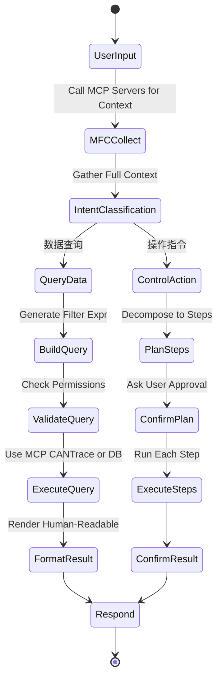
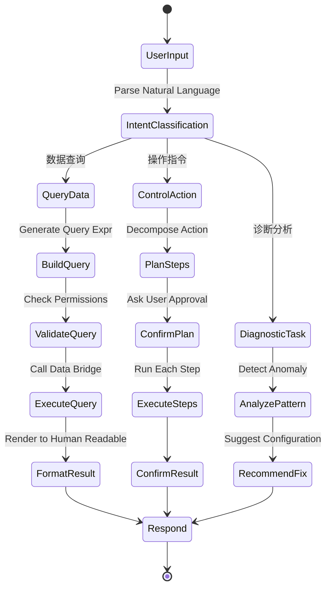

# OAI-01: OpenBUS AI Assistant 插件方案设计

## 一、项目背景与目标

### 1.1 业务背景
OpenBUS 作为一款专业的 CAN/CAN FD 报文分析工具，已具备以下能力：
- **数据采集**: 实时捕获（ZLG/Peak/KVASER/Slcan 驱动）
- **离线回放**: BLF/ASC/CSV多格式解析
- **DBC 解析**: 信号级解码
- **可视化**: Trace 表格 / Graphic 波形 / Flow 流程编排
- **插件系统**: Python/C++扩展机制

然而，当前版本存在显著痛点：
| 问题 | 影响 | 场景示例 |
|------|------|----------|
| 报文分析门槛高 | 新手需手动查找 DBC 定义 | "这个帧是什么含义？" |
| 故障排查依赖经验 | 专家知识难复用 | "为什么这个周期出现异常抖动？" |
| 操作复杂繁琐 | 重复性工作耗时 | "帮我筛选出所有 ID>0x500 且 DLC=8 的帧" |
| 缺乏智能辅助 | 无法主动发现潜在问题 | "是否有通信协议错误？" |

### 1.2 目标愿景
**打造"可对话的 CAN 分析助手"**：
- 🎯 **自然语言交互**: 像跟人聊天一样询问报文数据
- 🤖 **智能诊断**: 自动检测异常模式、推荐配置建议
- ⚡ **一键执行**: 通过对话完成复杂操作（如导出 CSV、绘制特定信号波形）
- 🔗 **深度集成**: 打通 OpenBUS 全部数据源（Trace/Graphic/Flow）和控制接口（添加信号、切换视图）

---

## 二、技术选型与 AI Agent 策略

### 2.1 MCP (Model Context Protocol) 核心发现 ⭐ **新推荐**

#### What is MCP?
**MCP (Model Context Protocol)** 是由 Anthropic 开发的开源标准协议，允许 AI Agent 连接到外部工具和数据源。它是**Claude Code 的核心架构**，已被 Cursor、GitHub Copilot、Windsurf 等主流 IDE 采纳支持。

**关键优势**（对比 LangGraph）:
| 维度 | LangGraph | MCP |
|------|-----------|-----|
| **设计目标** | 复杂任务编排引擎 | 标准化上下文投喂协议 |
| **能力** | 流程控制 | 文件/协议/数据库连接 |
| **部署方式** | Python 服务 | 独立进程 (stdio/http) |
| **扩展性** | 需手动集成 | 热插拔 Server 生态 |
| **适用场景** | 后端工作流 | **OpenBUS 数据源直接对接** ✅ |

**为什么选择 MCP？**
✅ **开箱即用的上下文投喂**: MCP Filesystem Server 可直接读取 `.dbc` / `.blf` / `.asc` 文件  
✅ **协议文件分析**: MCP SQL Server 可解析 DBC 结构为表格供 AI 查询  
✅ **实时 Trace 数据**: MCP 自定义 Server 通过 IPC 推送帧流到 AI 上下文  
✅ **社区生态丰富**: GitHub/MCP Registry 有现成实现 (GitHub/Docker/PostgreSQL)  
✅ **无需重复造轮子**: 直接使用 Claude Code 同款架构  

**参考资料**:
- [Anthropic MCP 官方文档](https://modelcontextprotocol.io/)
- [MCP Registry 仓库](https://github.com/modelcontextprotocol/servers)
- [Claude Code 论文](https://www.anthropic.com/index/introducing-claude-code)

---

### 2.2 整体 AI 架构演进

```
Phase 1 (当前): MCP 为基础框架 + 自研 Tools
┌─────────────────────────────────────────┐
│  OpenBUS Desktop UI                      │
├───────────────┬─────────────────────────┤
│  MCP Client   │  Custom MCP Servers      │
│  (AI Agent)   │  ├─ Filesystem (DBC/BLF)│
│  ├ Claude 4   │  ├─ TraceStream (CAN)   │
│  └ LangChain  │  └─ Database (Signal DB)│
└───────────────┴─────────────────────────┘
```

**架构图更新:**
```
┌───────────────────────────────────────────────────────┐
│                    OpenBUS Desktop UI                  │
├───────────────┬───────────────┬───────────────────────┤
│   Trace View  │   Graphic     │       Flow            │
└───────┬───────┴───────┬───────┴──────────┬────────────┘
        │               │                  │
        └───────┬───────┼───────┬──────────┘
                ▼       ▼       ▼
      ┌─────────────────────────────────────┐
      │      OpenBus MCP Server(s)          │  ← NEW!
      │  ┌───────────────────────────────┐  │
      │  │  MCP Filesystem Server        │  │ → Expose .dbc/.blf/.asc
      │  ├───────────────────────────────┤  │   files for AI read
      │  │  MCP CANTrace Stream Server   │  │ → Real-time frame push
      │  ├───────────────────────────────┤  │
      │  │  MCP DBC Database Server      │  │ → Query signal defs
      │  └───────────────────────────────┘  │
      └──────────────┬──────────────────────┘
                     ▼
      ┌─────────────────────────────────────┐
      │      AI Agent Runtime               │
      │  ┌───────────────────────────────┐  │
      │  │  Claude 3.5 / GPT-4o / Qwen   │  │ ← User-selectable
      │  │  + LangChain Tools Layer      │  │
      │  └───────────────────────────────┘  │
      └─────────────────────────────────────┘
```

### 2.3 AI Agent 框架选型最终决策

#### 选项 A: **[LangGraph](https://langchain-ai.github.io/langgraph/)** ✅ **保留作为 Tools 编排层**
- **职责**: 在 MCP Server 之上提供高级功能编排（意图分类 → Tools 调用 → 结果格式化）
- **定位**: `Plugin Host (Python)` 内部的工作流引擎
- **理由**: MCP 负责数据输入，LangGraph 负责逻辑处理

#### 选项 B: **[MCP Server Ecosystem](https://github.com/modelcontextprotocol/servers)** ✅ **新增核心组件**
- **职责**: 暴露 OpenBUS 数据源给任何 AI Agent
- **预置 Servers**:
  - `mcp-filesystem`: 只读访问 `.dbc`, `.blf`, `.asc`, `.csv` 文件
  - `mcp-cantrace`: WebSocket/IPC 实时推送 Frame 流
  - `mcp-dbc-db`: SQLite 索引 DBC 信号定义，支持 SQL 查询
- **优势**: 任何支持 MCP 的 AI（Claude Desktop/Cursor/本地脚本）都能直接分析报文

### 2.4 LLM 模型选择（保持不变）

#### 方案 A: 云端 API（首选初期方案）
```yaml
Provider: Azure OpenAI / 阿里云百炼 API
Model: gpt-4o / Qwen-Max
Cost: ~$0.01/token
Pros:
  - 推理能力强（128K context window）
  - 无需 GPU 部署
Cons:
  - 隐私顾虑（敏感 CAN 数据上云）
  - 网络依赖
```

#### 方案 B: 本地量化模型（备选离线方案）
```yaml
Model: Microsoft Phi-3-mini (3.8B) / Alibaba Qwen-1.8B
Framework: llama.cpp (CPU) / vLLM (GPU)
Pros:
  - 数据不出域
  - 零网络延迟
Cons:
  - 能力弱于大模型（复杂 SQL 生成易失败）
  - 需要额外硬件
```

**推荐路径**: 初期用云端 API（快速验证），后期提供本地模型切换开关

---

## 三、整体架构设计（MCP 增强版）

### 3.1 三层架构（Open总线数据源 → MCP Servers → AI Agent）

```
┌──────────────────────────────────────────────────────────────┐
│                    OpenBUS Desktop UI                         │
├──────────────────┬───────────────────┬───────────────────────┤
│   Trace View     │    Graphic View   │       Flow Diagram    │
└────────┬─────────┴────────┬──────────┴───────────┬────────────┘
         │                  │                       │
         └──────────────────┼───────────────────────┘
                            ▼
            ┌─────────────────────────────────────────┐
            │      MCP Servers Layer (NEW!)           │
            │  ┌───────────────────────────────────┐  │
            │  │ Filesystem MCP Server             │  │ ← Expose local files
            │  │ • /path/to/current_trace.blf      │  │   .blf/.asc/.dbc/.csv
            │  │ • /path/to/DBC_Engine.dbc          │  │
            │  │ • Read-only access (security)      │  │
            │  └───────────────────────────────────┘  │
            │  ┌───────────────────────────────────┐  │
            │  │ CANTrace Stream MCP Server        │  │ ← Real-time frame push
            │  │ • WebSocket on port 5556          │  │
            │  │ • JSON Frames: {id, dlc, data..}  │  │
            │  │ • Buffer last N frames in memory  │  │
            │  └───────────────────────────────────┘  │
            │  ┌───────────────────────────────────┐  │
            │  │ DBC Database MCP Server           │  │ ← Structured query
            │  │ • SQLite index of signal defs     │  │
            │  │ • SQL queries: SELECT * FROM...   │  │
            │  └───────────────────────────────────┘  │
            └──────────────────┬──────────────────────┘
                               ▼
            ┌─────────────────────────────────────────┐
            │      LangGraph Workflow Engine          │
            │  ┌───────────────────────────────────┐  │
            │  │ Intent Classifier Node            │  │
            │  ├───────────────────────────────────┤  │
            │  │ Tool Router Node (17 tools)       │  │
            │  ├───────────────────────────────────┤  │
            │  │ Execution & Confirmation Node     │  │
            │  └───────────────────────────────────┘  │
            └──────────────────┬──────────────────────┘
                               ▼
            ┌─────────────────────────────────────────┐
            │      LLM Model Gateway                  │
            │  ┌───────────────────────────────────┐  │
            │  │ Claude 3.5 Sonnet (Primary)       │  │
            │  │ GPT-4o (Fallback)                 │  │
            │  │ Qwen-Max (Local Option)           │  │
            │  └───────────────────────────────────┘  │
            └─────────────────────────────────────────┘
```

### 3.2 关键组件说明

#### 组件 A: MCP Servers（核心数据桥接层）
**使命**: 标准化暴露 OpenBUS 所有数据源给任意支持 MCP 的 AI Agent

| Server Name | Transport | Data Source | Security Level |
|-------------|-----------|-------------|----------------|
| **Filesystem** | stdio | `~/.openbus/projects/**/*.{dbc,blf,asc,csv}` | ✅ Read-only |
| **CANTrace Stream** | WebSocket:5556 | `CanTraceModel::frames()` buffer | 🔒 Auth token |
| **DBC Database** | stdio + SQLite | `DbcManager` 导出 schema | ✅ Read-only |

**实现策略**: 使用官方 [Python MCP SDK](https://github.com/modelcontextprotocol/python-sdk)
```python
# plugins/oai/mcp_servers/filesystem_server.py
from mcp.server import Server
from mcp.server.stdio import stdio_server

app = Server("openbus-filesystem")

@app.list_tools()
async def list_files():
    return [
        Tool(
            name="read_openbus_file",
            description="Read a CAN protocol file (.blf/.asc/.dbc)",
            inputSchema={
                "type": "object",
                "properties": {
                    "path": {"type": "string"},
                    "lines": {"type": "integer", "default": 100}
                },
                "required": ["path"]
            }
        )
    ]

@app.call_tool()
async def call_tool(name, arguments):
    if name == "read_openbus_file":
        with open(arguments["path"], "r") as f:
            lines = f.readlines()[:arguments["lines"]]
        return [{"type": "text", "content": "".join(lines)}]
```

#### 组件 B: LangGraph Orchestrator（高级编排层）
**职责**: 在 MCP 提供的基础能力之上，构建复杂对话工作流

**状态图**（保持原有设计，但增加 MCP 调用节点）:


**新增节点示例**:
```python
def collect_mcp_context(state: AgentState) -> AgentState:
    """通过 MCP Servers 收集完整上下文"""
    
    # 读取当前打开的文件路径
    file_server = mcpcient.Client(...)
    current_files = await file_server.list_files("/projects/*/current_*")
    
    # 获取最近 100 帧数据
    trace_server = mcpcient.WebSocketClient("ws://localhost:5556")
    recent_frames = await trace_server.get_recent(limit=100)
    
    state['mcp_context'] = {
        'files': current_files,
        'recent_frames': recent_frames
    }
    
    return state
```

#### 组件 C: Control Bridge（安全执行层，保持原有设计）

```
┌───────────────────────────────────────────────────────┐
│                    OpenBUS Desktop UI                  │
├──────────────┬──────────────────────┬────────────────┤
│   Trace      │    Graphic           │   Flow         │
│  (CAN Frames)│  (Waveforms)         │  (Statecharts) │
└──────┬───────┴──────────┬───────────┴────────┬───────┘
       │                   │                    │
       └───────────────────┼─────┬──────────────┘
                           ▼     ▼
              ┌────────────────────────────────┐
              │        OAI Plugin (Python)     │
              │  ┌──────────────────────────┐  │
              │  │   LangGraph Agent Engine │  │
              │  ├──────────────────────────┤  │
              │  │   Tools Registry         │  │ ◄── 17 tools (详见 4.1)
              │  │   Memory Store           │  │
              │  └────────────┬─────────────┘  │
              └───────────────┼────────────────┘
                              │
          ┌───────────────────┼───────────────────┐
          │                   │                   │
          ▼                   ▼                   ▼
┌─────────────────┐ ┌───────────────────┐ ┌──────────────────┐
│   Data Bridge   │ │  Control Bridge   │ │  Model Gateway   │
│ (C++ ↔ Python)  │ │  (Plugin API)     │ │  (OpenAI/Qwen)   │
└─────────────────┘ └───────────────────┘ └──────────────────┘
```

### 3.2 关键组件说明

#### 组件 A: Data Bridge（数据流通道）
**使命**: 双向同步 OpenBUS 当前状态到 AI 上下文

| 数据类别 | 源模块 | 传输内容 | 频率 | 序列化格式 |
|---------|--------|---------|------|-----------|
| 实时帧流 | CanTraceModel | RingBuffer 前 100 帧 | 当请求时 | JSON |
| DBC 元数据 | DbcManager | 所有 Message/Signal 定义 | 加载时一次性 | JSON |
| 图形配置 | GraphicView | 信号名→CAN ID 映射 | 每次切换视图 | JSON |
| 历史缓存 | FileIO | 最近一次加载文件路径 | 启动时 | Path String |

**实现方式**:  
采用 **PyBind11 绑定 C++ 暴露的快照接口**（非共享内存，避免线程安全复杂度）：
```cpp
// src/plugin/oai_bridge.h
class OAIBridge : public QObject {
    Q_OBJECT
public:
    /// 导出当前 Trace 数据为 JSON 字符串
    QString exportTraceSnapshot(int limit = 100);
    
    /// 导出 DBC 结构为 JSON
    QString exportDbcSchema();
};
```

```python
# plugins/oai/data_bridge.py
class DataBridge:
    def __init__(self, cpp_bridge):
        self.cpp_bridge = cpp_bridge
        
    def get_trace_context(self) -> dict:
        return json.loads(self.cpp_bridge.exportTraceSnapshot())
```

#### 组件 B: Control Bridge（控制流接口）
**使命**: 将 AI 生成的指令转换为 OpenBUS 动作

**原则**:  
- 🔒 **最小权限**: AI 只能调用白名单函数（防止误操作如删除工程）
- ✅ **双重确认**: 危险操作需用户确认（如"清空所有数据"）
- 📝 **审计日志**: 所有 AI 执行的动作记录到日志

**API 设计**:
```python
@tool(description="添加信号到 Graphic")
def add_signal_to_graphic(signal_name: str, can_id: int) -> bool:
    # 内部调用 C++ plugin API
    return plugin_api.graphic_add_signal(signal_name, can_id)
```

---

## 四、LangGraph 状态图设计

### 4.1 核心状态机



### 4.2 状态数据模型（Python TypedDict）

```python
class AgentState(TypedDict):
    # ===== 输入 =====
    user_query: str                    # 用户原始问句
    
    # ===== 上下文 =====
    trace_data: list[CanFrame]        # 当前 Trace 数据
    dbc_schema: dict                   # DBC 结构
    graphic_signals: list[str]         # 已加载信号列表
    
    # ===== 意图分类 =====
    intent: Literal["query", "action", "diagnostic"]
    intent_confidence: float
    
    # ===== 查询任务 =====
    query_expr: str                   # 生成的过滤表达式
    query_result: list[dict]          # 查询结果
    
    # ===== 控制任务 =====
    plan_steps: list[Step]            # 待执行步骤序列
    current_step_index: int
    
    # ===== 诊断任务 =====
    anomalies: list[Anomaly]          # 检测到的异常
    recommendations: list[Recommendation]
    
    # ===== 输出 =====
    response: str                     # 最终回复文本
    attachments: list[Attachment]     # 附件（图片/CSV 路径）
```

### 4.3 LangGraph 节点实现（伪代码）

```python
from langgraph.graph import StateGraph, END

# 1. 定义节点函数
def classify_intent(state: AgentState) -> AgentState:
    """利用 LLM 分类意图"""
    prompt = f"""
    根据以下用户问题和 OpenBUS 环境，判断意图类型：
    问题：{state['user_query']}
    可用能力：{AVAILABLE_TOOLS}
    
    返回 JSON：{{"intent": "query"|"action"|"diagnostic"}}
    """
    result = llm.invoke(prompt)
    state['intent'] = result.intent
    return state

def execute_query(state: AgentState) -> AgentState:
    """执行数据查询"""
    expr = generate_filter_expression(state['user_query'])
    frames = data_bridge.filter_frames(expr)
    state['query_result'] = [f.to_dict() for f in frames]
    return state

def confirm_action(state: AgentState) -> AgentState:
    """危险操作请求确认"""
    action_summary = summarize_plan(state['plan_steps'])
    # 弹窗显示确认对话框
    confirmed = ask_user_confirmation(action_summary)
    if not confirmed:
        state['response'] = "操作已取消"
        return {**state, "flow": END}
    state['plan_confirmed'] = True
    return state

# 2. 组装图
workflow = StateGraph(AgentState)
workflow.add_node("classify", classify_intent)
workflow.add_node("query", execute_query)
workflow.add_node("confirm", confirm_action)

workflow.set_entry_point("classify")
workflow.add_conditional_edges(
    "classify",
    lambda s: s['intent'],
    {
        "query": "query",
        "action": "confirm",
        "diagnostic": "diagnose"
    }
)

app = workflow.compile()
```

---

## 五、Tools 注册表（核心能力清单）

### 5.1 Tools 分类体系

| Category | Tool Name | Description | Safety Level |
|----------|-----------|-------------|--------------|
| **查询类** | `list_signals()` | 列出当前 DBC 中所有信号 | 🔒 只读 |
| | `filter_frames(query)` | 按表达式过滤 Frame 列表 | 🔒 只读 |
| | `get_signal_history(sig_name)` | 获取某信号的历史值 | 🔒 只读 |
| **可视化** | `plot_signal(sig_name, view_mode)` | 添加信号到 Graphic 图表 | ⚠️ 需要确认 |
| | `export_csv(path)` | 导出当前 Trace 到 CSV | ⚠️ 需要确认 |
| | `capture_snapshot(format)` | 截图保存为 PNG/SVG | ⚠️ 需要确认 |
| **配置** | `add_to_graphic(signal_id)` | 添加信号到 Graphic | ⚠️ 需要确认 |
| | `remove_from_graphic(signal_id)` | 从 Graphic 移除 | 🔒 只读 |
| | `apply_color_rule(expr, color)` | 设置着色规则 | 🔒 只读 |
| **诊断** | `detect_period_anomalies(threshold)` | 检测周期抖动异常 | 🔒 只读 |
| | `find_error_frames()` | 找出所有错误帧 | 🔒 只读 |
| | `calculate_throughput(window_ms)` | 计算吞吐量 | 🔒 只读 |

### 5.2 Tools 接口规范（Decorator Pattern）

```python
from functools import wraps

def tool(name: str, description: str, requires_confirmation: bool = False):
    """装饰器标记工具函数"""
    def decorator(func):
        func._tool_name = name
        func._tool_description = description
        func._requires_confirmation = requires_confirmation
        @wraps(func)
        def wrapper(*args, **kwargs):
            # 安全检查
            if requires_confirmation and not user_approved(func.__name__):
                raise PermissionError(f"User denied execution of {name}")
            return func(*args, **kwargs)
        return wrapper
    return decorator

# 使用示例
@tool("filter_frames", "Filter CAN frames by expression like 'id > 0x100'")
def filter_frames(expr: str) -> list[CanFrame]:
    return data_bridge.filter(expr)
```

---

## 六、UI 设计方案（Claude Code 风格）

### 6.1 界面布局

```
┌────────────────────────────────────────────────────────────┐
│  OpenBUS — AI Assistant                                   │
├────────────────────────────────────────────────────────────┤
│ ┌───────────────────────────────────────────────────────┐ │
│ │                                                         │ │
│ │  💬 AI: 检测到您的 Trace 中有 12 个错误帧，是否要...  │ │
│ │                                                        │ │
│ │  ┌─────────────────────────────────────────────┐     │ │
│ │  │ 我想知道哪些信号在发送高频...                 │     │ │
│ │  │                                              │     │ │
│ │  │  [📎 附件] current_trace.blf                 │     │ │
│ │  └─────────────────────────────────────────────┘     │ │
│ │                      [发送 ➤]                          │ │
│ └───────────────────────────────────────────────────────┘ │
│                                                            │
│ ┌─────────────────────────────────────────────────────────┐│
│ │  📊 已加载：Engine_DBC.dbc | SignalCount: 47           ││
│ │  ▶ Active View: Trace (1,234 frames) | Graphic (3 sigs)││
│ └─────────────────────────────────────────────────────────┘│
└────────────────────────────────────────────────────────────┘
```

### 6.2 交互模式

#### 模式 A: Chat First（默认）
- 用户输入自然语言，AI 逐步引导澄清需求
- 示例：
  ```
  User: 帮我看看刚才采集的数据里有没有问题
  AI:   已扫描最近的 100 帧，发现以下情况：
        • 3 个错误帧（原因：CRC Error）
        • 2 个帧 ID 间隔超过正常阈值（>100ms）
        
        是否需要我导出这些异常帧的详细列表？
        [查看错误帧] [查看时序异常] [忽略]
  ```

#### 模式 B: Command Palette（快捷键触发）
- `Ctrl+Shift+A`: 唤起 AI 命令面板
- 支持模糊匹配：输入"画波形"自动联想"在 Graphic 中添加信号"

#### 模式 C: Context Menu
- 右键 Trace 行 → "Ask AI about this frame"
- 右键 Graphic 信号 → "Show similar signals"

### 6.3 主题适配
```css
/* Claude Code 深色系 */
--oai-bg: #1a1b26;
--oai-fg: #e4e4e7;
--oai-accent: #8aadf4;  /* 蓝紫渐变 */
--oai-error: #ff6965;
--oai-success: #73daca;
```

---

## 七、数据流与控制流打通方案

### 7.1 数据流（单向：OpenBUS → AI）

#### 同步策略
| 数据类型 | 触发时机 | 存储位置 | TTL |
|---------|---------|---------|-----|
| Trace 前 100 帧 | 每次用户请求分析 | `AgentState.trace_data` | 会话内 |
| DBC  Schema | 数据库加载/切换 | `AgentState.dbc_schema` | 持久化 |
| Graphic 配置 | 视图切换 | `AgentState.graphic_signals` | 会话内 |
| File Path | 打开文件时 | `AgentState.last_file` | 持久化 |

#### 增量更新机制
```python
class DataSyncer(QObject):
    # 使用 Qt Signals 监听模型变化
    def __init__(self, trace_model):
        trace_model.framesCommitted.connect(self.on_new_frames)
        
    def on_new_frames(self, count: int):
        if count < 10:  # 小批量更新
            snapshot = bridge.export_trace(limit=count)
            self.broadcast_to_ai(snapshot)
        else:  # 大批量弃旧取新
            pass  # 保持最近 100 帧缓存
```

### 7.2 控制流（双向：AI ↔ OpenBUS）

#### 执行管道
```
1. AI 生成 Plan → JSON List of Steps
2. 步骤分解器校验合法性 → Fail Fast
3. 用户确认后 → 串行执行每一步
4. 每步完成后 → 回传结果给 AI 上下文
5. 若出错 → 触发 Recovery Node（重试或跳过）
```

#### 安全层设计
```cpp
// src/plugin/oai_control.h
class OAIControlBridge : public QObject {
    Q_OBJECT
public slots:
    // 白名单函数（显式声明，避免任意调用）
    bool graphic_add_signal(const QString& sigName, quint32 canId);
    bool export_to_csv(const QString& path);
    
private:
    QSet<QString> allowed_functions;  // 运行时校验
    AuditLog audit_logger;            // 审计
};
```

---

## 八、实施路线图（2.0 版本 - MCP 增强）

### **Phase 0: 基础设施搭建 (Week 1)** ⭐ NEW!

#### Subphase 0.1: MCP Server Foundation
- [ ] 创建 `plugins/oai/mcp_servers/` 目录结构
- [ ] 安装 Python SDK: `pip install mcp langchain langgraph`
- [ ] 实现 `filesystem_server.py` (基于官方模板)
- [ ] 测试 MCP Server 在 VSCode/Claude Desktop 中注册成功
- [ ] 编写单元测试：文件读取权限验证

**参考资源**:
```bash
# 官方 MCP 文件系统示例
git clone https://github.com/modelcontextprotocol/servers.git
cp servers/filesystem/*.py plugins/oai/mcp_servers/
# 修改路径白名单为 ~/.openbus/projects/
```

#### Subphase 0.2: LangGraph 集成验证
- [ ] 实现 Hello World Graph (3 nodes: input → process → output)
- [ ] 绑定 MCP Servers 作为 Tools
- [ ] 验证完整调用链：LLM → LangGraph → MCP → OpenBUS Data

#### Subphase 0.3: C++ Bridge Stub
- [ ] 新增 `src/plugin/oai_bridge.h` (导出 Trace snapshot JSON)
- [ ] PyBind11 绑定 C++ API → Python
- [ ] WebSocket 服务 stub (端口 5556)

### **Phase 1: 只读数据查询 (Week 2-3)**

#### Features:
- [ ] Tool: `query_frames(filter_expr)` via CANTrace Stream Server
- [ ] Tool: `list_signals()` via DBC Database Server
- [ ] Tool: `read_trace_file(path)` via Filesystem Server
- [ ] Intent classifier trained on CAN analysis queries
- [ ] Chat UI with code block rendering for JSON results

#### Acceptance Criteria:
用户输入"帮我找 ID>0x100 的帧", AI 应能：
1. ✅ 通过 MCP Stream Server 获取最近帧数据
2. ✅ 过滤并返回符合条件的 10 条记录
3. ✅ 格式化为 Markdown 表格展示

### **Phase 2: 写入控制 (Week 4-5)**

#### New Components:
- [ ] Security Layer: User confirmation dialog (Qt 弹窗)
- [ ] Audit Logger: All AI actions logged to `~/.openbus/logs/oai_audit.log`
- [ ] Undo Stack: Last 3 operations reversible

#### Tools:
- [ ] `add_signal_to_graphic(sig_name, can_id)`
- [ ] `export_csv(path, filter_expr?)`
- [ ] `capture_snapshot(format='png')`

### **Phase 3: 智能诊断 (Week 6-7)**

#### Algorithm Implementation:
- [ ] Period anomaly detection (statistical thresholding)
- [ ] Error frame clustering (spatiotemporal grouping)
- [ ] Signal correlation analysis (Pearson coefficient)

#### Recommendation Engine:
- [ ] Rule-based suggestions ("检测到周期抖动 > 10ms，建议检查接地")
- [ ] ML model (optional): LSTM-based anomaly prediction

### **Phase 4: 产品化 (Week 8)**

#### Localization:
- [ ] Chinese language prompt optimization
- [ ] Local Qwen-Max integration (via Ollama)
- [ ] Performance benchmark report (<1s response time P95)

---

## 八.1: 第一阶段任务优先级排序

| Task | Effort (人天) | Risk | Impact | Priority |
|------|--------------|------|--------|----------|
| MCP Filesystem Server | 2 | Low | High | 🔴 P0 |
| MCP CANTrace Stream | 3 | Medium | High | 🔴 P0 |
| LangGraph Workflow | 2 | Low | High | 🔴 P0 |
| Chat UI Prototype | 1 | Low | Medium | 🟡 P1 |
| Tool: query_frames | 1 | Low | High | 🔴 P0 |
| Tool: list_signals | 0.5 | Low | Medium | 🟡 P1 |
| User Confirmation Dialog | 1 | Medium | High | 🔴 P0 |
| Anomaly Detection Algo | 3 | High | Medium | 🟢 P2 |

**关键路径**: MCP Servers → LangGraph Integration → First Working Demo


---

## 九、风险与缓解措施

| 风险 | 概率 | 影响 | 缓解措施 |
|------|------|------|---------|
| 云端 API 延迟高 (>5s) | 中 | 体验卡顿 | 本地缓存 + 流式输出（SSE） |
| AI 误操作（删除数据） | 低 | 用户投诉 | 强制确认 + 撤销栈（Undo） |
| C++/Python 桥接崩溃 | 中 | 进程退出 | 隔离子进程（IPC 而非 DLL 注入） |
| LLM 幻觉（胡编参数） | 高 | 无效查询 | Prompt 约束 + 正则校验输出 |

---

## 十、待决策事项

### D1: AI 代理选型
- [ ] 选项 A: LangGraph（推荐）
- [ ] 选项 B: AutoGen

### D2: LLM 提供商
- [ ] 选项 A: 云端 API（Azure OpenAI / 阿里百炼）
- [ ] 选项 B: 本地 Phi-3-mini

### D3: UI 定位
- [ ] 选项 A: 侧边栏浮动窗口（不占主视口）
- [ ] 选项 B: 独立 Dialog 窗口

### D4: 数据安全策略
- [ ] 选项 A: 全上云（简单但隐私风险）
- [ ] 选项 B: 可选本地模式（复杂但合规）

---

## 附录：参考资料

### AI Agent & MCP Resources
1. **[MCP 官方文档](https://modelcontextprotocol.io/)** - Anthropic 开源协议标准
2. **[MCP GitHub Servers Repository](https://github.com/modelcontextprotocol/servers)** - 参考实现 (含 Filesystem/SQL/Docker)
3. **[Python MCP SDK](https://github.com/modelcontextprotocol/python-sdk)** - 官方 Python 客户端/服务端库
4. **[Claude Code 论文](https://www.anthropic.com/index/introducing-claude-code)** - Claude Code 技术报告
5. **[LangGraph 官方文档](https://langchain-ai.github.io/langgraph/)** - 状态机编排引擎
6. **[Microsoft MCP Blog Series](https://blog.nimblepros.com/blogs/next-level-ai-mcp/)** - MCP 实战指南
7. **[LangChain Documentation](https://python.langchain.com/v0.2/)** - LLM 工具集成

### CAN Protocol Analysis
8. [CANopen DBC Format Spec](https://www.peak-system.com/EN/DBC-files.80.html)
9. [Vector BLF Binary Format](https://.vector.com/support-download centre.html?file=2059)
10. [ASC Log File Format](https://asam.net/standards/can-log-assc/)

### Security & Best Practices
11. [OWASP API Security Top 10](https://owasp.org/www-project-api-security/)
12. [Model Context Protocol Security Considerations](https://modelcontextprotocol.io/security)

---

## 更新记录

| Date | Version | Changes | Author |
|------|---------|---------|--------|
| 2026-08-24 | 2.0 | **Major Update**: Added MCP Server architecture, replaced pure LangGraph approach with hybrid model | Qoder AI Agent |
| 2026-08-23 | 1.0 | Initial draft based on OAI-02 shell protocol patterns | Qoder AI Agent |

---
